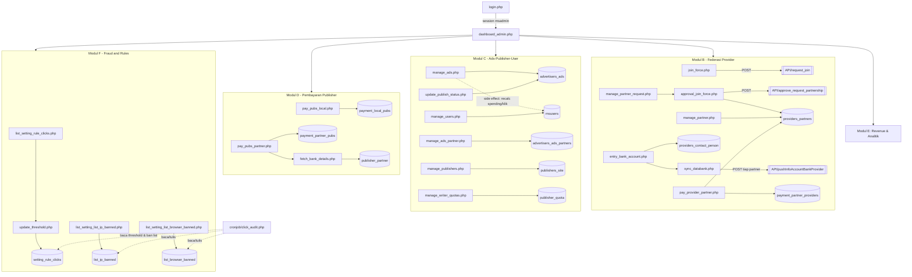

# Dokumentasi Panel Admin — `public_html/admin/`

> Terkait: [DATABASE_ERD.md](./DATABASE_ERD.md) (peran tabel `msadmin`, `providers_partners`, `payment_*`, `list_ip_banned`/`list_browser_banned`/`setting_rule_clicks`), [API_ENDPOINTS.md](./API_ENDPOINTS.md) (handshake federasi `request_join`→`approve_request_partnership`→`update_key` yang dipicu dari sini), [CRONJOB_JOBS.md](./CRONJOB_JOBS.md) (mapping, fraud audit, dan rekap yang datanya ditampilkan/di-setting di sini).
>
> Ada dokumen ringkasan yang sudah ada lebih dulu di `../documentation/10-admin-dan-approval.md` — dokumen ini melengkapi dengan detail per-file, dan **mengoreksi satu klaim penting** di dokumen tsb (lihat §5 temuan #1).

## 1. Ringkasan

`public_html/admin/` adalah dashboard admin terpisah dari sisi publisher/advertiser — sesi login sendiri (`$_SESSION['loggedin']` + `$_SESSION['loginemail_admin']`, tabel `msadmin`), tidak berbagi sesi dengan `login.php` di root. Berisi 42 entri: 36 halaman/skrip PHP dengan logika sendiri (termasuk `llm_settings.php`, ditambahkan belakangan), 6 file *shared include* (layout/style/fungsi bersama), plus `providers_data.json` (config identitas provider, sama seperti di tempat lain), `index.html` kosong (placeholder anti-directory-listing), dan `error_log` kosong.

Karakteristik umum:

- **Dua generasi UI berdampingan.** Halaman yang lebih baru meng-include `style_toogle.php` (token CSS bersama: `.admin-navbar`, `.sidebar` responsif, `.admin-main`) + `js_toogle.php` (toggle sidebar mobile/desktop) dan memakai `<main class="admin-main" id="mainContent">`. Halaman yang lebih lama menulis `<style>` sendiri dengan sidebar `position: fixed` lebar 250px tanpa collapse mobile. Keduanya nyalakan berdampingan — beberapa halaman lama (`join_force.php`, `manage_partner.php`, dll.) bahkan meng-include `style_toogle.php` **selain** `<style>` lokalnya sendiri, jadi sebagian token baru ikut aktif tapi layout intinya tetap yang lama.
- **Pola guard standar**: `session_start(); if (!isset($_SESSION['loggedin'])) { header('Location: login.php'); exit; }` di baris paling atas — dipakai konsisten di semua halaman (termasuk `llm_settings.php` yang baru; 2 file lama sempat tidak memakainya, sudah ditambahkan, lihat §5 #1 dan #2).
- **Koneksi DB dibuka ulang di setiap file** (pola sama seperti API/cronjob) — kadang `$conn`, kadang `$mysqli`, tidak konsisten namanya tapi keduanya `mysqli`.
- **`function_admin.php`** adalah kumpulan fungsi kecil (bukan class) untuk menghitung ulang & menuliskan balik agregat ke `msusers`/`advertisers_ads` setiap kali dipanggil (lihat §4 Modul A) — beberapa di antaranya dipanggil sebagai *side effect* saat sekadar menampilkan halaman (lihat §5 temuan #5).

## 2. Tabel Ringkas & Pengelompokan

| Modul | Halaman | Fungsi singkat | Guard sesi |
|---|---|---|---|
| **A. Auth, Layout & Shared Includes** | `login.php` | Login admin (`msadmin`, `password_verify`), set `$_SESSION['loggedin']` | — (ini halaman login) |
| | `logout.php` | Hancurkan sesi, redirect ke login | — |
| | `dashboard_admin.php` | Landing page setelah login, ringkasan login terakhir | ✅ |
| | `change_password.php` | Ganti password admin sendiri | ✅ |
| | `function_admin.php` | Helper: hitung ulang spending/revenue/klik per user, tulis balik ke `msusers`/`advertisers_ads` | — (library) |
| | `sidebar_menu.php`, `footer.php`, `style.php`, `style_toogle.php`, `js_toogle.php` | Partial UI bersama (menu, footer, CSS, toggle JS) | — (include) |
| **B. Provider/Partner Federation** | `join_force.php` | Kirim permintaan join ke `API/request_join` provider lain | ✅ |
| | `manage_partner_request.php` | Daftar `providers_request` masuk + link approve | ✅ |
| | `approval_join_force.php` | Approve permintaan → panggil `API/approve_request_partnership`, simpan key baru | ✅ |
| | `approval_join_force2.php` | ⚠️ Duplikat lama, tidak ditautkan dari mana pun (lihat §5 #4) | ✅ |
| | `manage_partner.php` | Daftar `providers_partners` + hitung ulang `partner_revenue_unpaid` saat render | ✅ |
| | `change_code_provider.php` | Ubah `providers.providers_code` (kode undangan join) — sekarang menampilkan identitas provider saat ini + penjelasan | ✅ |
| | `llm_settings.php` **(baru)** | Upsert baris config `llm_settings` (model, API key, max_tokens, temperature) dipakai fitur generate artikel/gambar/audio/kuis | ✅ |
| | `entry_bank_account.php` | Isi rekening bank/kontak provider sendiri (`providers_contact_person`) | ✅ |
| | `sync_databank.php` | Push rekening di atas ke tiap partner (`API/pushInfoAccountBankProvider`) | ✅ |
| | `pay_provider_partner.php` | Catat settlement B2B ke `payment_partner_providers` + recalc `providers_partners.partner_revenue_paid/unpaid` | ✅ |
| | `list_payment_provider_partner.php` | Riwayat settlement B2B | ✅ |
| **C. Ads/Publisher/User Management** | `manage_ads.php` | Daftar `advertisers_ads` + filter, trigger recalc spending/klik per baris | ✅ |
| | `update_publish_status.php` | **Titik approval iklan** — ubah `ispublished`/`is_paid` | ✅ |
| | `manage_ads_partner.php` | Daftar `advertisers_ads_partners` (read-only, tanpa form edit) | ✅ |
| | `manage_publishers.php` | Daftar `publishers_site` + pemilik, rate, revenue | ✅ |
| | `manage_users.php` | Daftar `msusers` + ringkasan revenue paid/unpaid | ✅ |
| | `manage_writer_quotas.php` | CRUD `publisher_quota` (kuota artikel AI) — token CSRF-nya sudah dimigrasi ke helper bersama | ✅ |
| **D. Pembayaran Publisher** | `pay_pubs_local.php` | Catat `payment_local_pubs` (publisher lokal) | ✅ |
| | `pay_pubs_partner.php` | Catat `payment_partner_pubs` + recalc `publisher_partner.revenue_paid/unpaid` | ✅ |
| | `fetch_bank_details.php` | AJAX ambil rekening publisher by email — guard sesi sudah ditambahkan (lihat §5 #2) | ✅ |
| | `list_payment_pubs_local.php` / `list_payment_pubs_partner.php` | Riwayat pembayaran publisher | ✅ |
| **E. Revenue & Analitik** | `list_pubs_partner_revenue.php` | Rekap `rekap_total_publisher_partner` per situs | ✅ |
| | `list_owner_pubs_partner_revenue.php` | Rekap `publisher_partner` per pemilik akun + trigger recalc paid/unpaid saat render | ✅ |
| | `top_active_publishers.php` | Ranking publisher by klik tervalidasi (proxy aktivitas) | ✅ |
| | `rekap_user_local_click.php` | Detail klik per user (dibuka dari `manage_users.php`) | ✅ |
| | `latest_recognized_clicks.php` | Klik terbaru yang lolos audit, lintas semua publisher | ✅ |
| | `publisher_click_forensics.php` | Alat investigasi fraud per publisher (reuse IP/UA, referrer mismatch, klik duplikat cepat) | ✅ |
| **F. Fraud & Rule Settings** | `list_setting_list_ip_banned.php` | CRUD `list_ip_banned` | ✅ |
| | `list_setting_list_browser_banned.php` | CRUD `list_browser_banned` | ✅ |
| | `list_setting_rule_clicks.php` | Lihat 16 aturan velocity (`setting_rule_clicks`) + modal edit | ✅ |
| | `update_threshold.php` | Eksekusi UPDATE `setting_rule_clicks` — guard sesi sudah ditambahkan (lihat §5 #1) | ✅ |
| — | `providers_data.json`, `index.html`, `error_log` | Config identitas provider / placeholder kosong / log kosong | — |

## 3. Diagram Navigasi & Alur Data

Struktur nyata diambil dari `sidebar_menu.php` (bukan tebakan), dikelompokkan per modul di atas.

## 4. Detail per Modul

### Modul A — Auth, Layout & Shared Includes

#### `login.php`
Form login admin. Verifikasi `password_verify()` terhadap `msadmin.passwords`, set `$_SESSION['loggedin']`/`$_SESSION['loginemail_admin']`, update `last_login`. **✅ Sudah diperbaiki** — sebelumnya tidak ada rate-limit/lockout percobaan gagal sama sekali (lihat §5 #8). Sekarang: tiap login gagal menaikkan `msadmin.number_last_login_attempt` dan mencatat `last_login_attempt`; setelah 5 kali gagal berturut-turut, akun dikunci sementara selama 15 menit (dihitung dari `last_login_attempt`, bukan flag terpisah — begitu jendela 15 menit lewat, satu percobaan baru diperbolehkan lagi). Login sukses me-reset `number_last_login_attempt` ke 0. Pesan ke user menampilkan sisa percobaan sebelum terkunci / sisa waktu kalau sedang terkunci.

#### `logout.php`
`session_unset()` + `session_destroy()`, redirect ke login. Sederhana, tidak ada catatan.

#### `dashboard_admin.php`
Landing page. Menampilkan `last_login`. Sudah pakai generasi UI baru (`style_toogle.php` + `admin-navbar` + `js_toogle.php`).

#### `change_password.php`
Verifikasi password lama (`password_verify`), simpan baru dengan `password_hash(..., PASSWORD_BCRYPT)`. Masih pakai UI generasi lama.

#### `function_admin.php`
Kumpulan fungsi yang masing-masing SELECT sebuah agregat lalu langsung UPDATE tabel sumbernya — dipanggil ulang setiap kali halaman terkait dirender (bukan cache):
- `getuser()` — ambil `loginemail` pemilik iklan.
- `countTotalAds()`, `countTotalWebsites()` — hitung jumlah baris.
- `updateLocalSpending()` / `updateGlobalSpending()` — SUM `current_spending`/`current_spending_from_partner` dari `advertisers_ads` → tulis ke `msusers`.
- `updateLocalRevenue()` / `updateGlobalRevenue()` — SUM `current_site_revenue*` dari `publishers_site` → tulis ke `msusers`, lalu panggil `updateTotalRevenue()`.
- `updateCurrentClick_local()` — SUM `jumlah_klik` dari `rekap_harian` → tulis ke `advertisers_ads.current_click`.

Fungsi-fungsi ini melakukan pekerjaan yang sama seperti `cronjob/calculate_budgetspentads.php`/`calculate_budgetspentads_partner.php`, tapi dipicu oleh **tampilan halaman admin**, bukan jadwal cron (lihat §5 #5).

#### `sidebar_menu.php`, `footer.php`, `style.php`, `style_toogle.php`, `js_toogle.php`
Partial bersama. `style_toogle.php`/`js_toogle.php` adalah pasangan CSS+JS untuk sidebar responsif generasi baru; `style.php` sepertinya draft awal yang sudah tidak dipakai (tidak ditemukan `include("style.php")` di file manapun yang dibaca — kemungkinan sisa refactor, isinya subset dari `style_toogle.php`).

### Modul B — Provider/Partner Federation Management

#### `join_force.php`
Form admin untuk memulai federasi: kirim `POST` ke `{target_domain}/API/request_join/index.php` (dikonfirmasi cocok dengan endpoint di [API_ENDPOINTS.md](./API_ENDPOINTS.md)). Header `Client-ID`/`Pass-Key` yang dikirim (`sha1($providers_domain_url)`) tidak sesuai dengan mekanisme auth `providers_code` yang sebenarnya divalidasi `API/request_join` — kemungkinan header basi dari desain awal yang sudah berubah, tidak menyebabkan masalah karena penerima tidak membacanya. Banyak `echo` debug (payload, response) tercetak polos sebelum `<!DOCTYPE html>`.

#### `manage_partner_request.php`
Tabel `providers_request` + tombol "Approve" (muncul kalau `is_followup=0`) yang mengarah ke `approval_join_force.php?id=...`.

#### `approval_join_force.php`
Ambil `api_endpoint`/`providers_domain_url`/`signature` dari `providers_request` by `id`, lalu `POST` ke `{api_endpoint}/approve_request_partnership/index.php`. Kalau sukses, UPDATE `providers_partners` (`public_key`, `secret_key`, `isapproved=1`) dan `providers_request.is_followup=1`.

#### `approval_join_force2.php`
**Isinya melakukan hal yang sama persis** dengan `approval_join_force.php` (bahkan docblock baris 3-nya salah tulis "admin/approval_join_force.php") — versi lebih lama, penuh `echo` debug termasuk **`public_key`/`secret_key` hasil approval dicetak polos ke halaman**, exit langsung (`exit("Invalid request ID.")`) tanpa tampilan error yang rapi, dan pakai `get_providers_domain_url($conn, $pid)` (query DB) alih-alih versi cache JSON. **Tidak ditautkan dari `sidebar_menu.php` maupun `manage_partner_request.php`** — file mati/orphan, lihat §5 #4.

#### `manage_partner.php`
Tabel `providers_partners` dengan pagination. Menghitung ulang `partner_revenue_unpaid = partner_revenue - partner_revenue_paid` dan **langsung UPDATE ke DB** untuk setiap baris yang dirender — side effect lain dari sekadar membuka halaman list (pola yang sama seperti `manage_ads.php`).

#### `change_code_provider.php`
Update `providers.providers_code` — kode undangan yang dibagikan ke calon partner, dicocokkan saat mereka mengirim `join_force.php`/`API/request_join`. **✅ Dirapikan**: sebelumnya cuma form kosong tanpa konteks apa pun (admin tidak bisa lihat kode yang sedang aktif tanpa cek database langsung). Sekarang halaman selalu menampilkan identitas provider saat ini (nama, domain, kode aktif) di atas form, plus penjelasan tertulis untuk admin tentang fungsi kode ini dan bahwa mengganti kode **tidak memutus** partner yang sudah disetujui (mereka sudah punya `public_key`/`secret_key` sendiri) — hanya memengaruhi permintaan gabung baru.

#### `llm_settings.php` (baru)
Halaman baru untuk mengatur baris konfigurasi LLM (`llm_settings`) yang dipakai `article_api.php`, `generate_ai_images.php`, `generate_audio_summary.php`, dan `generate_quiz.php` — keempatnya membaca lewat `SELECT * FROM llm_settings ORDER BY id LIMIT 1`, jadi tabel ini adalah **satu baris config aktif**, bukan daftar multi-baris. Sebelumnya tabel ini sama sekali tidak punya UI (cuma bisa diisi lewat query manual/phpMyAdmin) — halaman ini meng-upsert baris pertama (`UPDATE` kalau sudah ada baris, `INSERT` kalau kosong). Field: nama model, OpenAI API key, Replicate API key (keduanya `type="password"` dengan tombol show/hide), `max_tokens`, `temperature` (divalidasi 0-2). Ditautkan dari menu Settings di sidebar.

#### `entry_bank_account.php`
Form isi kontak/rekening bank provider sendiri (`providers_contact_person`, `id=1`, upsert manual via `insertOrUpdateContactPerson()`). Validasi bank terhadap whitelist array Indonesia (BCA, Mandiri, dst). Tombol kedua submit ke `sync_databank.php`. Kedua form sudah dilengkapi token CSRF.

#### `sync_databank.php`
Loop semua `providers_partners WHERE isapproved=1`, `POST` rekening di atas ke `{api_endpoint}/pushInfoAccountBankProvider/index.php` tiap partner (header `public_key`/`secret_key`) — cocok dengan endpoint yang sudah didokumentasikan di [API_ENDPOINTS.md](./API_ENDPOINTS.md). Hasil sinkron disimpan ke `$_SESSION['sync_message']` dan ditampilkan di halaman redirect.
**✅ Sudah diperbaiki**: ditemukan saat rollout CSRF — file ini sebelumnya menjalankan seluruh sinkronisasi (loop + cURL ke semua partner) **tanpa mengecek method request sama sekali**, jadi bisa dipicu lewat GET biasa (mis. `` di halaman lain) meski form pemicunya sendiri `method="POST"`. Sekarang disyaratkan `$_SERVER['REQUEST_METHOD'] === 'POST' && admin_csrf_valid()` sebelum loop dijalankan.

#### `pay_provider_partner.php`
*(Komentar baris 3: "jangan dihilangkan" — catatan pengingat dari developer, kemungkinan file ini pernah nyaris terhapus.)* Catat `payment_partner_providers`, lalu SUM ulang seluruh `nominal` untuk pasangan `email_provider`+`partner_provider` dan UPDATE `providers_partners.partner_revenue_paid/unpaid`. Ada kode mati: `$sql_inserts_p` dibangun lewat `str_replace` untuk preview SQL tapi `echo`-nya dikomentari — pola yang sama dengan kode mati yang ditemukan di audit cronjob sebelumnya.

#### `list_payment_provider_partner.php`
Read-only, tabel `payment_partner_providers` dengan pagination.

### Modul C — Ads/Publisher/User Management

#### `manage_ads.php`
Daftar `advertisers_ads` dengan filter (judul, paid, published, paused, expired) — filter & pagination dibangun manual (concat `$sql .=`) tapi parameternya tetap di-bind, aman. **Untuk setiap baris yang dirender**, memanggil `updateLocalSpending()`, `updateGlobalSpending()`, `updateCurrentClick_local()` dari `function_admin.php` — lihat §5 #5. Modal "View"/"Edit" pakai data attribute HTML, submit edit ke `update_publish_status.php`.

#### `update_publish_status.php`
UPDATE `ispublished`, `published_date`, `is_paid`, `paid_date` di `advertisers_ads` — ini **titik approval iklan** yang sesungguhnya (dikonfirmasi cocok dengan catatan di `documentation/10-admin-dan-approval.md`).

#### `manage_ads_partner.php`
Analog `manage_ads.php` tapi untuk `advertisers_ads_partners` — **read-only**, tidak ada form edit publish-status setara `update_publish_status.php` untuk iklan partner (mapping berbeda: partner sudah mengelola statusnya sendiri di jaringan asal).

#### `manage_publishers.php`
Daftar `publishers_site` JOIN `msusers` (pemilik), bisa dicari (nama/domain/provider/email) dan diurutkan (rate, revenue lokal/partner, tanggal daftar) via whitelist kolom — pola sort aman (`$allowed_sorts` map), konsisten dipakai juga di `manage_users.php`, `top_active_publishers.php`, dan `manage_writer_quotas.php`.

#### `manage_users.php`
Daftar `msusers` dengan ringkasan `total_paid`/`total_unpaid`/`total_revenue` (dihitung di SQL via `COALESCE(...)+...`, bukan kolom tersimpan). Link "Detail" ke `rekap_user_local_click.php?user_id=`.

#### `manage_writer_quotas.php`
CRUD `publisher_quota`. Sebelumnya satu-satunya halaman dengan token CSRF sendiri (`$_SESSION['writer_quota_csrf']`); sekarang dimigrasi memakai helper bersama (`admin_csrf_token()`/`admin_csrf_field()`/`admin_csrf_valid()` di `function_admin.php`) yang sama seperti seluruh halaman admin lain — lihat §5 #10.

### Modul D — Pembayaran Publisher

#### `pay_pubs_local.php`
Form pilih email dari `msusers`, INSERT `payment_local_pubs`. **Tidak memanggil fungsi recalculation apa pun setelahnya** — beda dari dua saudaranya di bawah (lihat §5 #6): `msusers.local_revenue_paid`/`local_revenue_unpaid` tidak ikut ter-update otomatis oleh aksi ini.

#### `pay_pubs_partner.php`
Form pilih email dari `publisher_partner`, ambil `publisher_local_id`/`pubs_providers_domain_url`, INSERT `payment_partner_pubs`, lalu panggil `updateRevenueTotal()` dan `updatePublisherRevenuePaid_unPaid()` (di `function.php`) untuk menyegarkan saldo. AJAX ke `fetch_bank_details.php` saat email dipilih, untuk auto-isi tampilan rekening (read-only di form).

#### `fetch_bank_details.php`
Terima `$_GET['email']`, `SELECT bank, account_name, account_number FROM publisher_partner WHERE loginemail = ?`, balas JSON. **✅ Sudah diperbaiki** — sebelumnya tidak ada `session_start()`/pengecekan sesi sama sekali, endpoint ini bisa diakses langsung tanpa login (lihat §5 #2). Guard sesi standar sudah ditambahkan di baris paling atas.

#### `list_payment_pubs_local.php` / `list_payment_pubs_partner.php`
Read-only, riwayat pembayaran dengan pagination + (khusus versi local) kartu ringkasan total nominal & jumlah transaksi serta kolom pencarian.

### Modul E — Revenue & Analitik

#### `list_pubs_partner_revenue.php`
Tabel `rekap_total_publisher_partner`. Query `LIMIT $limit OFFSET $offset` diinterpolasi langsung (bukan bind) dan `$page` **tidak di-cast ke int** — lihat §5 #9.

#### `list_owner_pubs_partner_revenue.php`
Tabel `publisher_partner`. Sama seperti `manage_partner.php`: **memanggil `updatePublisherRevenuePaid_unPaid()` untuk tiap baris saat render** — side effect lagi dari membuka halaman list. `$page` juga tidak di-cast ke int.

#### `top_active_publishers.php`
Ranking publisher by jumlah klik tervalidasi dalam window 7/30/90/semua hari, dengan pencarian nama/domain/email. Query pakai prepared statement + parameter dinamis (`$summary_types`/`$summary_params` dirangkai sesuai filter aktif) — pola paling rapi di modul ini.

#### `rekap_user_local_click.php`
Detail transaksi klik satu user (`ad_clicks` JOIN `publishers_site` by `publishers_local_id`), diakses dari tombol "Detail" di `manage_users.php`. Redirect ke `manage_users.php` kalau `user_id` tidak valid/tidak ditemukan.

#### `latest_recognized_clicks.php`
Klik tervalidasi (`isaudit=1 AND is_reject=0`) lintas semua publisher, terbaru dulu, dengan pencarian multi-kolom.

#### `publisher_click_forensics.php`
Alat investigasi fraud paling canggih di folder ini (satu-satunya file dengan docblock yang menjelaskan tujuannya secara eksplisit): untuk satu `pub_id`, hitung distinct IP/UA/referrer, deteksi user-agent bot (`is_probable_bot_user_agent()` dari `function.php`), referrer yang host-nya tidak cocok domain situs, dan **deteksi klik duplikat cepat** (grup by IP+UA, urut waktu, tandai pasangan klik dalam jendela `burst_window` detik) berikut estimasi revenue yang "bocor" akibat duplikat yang keduanya diakui.

### Modul F — Fraud & Rule Settings

#### `list_setting_list_ip_banned.php` / `list_setting_list_browser_banned.php`
CRUD penuh (search, add, edit, delete) untuk `list_ip_banned`/`list_browser_banned` — tabel yang sama yang dibaca `click_audit.php` (lihat [CRONJOB_JOBS.md](./CRONJOB_JOBS.md)) dan diisi otomatis oleh `banIpForVelocity()`. Delete lewat `GET ?delete_id=` (bukan POST) — CSRF-able secara teknis tapi dampaknya "cuma" menghapus satu baris ban, bukan kebocoran data.

#### `list_setting_rule_clicks.php`
Tabel `setting_rule_clicks` (16 aturan `aa`–`ap`) + modal JS yang submit ke `update_threshold.php`.

#### `update_threshold.php`
Terima `POST rule_id` + `threshold`, langsung `UPDATE setting_rule_clicks SET threshold = ? WHERE id = ?`. **✅ Sudah diperbaiki** — sebelumnya tidak ada `session_start()`/pengecekan sesi sama sekali (file ini bahkan tidak meng-include apa pun selain `db.php`), temuan paling serius di seluruh folder admin (lihat §5 #1). Guard sesi standar sudah ditambahkan di baris paling atas, sebelum `include("../db.php")`.

## 5. Temuan & Catatan Kualitas Kode

1. **✅ Diperbaiki (sebelumnya 🔴 Kritis) — `update_threshold.php` tanpa guard sesi, menulis langsung ke tabel fraud-detection.** Sebelumnya tidak ada `session_start()` atau pengecekan `$_SESSION['loggedin']` di file ini — siapa pun yang tahu path-nya bisa mengirim `POST` (`rule_id`, `threshold`) dan mengubah ambang batas velocity klik (`setting_rule_clicks`) yang dipakai `cronjob/click_audit.php` untuk memutuskan valid/fraud, tanpa login sama sekali. Ini bertentangan langsung dengan klaim di `documentation/10-admin-dan-approval.md` baris 67 ("Setiap halaman admin memvalidasi `$_SESSION['loggedin']` di baris paling atas... pola konsisten di semua file `admin/*.php`") — klaim itu tidak akurat untuk file ini. Guard sesi standar (`session_start()` + cek `$_SESSION['loggedin']` + redirect ke `login.php`) sudah ditambahkan di baris paling atas, sebelum `include("../db.php")`.
2. **✅ Diperbaiki (sebelumnya 🔴 Kritis) — `fetch_bank_details.php` tanpa guard sesi, membocorkan data rekening bank by email.** Endpoint AJAX ini (`?email=...`) sebelumnya juga tidak punya `session_start()`/pengecekan sesi apa pun — `SELECT bank, account_name, account_number FROM publisher_partner WHERE loginemail = ?` bisa dipanggil siapa saja yang tahu (atau menebak/enumerasi) email publisher, dan langsung dapat detail rekeningnya dalam JSON. Guard sesi standar yang sama sudah ditambahkan.
3. **Dua generasi UI berdampingan** (lihat §1) — bukan bug fungsional, tapi pengalaman pakai tidak konsisten: sebagian halaman responsif di mobile (sidebar bisa di-collapse), sebagian lagi sidebar `position: fixed` 250px yang akan menutupi konten di layar sempit.
4. **`approval_join_force2.php` adalah file mati/duplikat.** Isinya melakukan hal yang sama dengan `approval_join_force.php` tapi versi lebih tua — penuh `echo` debug (termasuk **mencetak `public_key`/`secret_key` hasil approval federasi langsung ke halaman**), docblock-nya sendiri salah menyebut nama file (`admin/approval_join_force.php`), dan tidak ditautkan dari `sidebar_menu.php` maupun `manage_partner_request.php` (yang keduanya hanya mengarah ke `approval_join_force.php`). Kemungkinan sisa sebelum file utamanya dirapikan, lupa dihapus.
5. **Side effect tulis-ke-DB dari sekadar membuka halaman list.** `manage_ads.php` memanggil `updateLocalSpending()`/`updateGlobalSpending()`/`updateCurrentClick_local()` untuk *setiap baris* yang dirender; `manage_partner.php` dan `list_owner_pubs_partner_revenue.php` melakukan hal serupa untuk `partner_revenue_unpaid`/`revenue_paid_unpaid`. Efeknya duplikatif dengan `cronjob/calculate_budgetspentads*.php` yang sudah menghitung ulang nilai yang sama secara terjadwal — membuka halaman admin yang sama berulang kali berarti query UPDATE yang sama juga berulang kali per baris, murni karena melihat datanya (bukan mengedit).
6. **Asimetri antar jalur pembayaran**: `pay_pubs_partner.php` dan `pay_provider_partner.php` sama-sama menghitung ulang saldo *paid/unpaid* setelah insert pembayaran, tapi `pay_pubs_local.php` **tidak** — `msusers.local_revenue_paid`/`local_revenue_unpaid` tidak disegarkan otomatis setelah mencatat pembayaran publisher lokal lewat halaman ini.
7. **Kode mati (dead code)** yang sama polanya dengan temuan di audit cronjob sebelumnya: `pay_provider_partner.php` membangun `$sql_inserts_p` (SQL literal via `str_replace`) yang `echo`-nya sudah dikomentari — dihitung tapi tidak pernah ditampilkan atau dieksekusi.
8. **✅ Diperbaiki — `login.php` (admin) sebelumnya tidak memakai kolom lockout yang ada.** Skema `msadmin` punya `number_last_login_attempt`/`last_login_attempt` (persis seperti di `msusers`), tapi sebelumnya `login.php` tidak pernah membaca/menambah kolom itu — tidak ada pembatasan percobaan login gagal untuk akun admin. Sekarang sudah diterapkan: kunci sementara 15 menit setelah 5 kali gagal berturut-turut (lihat detail di §4 Modul A). Catatan: `login.php` di root (`msusers`, publisher/advertiser) masih **hanya mencatat** hitungan gagal tanpa pernah menegakkannya (tidak pernah mengecek nilainya sebelum mengizinkan percobaan lagi) — di luar scope perbaikan ini karena yang diminta khusus login admin.
9. **Pagination tanpa cast eksplisit** di `list_pubs_partner_revenue.php` dan `list_owner_pubs_partner_revenue.php`: `$page = $_GET['page']` tanpa `(int)`, lalu dipakai untuk hitung `$offset` yang diinterpolasi langsung ke `LIMIT $limit OFFSET $offset` (bukan bind parameter seperti file lain di modul yang sama). Karena PHP memaksa konteks aritmatika saat menghitung `$offset`, ini bukan celah SQL-injection yang praktis dieksploitasi, tapi tidak konsisten dengan disiplin prepared-statement di file-file sejenis lainnya.
10. **✅ Diperbaiki — CSRF token sekarang diterapkan di semua form POST admin.** Sebelumnya hanya `manage_writer_quotas.php` yang punya token CSRF (miliknya sendiri, `$_SESSION['writer_quota_csrf']`), tidak direplikasi ke form POST lain (`pay_*.php`, `entry_bank_account.php`, `list_setting_list_ip_banned.php`/`list_browser_banned.php`, `join_force.php`, `approval_join_force*.php`, `change_password.php`, `change_code_provider.php`, `manage_ads.php`→`update_publish_status.php`, `list_setting_rule_clicks.php`→`update_threshold.php`). Sekarang semuanya memakai satu token per sesi admin lewat helper bersama di `function_admin.php` (`admin_csrf_token()`/`admin_csrf_field()`/`admin_csrf_valid()`), termasuk `manage_writer_quotas.php` yang dimigrasi ke helper yang sama. `login.php` sengaja dikecualikan (form login pra-otentikasi, pertimbangan terpisah). Efek samping dari audit ini: ditemukan `sync_databank.php` tidak pernah mengecek method request sama sekali (lihat §4 Modul B) — juga sudah diperbaiki. Yang **masih belum** diproteksi CSRF: delete via `GET ?delete_id=` di `list_setting_list_ip_banned.php`/`list_browser_banned.php` (lihat temuan terpisah di §4 Modul F) — perlindungan token hanya berlaku untuk aksi lewat body POST.
