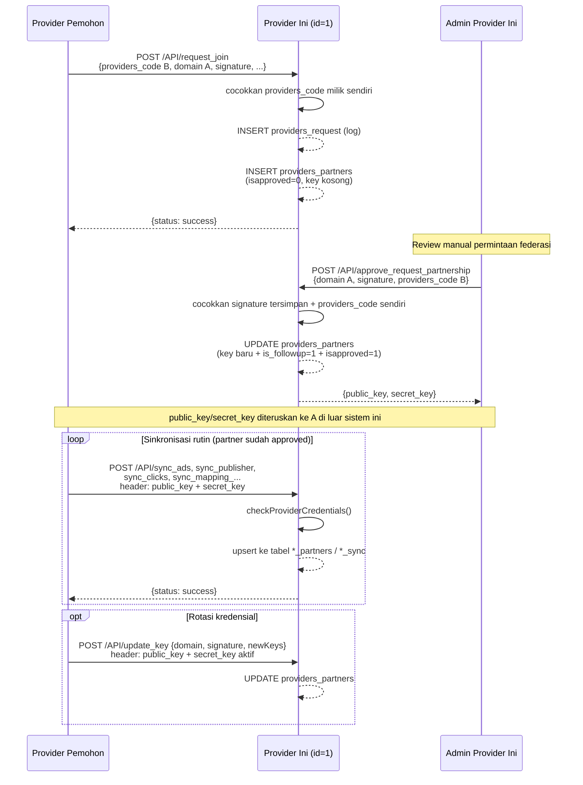

# Dokumentasi API — `public_html/API/`

> Terkait: [DATABASE_ERD.md](./DATABASE_ERD.md) — terutama bagian 4.1 "Federasi Provider". API di folder ini **adalah** implementasi jaringan federasi itu.

## 1. Ringkasan

Folder `public_html/API/` bukan API publik untuk browser pengguna akhir — ini adalah API **machine-to-machine antar-provider ad-network** (federasi). Provider lain yang sudah/ingin jadi partner memanggil endpoint-endpoint ini untuk gabung jaringan, sinkronisasi katalog iklan/publisher, dan melaporkan klik & pembayaran.

Karakteristik yang sama di semua 15 endpoint:

- **1 folder = 1 endpoint = 1 file `index.php`.** Tidak ada router pusat; tiap file berdiri sendiri dan meng-`include("../../db.php")` + `include("../../function.php")` masing-masing.
- **Request**: selalu raw JSON di body (`file_get_contents('php://input')` → `json_decode`), bukan form-urlencoded/query string.
- **Response**: selalu JSON `{"status": "success"|"error"|"info", "message": "...", ...}`.
- **Koneksi DB ganda**: hampir semua file membuka koneksi PDO *dan* MySQLi sekaligus di awal file — PDO dipakai untuk query prepared-statement, MySQLi seringkali dibuka tapi tidak dipakai (sisa refactor).
- **Baris komentar pertama** tiap file mencantumkan path lengkapnya sendiri, contoh `// {BASE_END_POINT}API/insert_ads/index.php` — ini konvensi placeholder untuk base URL yang dipakai peserta federasi lain saat menyusun endpoint tujuan.

## 2. Tabel Ringkas 15 Endpoint

| Endpoint | Dipanggil oleh | Cara autentikasi | Tabel utama yang disentuh |
|---|---|---|---|
| `request_join` | Provider **lain** (pemohon) | `providers_code` tujuan cocok | INSERT `providers_request`, `providers_partners` (pending) |
| `approve_request_partnership` | Sistem provider **ini** (setelah admin approve) | `signature` tersimpan + `providers_code` sendiri | UPDATE `providers_partners` (approve + terbitkan key) |
| `update_key` | Partner (rotasi kredensial) | header key aktif + `providers_domain_url` + `signature` | UPDATE `providers_partners` |
| `insert_advertiser` | Front-end provider sendiri | `secret_key_provider` = secret_key sendiri | INSERT `msusers` |
| `insert_ads` | Front-end provider sendiri | `secret_key` = secret_key sendiri | INSERT/UPDATE `advertisers_ads` |
| `insert_pubs` | Front-end provider sendiri | `secret_key_provider` = secret_key sendiri | INSERT `msusers` |
| `getOwnerPublisher` | Partner | header `public_key`+`secret_key` | SELECT `publishers_site` → `msusers` |
| `approval_advertiser_partner` | Partner | header `public_key`+`secret_key` | UPDATE `mapping_advertisers_ads_publishers_site` |
| `pushInfoAccountBankProvider` | Partner | header `public_key`+`secret_key` | UPSERT `providers_contact_person_sync` |
| `getinfoPaymentProviderPartner` | Partner | header `public_key`+`secret_key` | UPSERT (dedup) `payment_partner_providers_sync` |
| `getinfoPaymentPubsPartner` | Partner | header `public_key`+`secret_key` | UPSERT (dedup) `payment_partner_pubs_sync` |
| `sync_ads` | Partner | header `public_key`+`secret_key` | UPSERT `advertisers_ads_partners` |
| `sync_publisher` | Partner | header `public_key`+`secret_key` | UPSERT `publishers_site_partners` |
| `sync_clicks` | Partner | header `public_key`+`secret_key` | UPSERT massal `ad_clicks_partner` |
| `sync_mapping_advertisers_ads_publishers_site_from_partners` | Partner | header `public_key`+`secret_key` | UPSERT massal `mapping_advertisers_ads_publishers_site_from_partners` |

## 3. Pola Autentikasi

Ada tiga pola utama yang dipakai bergantian di 15 endpoint ini — penting untuk dipahami sebelum mengintegrasikan partner baru. `update_key` memakai header credential aktif sekaligus signature.

### 3.1 Header `public_key` + `secret_key` (pola paling umum — 9 endpoint rutin)

Dipakai oleh semua endpoint **sinkronisasi rutin** (`sync_*`, `getinfo*`, `getOwnerPublisher`, `approval_advertiser_partner`, `pushInfoAccountBankProvider`). Kredensial dikirim lewat **HTTP header**, bukan body, lalu divalidasi via `checkProviderCredentials()` (`function_provider.php:228`):

```php
$headers = getallheaders();
$Header_public_key = $headers['public_key'] ?? null;
$Header_secret_key = $headers['secret_key'] ?? null;
checkProviderCredentials($providers_domain_url, $Header_public_key, $Header_secret_key, $pdo);
```

Fungsi ini cuma mengecek apakah ada baris di `providers_partners` dengan kombinasi `providers_domain_url` + `public_key` + `secret_key` yang persis sama — key ini didapat partner dari hasil `approve_request_partnership` (lihat §5).

### 3.2 Body `secret_key`/`secret_key_provider` dibandingkan ke kunci provider sendiri (3 endpoint)

Dipakai oleh `insert_advertiser`, `insert_ads`, `insert_pubs` — mengecek `secret_key` yang dikirim di body sama dengan `providers.secret_key` milik **provider ini sendiri** (id=1, via `getSecretKeyById()`). Ini bukan kredensial partner, jadi endpoint-endpoint ini kemungkinan dimaksudkan untuk dipanggil oleh sistem/form internal sendiri (yang sudah tahu secret key-nya sendiri), bukan oleh provider federasi lain.

### 3.3 Signature + kode provider (2 endpoint, khusus alur "join")

Dipakai hanya oleh `request_join` dan `approve_request_partnership` — lihat detail alurnya di §5. Menggunakan `providers_code` (kode publik yang dibagikan manual ke calon partner) dan `signature` yang disimpan-balik dari permintaan sebelumnya, bukan `public_key`/`secret_key`.

## 4. Detail per Endpoint

### `request_join/index.php`
**Fungsi**: Titik masuk permintaan bergabung ke jaringan federasi. Dipanggil oleh sistem provider **pemohon**, ke server provider **tujuan**.
**Body**: `request_from`, `signature`, `providers_domain_url` (domain pemohon), `target_providers_domain_url`, `providers_code` (kode milik provider tujuan — dibagikan out-of-band), `providers_api_url`, `ipaddress`, `source_url`, `browser_agent`.
**Auth**: `providers_code` di body harus sama dengan `providers.providers_code` milik provider tujuan (id=1).
**Efek**: `insertProvidersRequest()` → log ke `providers_request`; `insertProviderPartner_preApproval()` → buat baris baru di `providers_partners` dengan `isapproved=0`, `public_key`/`secret_key` kosong (status "menunggu approval").
**Catatan**: `$expected_secret_key` dihitung (`sha1($providers_code)`) tapi tidak pernah dipakai untuk pengecekan apa pun — dead code.

### `approve_request_partnership/index.php`
**Fungsi**: Menyetujui permintaan yang sudah tercatat lewat `request_join`, lalu menerbitkan `public_key` + `secret_key` baru untuk partner tersebut.
**Body**: `providers_domain_url`, `providers_code`, `signature`.
**Auth**: (a) `signature` harus sama dengan yang tersimpan di `providers_partners` untuk `providers_domain_url` itu (`getSignatureByDomainUrl()`), DAN (b) `providers_code` harus sama dengan kode provider **ini sendiri** (id=1). Karena syarat (b) mengharuskan pemanggil tahu kode provider ini sendiri, endpoint ini realistisnya dipicu oleh sistem/admin provider ini sendiri, bukan langsung oleh pemohon.
**Efek**: generate key dengan `bin2hex(random_bytes(32))`, lalu `UpdateProviderPartner()` memperbarui key, `is_followup=1`, `isapproved=1`, dan waktu approval.
**Response sukses**: `{status:"success", public_key, secret_key, message}` — kunci baru dikembalikan langsung di body respons, harus diteruskan ke partner lewat jalur lain.

### `update_key/index.php`
**Fungsi**: Rotasi `public_key`/`secret_key` sebuah partner yang sudah disetujui.
**Body**: `providers_domain_url`, `signature`, `newPublicKey`, `newSecretKey`.
**Auth aktual**: header `public_key`+`secret_key` yang masih aktif, ditambah domain+signature yang cocok. Key baru minimal 32 karakter; kegagalan auth menghasilkan HTTP 401/403.
**Efek**: `updateKeysByDomainAndSignature()` → UPDATE `providers_partners` berdasarkan kecocokan `providers_domain_url` + `signature`.
**✅ Sudah diperbaiki**: kode mati dari implementasi lama sudah dihapus. Implementasi sekarang memvalidasi header credential aktif terlebih dahulu, mensyaratkan key baru minimal 32 karakter, lalu mencocokkan `providers_domain_url` + `signature` pada query UPDATE.

### `insert_advertiser/index.php`
**Fungsi**: Mendaftarkan advertiser baru.
**Body**: `providers_name`, `providers_domain_url`, `advertisers_name`, `advertisers_email`, `advertisers_whatsapp`, `secret_key_provider`.
**Auth**: `secret_key_provider` == `providers.secret_key` milik provider ini (id=1).
**Efek**: generate password dengan `bin2hex(random_bytes(16))`, cek duplikasi email, lalu `insertAdvertiser()` mem-`password_hash()`-kannya dan INSERT ke `msusers`.
**✅ Sudah diperbaiki**: sebelumnya cek duplikasi dan INSERT sama-sama menunjuk tabel `advertisers` yang **tidak ada** di `sql/kumpulbl_kbc_hanya_structure.sql` (sisa kode lama dari sebelum publisher/advertiser disatukan jadi satu tabel akun). Ditelusuri lewat git history: baris INSERT itu tidak berubah sejak commit pertama repo ini, dan tidak ada file lain di seluruh riwayat repo yang pernah mengasumsikan tabel `advertisers` ada — jadi endpoint ini kemungkinan besar tidak pernah benar-benar berfungsi. Sekarang `insertAdvertiser()` di `function_ads.php` retarget ke `msusers`, mengikuti pola yang sama seperti alur signup normal di `reg.php` (lihat `documentation/README.md`: publisher & advertiser berbagi satu tabel akun). `providers_name`/`providers_domain_url` tidak lagi disimpan (tidak ada kolom padanan di `msusers`).

### `insert_ads/index.php`
**Fungsi**: Membuat iklan baru untuk seorang advertiser.
**Body**: `providers_name`, `providers_domain_url`, `advertisers_id`, `title_ads`, `description_ads`, `landingpage_ads`, `total_click`, `secret_key`.
**Auth**: `secret_key` == `providers.secret_key` milik provider ini (id=1).
**Efek**: `insertAdvertisersAds()` → INSERT ke `advertisers_ads`, lalu langsung `updateAdvertisersAds($lastInsertId, 0)` → UPDATE baris yang sama untuk set `current_click=0` **dan** `local_ads_id = id` (menyalin id auto-increment ke kolom `local_ads_id` miliknya sendiri — pola "local_ads_id == id sendiri" untuk baris lokal, berbeda dari baris `_partners` yang `local_ads_id`-nya menunjuk ke id di server asal).
**Catatan**: pemanggilan legacy `debug_text()` masih ada, tetapi fungsi tersebut sekarang no-op dan tidak membuat file publik.

### `insert_pubs/index.php`
**Fungsi**: Mendaftarkan publisher baru.
**Body**: `publishers_name`, `publishers_email`, `publishers_whatsapp`, `publishers_bank`, `publishers_account_name`, `publishers_account_number`, `secret_key_provider`.
**Auth**: `secret_key_provider` == `providers.secret_key` milik provider ini (id=1).
**Efek**: cek duplikasi `loginemail`, generate password acak (sama pola seperti `insert_advertiser`), lalu **INSERT ke tabel `msusers`** (`loginemail`, `passwords` di-`password_hash()` BCRYPT, `whatsapp`, `realname`, `bank`, `account_name`, `account_number`, `regdate`). Response menyertakan `id` (auto-increment `msusers.id`).
**✅ Sudah diperbaiki**: sebelumnya SQL (ditulis inline di file ini, bukan lewat fungsi di `function_*.php`) menunjuk **tabel `publishers`** yang tidak ada di skema (yang ada `publishers_site`/`publishers_site_partners`/`publisher_partner` — tabel *situs*, bukan tabel *akun*), lalu UPDATE baris itu supaya `publishers_local_id = id` — pola self-reference yang juga tidak relevan untuk `msusers`. Password sebelumnya cuma di-`sha1()` (tidak akan pernah cocok dengan `password_verify()` di `login.php`), dan **tidak ada pengecekan email duplikat sama sekali** (`msusers.loginemail` tidak unique di level database) — keduanya sudah diperbaiki sekaligus.

### `getOwnerPublisher/index.php`
**Fungsi**: Partner meminta info kontak pemilik sebuah situs publisher lokal (untuk keperluan pembayaran lintas-jaringan).
**Body**: `providers_domain_url`, `pub_id` (id situs di `publishers_site`), `pubs_providers_domain_url`.
**Auth**: header `public_key`+`secret_key`.
**Alur query**: `pub_id` → `publishers_site.publishers_local_id` → `msusers.id` → ambil `loginemail`, `whatsapp`, `bank`, `account_name`, `account_number`.
**Response sukses**: `{status:"success", data:{loginemail, whatsapp, bank, account_name, account_number, pubs_providers_domain_url, publishers_local_id, pub_id}}`.
**Catatan**: query kedua menyisipkan `$pubs_providers_domain_url`, `$publishers_local_id`, `$pub_id` langsung sebagai literal SQL (bukan parameter terikat) — nilai-nilai ini berasal dari body request/hasil query pertama, bukan input bebas pengguna, tapi tetap pola yang lebih rapuh dibanding query pertama yang sudah pakai `:pub_id` terikat.

### `approval_advertiser_partner/index.php`
**Fungsi**: Partner memberi tahu bahwa seorang advertiser di sisi mereka sudah menyetujui/menolak sebuah mapping iklan↔situs (federasi ke arah sebaliknya dari `sync_mapping_*`).
**Body**: `id`, `local_ads_id`, `pubs_providers_domain_url`, `providers_domain_url`, `ads_providers_domain_url`, `is_approved_by_advertiser`.
**Auth**: header `public_key`+`secret_key`.
**Efek**: UPDATE `mapping_advertisers_ads_publishers_site` (set `is_approved_by_advertiser`, dan `approval_date_advertiser` jika nilainya bukan 0), dicocokkan lewat `id` + `local_ads_id` + `pubs_providers_domain_url` + `ads_providers_domain_url`.

### `pushInfoAccountBankProvider/index.php`
**Fungsi**: Partner mendorong (push) info kontak & rekening bank mereka ke provider ini.
**Body**: `providers_domain_url`, `email`, `whatsapp`, `account_name`, `account_bank`, `account_number`, `last_update`.
**Auth**: header `public_key`+`secret_key`.
**Efek**: upsert manual (SELECT COUNT dulu, lalu UPDATE atau INSERT) ke `providers_contact_person_sync`, dikunci oleh `providers_domain_url`.

### `getinfoPaymentProviderPartner/index.php`
**Fungsi**: Sinkron catatan pembayaran **ke provider partner** (level jaringan, bukan publisher perorangan).
**Body**: `id` (local_id di sisi pengirim), `partner_providers_domain_url`, `email_provider`, `nominal`, `payment_description`, `payment_date`, `payment_by`.
**Auth**: header `public_key`+`secret_key`.
**Efek**: cek duplikasi via kombinasi `local_id` + `partner_providers_domain_url`; kalau belum ada, INSERT ke `payment_partner_providers_sync`. Kalau sudah ada, balas `status:"info"` tanpa perubahan (idempotent).

### `getinfoPaymentPubsPartner/index.php`
**Fungsi**: Sinkron catatan pembayaran **ke publisher milik partner** (analog dengan endpoint di atas, tapi level publisher perorangan).
**Body**: `id`, `publisher_local_id`, `providers_domain_url`, `email_pubs`, `nominal`, `payment_description`, `payment_date`, `payment_by`.
**Auth**: header `public_key`+`secret_key`; kegagalan menghasilkan HTTP 401.
**Efek**: cek duplikasi via `local_id` + `publisher_local_id` + `pubs_providers_domain_url`; kalau belum ada, INSERT ke `payment_partner_pubs_sync`.

### `sync_ads/index.php`
**Fungsi**: Partner mendorong (push) katalog iklan mereka supaya di-cache lokal.
**Body**: `providers_name`, `providers_domain_url`, `advertisers_id`, `local_ads_id`, `ispublished`, `title_ads`, `description_ads`, `landingpage_ads`, `image_url`, `total_click`, `current_click`, `budget_per_click_textads`, `is_expired`, `expired_date`, `is_paused`, `paused_date`, `budget_allocation`, `current_spending`.
**Auth**: header `public_key`+`secret_key`.
**Efek**: `insertOrUpdateAdvertisersAdsPartner()` (didefinisikan di file ini sendiri, bukan di `function_*.php`) — cek existing by `local_ads_id` + `providers_domain_url`, lalu UPDATE atau INSERT ke `advertisers_ads_partners`.
**✅ Sudah diperbaiki**: `$expected_secret_key` sebelumnya dihitung dari `title_ads+description_ads+landingpage_ads+providers_domain_url` di dalam `if (true)` — sama seperti di `update_key`, tidak ada nilai tersimpan/terkirim untuk dibandingkan (kode mati, bukan validasi yang dimatikan). Sudah dihapus; otentikasi partner untuk endpoint ini tetap sepenuhnya bertumpu pada `checkProviderCredentials()` (header `public_key`/`secret_key`) yang sudah lebih dulu dijalankan sebelum baris ini.

### `sync_publisher/index.php`
**Fungsi**: Partner mendorong katalog situs publisher mereka.
**Body**: `id`, `providers_name`, `providers_domain_url`, `publishers_local_id`, `site_name`, `site_domain`, `site_desc`, `rate_text_ads`, `advertiser_allowed`, `advertiser_rejected`, `regdate`, `isbanned`, `banned_date`, `banned_reason`.
**Auth**: header `public_key`+`secret_key`.
**Efek**: `insertOrUpdatePublisherPartner()` (didefinisikan di file ini sendiri) — cek existing by `local_id` + `publishers_local_id` + `providers_domain_url`, lalu UPDATE atau INSERT ke `publishers_site_partners`.
**Catatan**: nama file di komentar baris pertama (`sync_publishers/index.php`, jamak) tidak sama dengan nama folder sebenarnya (`sync_publisher`, tunggal) — komentar sudah usang.

### `sync_clicks/index.php`
**Fungsi**: Partner mengirim **batch** data klik iklan federasi (array `ad_clicks`) untuk disalin ke sisi lokal.
**Body**: `providers_domain_url`, `ad_clicks: [...]` (array objek klik dengan struktur mengikuti kolom `ad_clicks_partner`).
**Auth**: header `public_key`+`secret_key`.
**Efek**: untuk tiap item di `ad_clicks` yang `pubs_providers_domain_url`-nya **bukan** domain provider ini sendiri, cek `hash_audit` sudah ada atau belum di `ad_clicks_partner`, lalu INSERT (dengan `ON DUPLICATE KEY UPDATE` sebagai jaring pengaman kedua) ke `ad_clicks_partner`.
**Catatan**: filter `pubs_providers_domain_url !== $this_providers_domain_url` artinya endpoint ini secara desain menolak menyimpan klik yang situsnya justru milik provider ini sendiri (klik semacam itu seharusnya masuk `ad_clicks`, bukan `ad_clicks_partner`).

### `sync_mapping_advertisers_ads_publishers_site_from_partners/index.php`
**Fungsi**: Partner mengirim **batch** data mapping approval iklan↔situs (array `ad_data`) versi mereka.
**Body**: `providers_domain_url`, `ad_data: [...]` (array objek mengikuti kolom `mapping_advertisers_ads_publishers_site_from_partners`).
**Auth**: header `public_key`+`secret_key`.
**Efek**: untuk tiap item, INSERT ... `ON DUPLICATE KEY UPDATE` ke `mapping_advertisers_ads_publishers_site_from_partners` (id disamakan dengan `local_mapping_id` dari pengirim).
**✅ Sudah diperbaiki**: variabel `$exists` sebelumnya dihitung (SELECT COUNT by id) tapi hasilnya tidak pernah dipakai untuk bercabang — kondisi berikutnya `if (true)` selalu jalan ke INSERT/UPDATE, dan logikanya sebenarnya sudah cukup lewat klausa `ON DUPLICATE KEY UPDATE` di SQL-nya sendiri. Pengecekan `$exists` yang redundan ini sudah dihapus, perilaku tidak berubah.

## 5. Alur Federasi End-to-End



## 6. Temuan & Catatan Kualitas Kode

Ringkasan hal-hal yang ditemukan saat menyusun dokumentasi ini — bukan perbaikan, murni observasi supaya diketahui:

1. **✅ Diperbaiki** — dua endpoint sebelumnya menunjuk tabel yang tidak ada di skema: `insert_advertiser` → tabel `advertisers`, `insert_pubs` → tabel `publishers`. Ditelusuri lewat git history: kedua INSERT itu tidak berubah sejak commit pertama repo ini dan tidak ada file lain di seluruh riwayat repo yang pernah mengasumsikan kedua tabel itu ada — jadi bukan regresi skema, melainkan kode yang sejak awal tidak pernah cocok dengan skema project ini (kemungkinan sisa dari skema lama sebelum publisher/advertiser disatukan jadi satu tabel akun). Keduanya sudah di-retarget ke `msusers`, tabel akun yang benar-benar dipakai (`reg.php`, `login.php`) — lihat detail di `insert_advertiser`/`insert_pubs` §4.
2. **✅ Diperbaiki** — `getinfoPaymentPubsPartner` sekarang memvalidasi header `public_key`/`secret_key`.
3. **✅ Diperbaiki** — tiga tempat sebelumnya menghitung nilai bergaya "validasi" tapi dilewati oleh kondisi yang selalu benar: `update_key` (`if (1==1)`), `sync_ads` (`if (true)`), dan pengecekan `$exists` yang tidak dipakai di `sync_mapping_advertisers_ads_publishers_site_from_partners`. Setelah dibaca lebih teliti, ketiganya bukan validasi yang "dimatikan" — nilai yang dihitung (`$expected_secret_key`, `$exists`) tidak pernah punya nilai tersimpan/terkirim lain untuk dibandingkan, jadi sejak awal memang kode mati. Sudah dihapus di ketiga file tanpa mengubah perilaku; otorisasi sesungguhnya untuk `update_key` (WHERE clause `signature`) dan `sync_ads` (header `checkProviderCredentials()`) tidak berubah.
4. **✅ Diperbaiki** — `debug_text()` sekarang no-op sehingga payload dan credential tidak lagi ditulis ke file publik.
5. Query kedua di `getOwnerPublisher` menyisipkan variabel langsung ke string SQL alih-alih parameter terikat (lihat catatan di bagian endpoint tsb).

Semua koneksi PDO/MySQLi dibuka ulang di tiap file tanpa connection pooling — wajar untuk API request-per-invocation seperti ini, tapi berarti tiap panggilan endpoint = minimal 1–2 koneksi DB baru.
