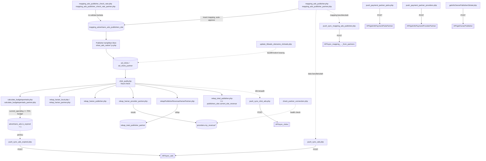

# Dokumentasi Cronjob — `public_html/cronjob/`

> Terkait: [DATABASE_ERD.md](./DATABASE_ERD.md) (skema & pola federasi lokal-vs-partner), [API_ENDPOINTS.md](./API_ENDPOINTS.md) (endpoint yang dipanggil oleh skrip `push_*`/`getinfo*` di sini).
>
> Ada dokumen ringkasan yang sudah ada lebih dulu di `../documentation/11-cronjob-dan-otomatisasi.md` (tabel satu-baris per file + sketsa diagram alur). Dokumen ini **melengkapi dengan detail per-file yang jauh lebih dalam**, dan beberapa poin di dalamnya mengoreksi klaim di dokumen tsb berdasarkan pembacaan penuh kode sumber (lihat §5).

## 1. Ringkasan

Folder ini berisi 25 entri: 23 skrip PHP, `providers_data.json` (config identitas provider — sama isinya dengan `public_html/providers_data.json`, lihat [DATABASE_ERD.md](./DATABASE_ERD.md)), dan `index.html` kosong (0 byte — placeholder anti-directory-listing, bukan halaman fungsional).

Karakteristik umum:

- **Tidak ada file crontab/scheduler di repo.** Jadwal eksekusi presisi tiap job (menit/jam/harian) diatur di panel hosting (cPanel Cron Jobs) di luar kode ini — **perlu konfirmasi** ke tim operasional untuk urutan & frekuensi pastinya.
- **Output HTML, bukan CLI murni.** Sebagian besar skrip mencetak halaman HTML lengkap dengan styling (Bootstrap/CSS custom) — dirancang supaya bisa dibuka manual di browser untuk debugging langkah-demi-langkah, bukan hanya dijalankan lewat `php script.php` di CLI.
- **Tidak ada locking/orkestrasi.** Tidak ada mekanisme yang mencegah dua run job yang sama tumpang tindih, atau yang memastikan urutan antar-job (mis. `calculate_budgetspentads.php` idealnya jalan setelah `click_audit.php` selesai) — urutan yang benar sepenuhnya bergantung pada jadwal cron eksternal.
- **Tiga lapis data yang sama seperti API**: data "lokal" (`advertisers_ads`, `publishers_site`, `ad_clicks`, `mapping_advertisers_ads_publishers_site`) vs cache "partner" (`advertisers_ads_partners`, `publishers_site_partners`, `ad_clicks_partner`, `mapping_advertisers_ads_publishers_site_from_partners`) — hampir tiap modul di bawah punya sepasang file, satu untuk tiap sisi.
- **Push ke jaringan lewat cURL**, menuju endpoint yang didokumentasikan di [API_ENDPOINTS.md](./API_ENDPOINTS.md), dengan kredensial `public_key`/`secret_key` per baris `providers_partners` (pola header yang sama seperti §3.1 di dokumen itu).

## 2. Tabel Ringkas & Pengelompokan

| Modul | File | Fungsi singkat | Tabel utama |
|---|---|---|---|
| **A. Mapping Iklan↔Situs** | `mapping_ads_publisher.php` | Mesin pencocokan awal: iklan lokal aktif × semua situs publisher, markup 1.5×, auto-approve saat insert | tulis `mapping_advertisers_ads_publishers_site` |
| | `mapping_ads_publisher_check_rate.php` | Re-validasi berkala rate/budget mapping lokal, approve/reject otomatis kalau harga berubah | baca+tulis `mapping_advertisers_ads_publishers_site` |
| | `mapping_ads_publisher_partner.php` | Versi lintas-jaringan: iklan partner (`advertisers_ads_partners`) × situs lokal, markup 2× | tulis `mapping_advertisers_ads_publishers_site` |
| | `mapping_ads_publisher_check_rate_partner.php` | Re-validasi rate/budget untuk sisi iklan partner (`advertisers_ads_partners`) | baca+tulis `mapping_advertisers_ads_publishers_site` |
| **B. Fraud Audit & Housekeeping** | `click_audit.php` | Audit anti-fraud async, ≤1000 klik `isaudit=0`/run, 16+ aturan velocity+IP/browser-ban+proxy/ad-status | `ad_clicks`, `list_ip_banned`, `setting_rule_clicks` |
| | `update_titleads_sitename_clickads.php` | Backfill `title_ads`/`site_name`/`site_domain` yang kosong di baris klik lama | `ad_clicks`, `ad_clicks_partner` |
| **C. Budget & Auto-Expire** | `calculate_budgetspentads.php` | Jumlahkan revenue klik valid **lokal** → `current_spending`, auto-expire di ≥70% budget | `ad_clicks` → `advertisers_ads` |
| | `calculate_budgetspentads_partner.php` | Sama, tapi sumber klik dari **jaringan partner** → `current_spending_from_partner` | `ad_clicks_partner` → `advertisers_ads` |
| **D. Rekap Harian / Revenue Rollup** | `rekap_harian_local.php` | Rekap harian spending per iklan, sumber klik lokal | `ad_clicks` → `rekap_harian` |
| | `rekap_harian_partner.php` | Sama, sumber klik partner (⚠️ ada bug, lihat §5) | `ad_clicks_partner` → `rekap_harian` |
| | `rekap_harian_publisher.php` | Rekap harian revenue per publisher (gabung lokal+partner) | `ad_clicks` → `rekap_harian_publishers` |
| | `rekapPublisherRevenueHarianPartner.php` | Rekap harian revenue publisher dari klik partner, lalu rollup ke total kumulatif | `ad_clicks_partner` → `rekap_publisher_revenue_harian_partner` → `rekap_total_publisher_partner` |
| | `rekap_harian_provider_partner.php` | Rekap harian klik & revenue di level provider mitra, lalu recalc `providers.my_revenue*` | `ad_clicks` → `rekap_harian_provider_partner` → `providers` |
| | `rekap_total_publisher.php` | ⚠️ **Bukan** rollup `rekap_total_publisher_partner` (lihat §5) — recalc `publishers_site.current_site_revenue`/`current_site_revenue_from_partner` langsung dari `ad_clicks` | `ad_clicks` → `publishers_site` |
| **E. Push Sinkronisasi (Outbound)** | `push_sync_ads.php` | Push semua iklan aktif ke tiap partner | → `API/sync_ads` |
| | `push_sync_ads_expired.php` | Push iklan yang baru expired + sinkron status expired/paused ke cache mapping lokal | → `API/sync_ads`, lalu update `mapping_advertisers_ads_publishers_site` |
| | `push_sync_publishers.php` | Push data situs publisher lokal | → `API/sync_publisher` |
| | `push_sync_click_ads.php` | Push klik yang sudah diaudit & belum pernah sync (≤14 hari) | → `API/sync_clicks` |
| | `push_sync_mapping_ads_publisher.php` | Push baris mapping lintas-jaringan yang baru diperbarui | → `API/sync_mapping_advertisers_ads_publishers_site_from_partners` |
| | `push_payment_partner_pubs.php` | Push riwayat pembayaran ke publisher partner (7 hari terakhir) | → `API/getinfoPaymentPubsPartner` |
| | `push_payment_partner_providers.php` | Push riwayat settlement antar-provider (7 hari terakhir) | → `API/getinfoPaymentProviderPartner` |
| **F. Info Pull & Kesehatan Koneksi** | `getinfoOwnerPublisherGlobal.php` | Ambil kontak pemilik publisher lintas-jaringan (24 jam terakhir) | → `API/getOwnerPublisher` → `publisher_partner` |
| | `check_partner_connection.php` | Health-check `providers_partners.providers_domain_url/check/ok.txt`, toggle `is_hold` | `providers_partners` |
| — | `providers_data.json` | Config: identitas provider ini sendiri (id, nama, domain) — dibaca lewat `get_providers_domain_url_json()` | — |
| — | `index.html` | File kosong, placeholder | — |

## 3. Diagram Alur Pipeline

## 4. Detail per File

### Modul A — Mapping Iklan↔Situs

#### `mapping_ads_publisher.php`
**Fungsi**: Mesin pencocokan **utama** untuk sisi lokal. Ambil semua `advertisers_ads` dengan `ispublished=1 AND is_expired=0`, lalu untuk **setiap** baris di `publishers_site` (tanpa filter status publisher), hitung `rate_text_ads_with_markup = rate_text_ads * 1.5`. Kalau `budget_per_click_textads >= rate_text_ads_with_markup`, upsert baris ke `mapping_advertisers_ads_publishers_site` dengan `is_approved_by_publisher=1, is_approved_by_advertiser=1` (auto-approve dua arah saat pertama kali cocok).
**Catatan**: pakai prepared statement (`mysqli->prepare`) dengan benar; `$site_desc` di-`str_replace("'","")` sebelum dipakai supaya aman disisipkan ke kolom string via bind — konsisten aman.

#### `mapping_ads_publisher_check_rate.php`
**Fungsi**: **Re-validator berkala** (bukan mesin pencocokan awal) untuk mapping lokal — resolusi atas pertanyaan "perlu konfirmasi" di `documentation/11-cronjob-dan-otomatisasi.md` soal beda file ini dengan `mapping_ads_publisher.php`. Dua tahap:
1. Tiap `publishers_site`, cek mapping-nya: kalau `rate_with_margin (1.5x) > budget_per_click_textads` di mapping → set `is_approved_by_advertiser=0` + alasan `'out of budget'`; kalau cocok lagi → approve ulang otomatis dan bersihkan alasan.
2. Tiap `advertisers_ads`, cek mapping-nya dari sisi budget: kalau `budget_per_click_textads < rate_text_ads` di mapping → `is_approved_by_publisher=0`; kalau cocok → approve ulang. Juga men-sinkronkan `is_published`/`is_expired`/`is_paused` cache mapping mengikuti status master `advertisers_ads` setiap kali status master itu tidak aktif.
**Catatan**: memakai prepared statement dengan baik di semua query.

#### `mapping_ads_publisher_partner.php`
**Fungsi**: Versi lintas-jaringan dari `mapping_ads_publisher.php` — mencocokkan `advertisers_ads_partners` (iklan milik partner) ke `publishers_site` (situs lokal), markup **2×** (bukan 1.5× seperti versi lokal — perbedaan margin yang nyata dan belum terdokumentasi sebelumnya).
**⚠️ Catatan penting**: SQL dirangkai lewat **interpolasi string langsung** (`"...WHERE local_ads_id = $local_ads_id..."`), bukan prepared statement seperti versi lokalnya, dan **tidak** membersihkan tanda kutip pada `$site_desc`, `$title_ads`, `$description_ads`, `$landingpage_ads` sebelum disisipkan ke query (berbeda dari `mapping_ads_publisher.php` yang eksplisit `str_replace("'","",$site_desc)`). Karena `title_ads`/`description_ads` berasal dari data iklan partner (bisa memuat karakter apa saja, termasuk tanda kutip), ini rawan pecah query atau celah SQL-injection kalau data dari partner mengandung tanda kutip.

#### `mapping_ads_publisher_check_rate_partner.php`
**Fungsi**: Re-validator berkala untuk sisi partner (mengecek `advertisers_ads_partners` + mapping yang bersangkutan), logika sama seperti `mapping_ads_publisher_check_rate.php` (dua tahap: cek dari sisi rate publisher, cek dari sisi budget iklan partner).
**⚠️ Catatan**: sama seperti mapping partner di atas — semua query pakai interpolasi string langsung, bukan prepared statement.

### Modul B — Fraud Audit & Housekeeping

#### `click_audit.php`
**Fungsi**: Audit anti-fraud asinkron, memproses hingga 1000 baris `ad_clicks` dengan `isaudit=0` per run lewat `checkFraud()`: validasi iklan masih aktif (`isAdActive`), deteksi proxy/VPN dari header, cek `list_ip_banned`/`list_browser_banned` (termasuk deteksi bot user-agent & IP lokal), lalu 16 aturan **velocity klik** berjenjang (`aa`–`ap`, dari 20 detik sampai 24 jam, threshold per aturan dari `setting_rule_clicks`) — begitu satu aturan terlampaui, IP langsung di-auto-ban ke `list_ip_banned` (`banIpForVelocity()`) supaya serangan berikutnya dari IP yang sama langsung tertolak di klik pertama, bukan menunggu pola berulang lagi. Klik yang lolos semua pemeriksaan diberi `hash_audit` via `createHashAudit()`.
**Terkait bug yang sudah diperbaiki**: bagian akhir file ini (setelah fungsi `checkFraud`) juga melakukan backfill `title_ads`/`site_name`/`site_domain` ke `ad_clicks`/`ad_clicks_partner` — logika yang sama dengan `update_titleads_sitename_clickads.php` di bawah, termasuk guard `is_array()` (commit `ca3a7f4`) untuk mencegah warning "array offset on bool" saat `$site_stmt->fetch()` tidak menemukan baris.

#### `update_titleads_sitename_clickads.php`
**Fungsi**: Housekeeping murni — melengkapi kolom `title_ads`/`site_name`/`site_domain` yang `NULL` di baris `ad_clicks` dan `ad_clicks_partner` lama, dengan look-up ke `advertisers_ads`/`advertisers_ads_partners` (untuk `title_ads`, dipilih berdasarkan apakah `ads_providers_domain_url` sama dengan domain sendiri) dan `publishers_site`/`publishers_site_partners` (untuk `site_name`/`site_domain`, dipilih berdasarkan `pubs_providers_domain_url`).
**Terkait bug yang sudah diperbaiki**: sebelum commit `ca3a7f4`, `$site_result['site_name']`/`$site_domain` diakses tanpa mengecek apakah `$site_stmt->fetch()` berhasil menemukan baris — kalau `pub_id` tidak match, `fetch()` mengembalikan `false` dan `false['site_name']` memicu PHP Warning "Trying to access array offset on value of type bool" (persis warning yang dilaporkan di awal sesi ini). Sekarang sudah dijaga dengan `is_array($site_result) ? (...) : null`.

### Modul C — Budget & Auto-Expire

#### `calculate_budgetspentads.php`
**Fungsi**: Untuk tiap `(local_ads_id, ads_providers_domain_url)` unik yang domain-nya **milik provider ini sendiri** di `ad_clicks`, jumlahkan `revenue_publishers + revenue_adnetwork_local + revenue_adnetwork_partner` dari klik yang `isaudit=1 AND is_reject=0`, lalu UPDATE `advertisers_ads.current_spending`. Kalau `current_spending + current_spending_from_partner >= 70% * budget_allocation`, set `is_expired=1`.
**Catatan**: nama fungsi internalnya `calculate_budgetspentads_partner()` — sama persis nama fungsi di file `calculate_budgetspentads_partner.php` (isinya nyaris identik, hanya beda kolom target `UPDATE` dan tabel sumber). Karena masing-masing didefinisikan di file terpisah dan tidak pernah di-`include` bersamaan, tidak terjadi bentrok nama fungsi saat runtime — tapi penamaan ini berpotensi membingungkan pembaca kode.

#### `calculate_budgetspentads_partner.php`
**Fungsi**: Kebalikan arah kewajiban dari file sebelumnya — menghitung klik pada iklan **milik advertiser lokal** yang terjadi **di situs milik jaringan partner** (dari `ad_clicks_partner`), lalu UPDATE `advertisers_ads.current_spending_from_partner`. Docblock di file ini menjelaskan eksplisit: "provider lokal berkewajiban membayar ke publisher partner karena iklan lokal diklik dari jaringan partner". Threshold auto-expire (70%) sama seperti di atas, dihitung dari total gabungan `current_spending + current_spending_from_partner`.

### Modul D — Rekap Harian & Revenue Rollup

#### `rekap_harian_local.php`
**Fungsi**: Agregasi harian dari `ad_clicks` (klik valid, `isaudit=1 AND is_reject=0`) di-`GROUP BY` tanggal+iklan+domain, upsert ke `rekap_harian` dengan `sumber_data='ad_clicks'`.
**Catatan**: variabel `$date_two_days_ago` dan komentar "Filter untuk dua hari terakhir" **menyesatkan** — nilainya sebenarnya `strtotime('-200 days')`, jadi window datanya 200 hari, bukan 2 hari. Ekspor JSON/CSV di bagian akhir file **dikomentari** (tidak aktif).

#### `rekap_harian_partner.php`
**Fungsi**: Sama seperti di atas tapi sumber `ad_clicks_partner`, `sumber_data='ad_clicks_partner'`.
**⚠️ Bug nyata**: query pengecekan "apakah baris rekap sudah ada" (`$check_query`) di file ini **tidak** menyertakan filter `sumber_data` (berbeda dari versi lokal yang menyertakannya), padahal query `UPDATE`-nya tetap mensyaratkan `AND sumber_data = ?`. Akibatnya: jika sudah ada baris `rekap_harian` untuk `(tanggal, local_ads_id, ads_providers_domain_url)` yang sama dengan `sumber_data='ad_clicks'` (dibuat oleh `rekap_harian_local.php`), maka `exists` di sini terbaca `>0` sehingga masuk cabang UPDATE — tapi `UPDATE`-nya mensyaratkan `sumber_data='ad_clicks_partner'` yang tidak match baris manapun, sehingga **0 baris berubah** dan data rekap dari sisi partner untuk kombinasi itu tidak pernah tersimpan.
**Bug lain**: sama seperti versi lokal, `$date_two_days_ago` sebenarnya 200 hari. Ekspor JSON (`../JSON/rekap_harian.json`) dan CSV (`../rekap_harian.csv`) di file ini **aktif** (tidak dikomentari) — kalau `$result` kosong (tidak ada klik partner di window), `$data_rekap` tetap array kosong sampai baris `fputcsv($csv_file, array_keys($data_rekap[0]))` dieksekusi di luar blok `if(!empty($result))`, yang akan memicu PHP warning "Undefined array key 0" karena `$data_rekap[0]` tidak ada.

#### `rekap_harian_publisher.php`
**Fungsi**: Agregasi harian `SUM(revenue_publishers)` dari `ad_clicks` per `(tanggal, pub_id, pubs_providers_domain_url, ads_providers_domain_url)`, upsert ke `rekap_harian_publishers`. Juga menghitung (tapi **tidak menyimpan ke DB**, hanya untuk tampilan HTML debug berjalan) akumulasi `$current_site_revenue`/`$current_site_revenue_from_partner` dengan membandingkan apakah `ads_providers_domain_url == pubs_providers_domain_url`.
**Catatan**: hanya mengambil dari `ad_clicks` (lokal) — klik dari `ad_clicks_partner` untuk publisher yang sama ditangani terpisah oleh `rekapPublisherRevenueHarianPartner.php`, bukan digabung di sini.

#### `rekapPublisherRevenueHarianPartner.php`
**Fungsi**: Memanggil 3 fungsi berurutan: (1) `rekapPublisherRevenueHarianPartner($mysqli)` — agregasi harian `ad_clicks_partner` per `(pub_id, pubs_providers_domain_url, tanggal)` ke `rekap_publisher_revenue_harian_partner`; (2) `updateSiteInfo($mysqli)` — `UPDATE ... JOIN publishers_site_partners` untuk mengisi `site_name`/`site_domain` di tabel rekap tsb; (3) `rekapTotalPublisherPartner($mysqli)` (didefinisikan di `function_publisher.php`) — roll-up **kumulatif seluruh histori** (bukan per-hari) dari `rekap_publisher_revenue_harian_partner` ke `rekap_total_publisher_partner`.
**Catatan**: fungsi `rekapPublisherRevenueHarianPartner()` sendiri membangun `$check_query_p` lewat `str_replace` untuk ditampilkan di log HTML, tapi query yang benar-benar dieksekusi (`$check_query`/`$stmt_check`) tetap prepared statement — variabel `_p` itu murni untuk tampilan debug, tidak pernah dieksekusi (aman, tapi berpotensi membingungkan karena `str_replace`-nya sendiri salah: baris kedua menggantikan pola `"pubs_providers_domain_url = ?"` dengan teks yang keliru memakai nama kolom `pub_id`).

#### `rekap_harian_provider_partner.php`
**Fungsi**: Fungsi `rekapHarianProviderPartner()` mengagregasi `ad_clicks` (klik valid, `revenue_adnetwork_partner >= 1`, window tanggal) per `(tanggal, ads_providers_domain_url)` ke `rekap_harian_provider_partner` (`ON DUPLICATE KEY UPDATE`). Setelah itu memanggil `updateProviderRevenue($pdo)` (`function_provider.php:5`) untuk menghitung ulang `providers.my_revenue`/`my_revenue_paid`/`my_revenue_unpaid` dari total `ad_clicks_partner.revenue_adnetwork_partner` dikurangi total `payment_partner_providers_sync.nominal`.
**Catatan**: variabel `$three_days_ago` dan komentar "3 hari terakhir" lagi-lagi menyesatkan — nilainya `strtotime('-300 days')`.
**⚠️ Bug nyata di `updateProviderRevenue()`** (`function_provider.php:24-40`): loop dalam yang mencari `$totalPaid` yang sesuai untuk tiap `$pub_provider` **tidak pernah membandingkan** `$partner_providers_domain_url` dengan `$pub_provider` — variabel `$totalPaid` di-assign ulang di setiap iterasi tanpa syarat, sehingga nilai akhirnya selalu berasal dari baris **terakhir** di `$paidAmounts`, bukan baris yang benar-benar cocok untuk provider yang sedang diproses. Akibatnya `my_revenue_paid`/`my_revenue_unpaid` bisa salah untuk semua provider kecuali yang kebetulan berada di posisi terakhir pada hasil query `$sqlPaid`.

#### `rekap_total_publisher.php`
**⚠️ Nama file menyesatkan / mengoreksi dokumentasi lama**: `documentation/11-cronjob-dan-otomatisasi.md` menyebut file ini "menjumlahkan seluruh rekap harian partner menjadi total kumulatif ... via fungsi `rekapTotalPublisherPartner()`" — setelah membaca kode sumbernya, klaim itu **tidak tepat**: file ini sama sekali tidak memanggil `rekapTotalPublisherPartner()` dan tidak menyentuh tabel `rekap_total_publisher_partner`. Fungsi `rekapTotalPublisherPartner()` sebenarnya dipanggil dari `rekapPublisherRevenueHarianPartner.php` (lihat di atas).
**Fungsi sebenarnya**: ambil semua `(pub_id, pubs_providers_domain_url)` unik dari `ad_clicks` yang valid (window 120.000 jam ≈ 13.7 tahun — praktis tanpa batas), lalu untuk tiap kombinasi hitung dua angka lewat `calculateTotalRevenueByPubIdAndProvidersDomain()`: total `revenue_publishers` di mana `pubs_providers_domain_url = ads_providers_domain_url` (revenue dari trafik "sendiri") dan di mana `!=` (revenue dari trafik silang-provider), lalu langsung `UPDATE publishers_site SET current_site_revenue = ..., current_site_revenue_from_partner = ...`. Jadi file ini adalah **penghitung ulang saldo revenue per situs publisher**, bukan roll-up tabel `rekap_total_publisher_partner`.

### Modul E — Push Sinkronisasi ke Partner (Outbound)

Ketujuh file berikut punya kerangka identik: ambil daftar `providers_partners`, untuk tiap partner bangun `$api_url = $provider['api_endpoint'] . "/<endpoint>/index.php"`, kirim data lewat cURL POST dengan header `public_key`/`secret_key` dari baris partner tsb.

#### `push_sync_ads.php`
Push semua `advertisers_ads` dengan `ispublished=1 AND is_expired=0` (tanpa filter perubahan terbaru — **mengirim ulang seluruh katalog aktif di setiap run**) ke `API/sync_ads` tiap partner, plus `secret_key_request = sha1(title+desc+landing+domain)` (dihitung tapi — sebagaimana dicatat di [API_ENDPOINTS.md](./API_ENDPOINTS.md) — tidak divalidasi berarti oleh `API/sync_ads` di sisi penerima).

#### `push_sync_ads_expired.php`
File terbesar di modul ini (413 baris), 5 tahap: (1) push iklan yang baru `is_expired=1` dalam 250 jam terakhir ke `API/sync_ads` tiap partner dengan `is_hold=0`; (2) update `mapping_advertisers_ads_publishers_site.is_expired` untuk semua iklan lokal yang expired; (3) sama untuk iklan dari `advertisers_ads_partners` yang expired; (4)+(5) sinkronkan status `is_paused` (dua arah, aktif↔nonaktif) dari `advertisers_ads` dan `advertisers_ads_partners` ke cache mapping — bagian ini sudah dikomentari dengan baik di kode sumbernya sendiri, menjelaskan bahwa tanpa langkah ini `is_paused` di cache mapping bisa "nyangkut" di nilai lama karena `mapping_ads_publisher.php` hanya me-refresh baris yang masih lolos syarat harga.

#### `push_sync_publishers.php`
Push `publishers_site` ke `API/sync_publisher` tiap partner.
**Catatan**: filter `last_updated >= NOW() - INTERVAL 240000 HOUR` (~27 tahun) — secara praktis tidak memfilter apa pun, seluruh situs publisher dikirim ulang di setiap run.

#### `push_sync_click_ads.php`
Push klik yang `isaudit=1 AND is_reject=0` dan belum pernah sync, dalam window 14 hari terakhir, ke `API/sync_clicks`, lalu tandai `ad_clicks.is_sync=1` untuk klik yang berhasil dikirim. Juga memanggil `updatePartnerRevenueByDomain()` per provider sebelum mengirim.

#### `push_sync_mapping_ads_publisher.php`
Push baris `mapping_advertisers_ads_publishers_site` yang `last_updated` dalam 2400 jam (100 hari) terakhir dan cocok arah `(pubs_providers_domain_url, ads_providers_domain_url)` untuk partner tsb, ke `API/sync_mapping_advertisers_ads_publishers_site_from_partners`.

#### `push_payment_partner_pubs.php`
Push baris `payment_partner_pubs` (7 hari terakhir) untuk tiap partner ke `API/getinfoPaymentPubsPartner` — endpoint tujuan ini yang di [API_ENDPOINTS.md](./API_ENDPOINTS.md) dicatat **tidak memvalidasi** `public_key`/`secret_key` di sisi penerima, meski pengirimnya (file ini) tetap mengirim header itu seperti biasa.

#### `push_payment_partner_providers.php`
Push baris `payment_partner_providers` (7 hari terakhir) ke `API/getinfoPaymentProviderPartner`. Ada baris debug `$sqlCheck_r = str_replace(":target", $target, $sqlCheck)` yang dibuang setelah dicetak (tidak dieksekusi) — murni untuk menampilkan query final di log HTML, eksekusi sebenarnya tetap lewat prepared statement `$stmt_ads`.

### Modul F — Info Pull & Kesehatan Koneksi

#### `getinfoOwnerPublisherGlobal.php`
**Fungsi**: Ambil `(pub_id, pubs_providers_domain_url)` dari `rekap_total_publisher_partner` (24 jam terakhir), untuk tiap baris cari kredensial partner terkait di `providers_partners`, lalu POST ke `{api_endpoint}/getOwnerPublisher/index.php` (mengonfirmasi pairing dengan `API/getOwnerPublisher` di [API_ENDPOINTS.md](./API_ENDPOINTS.md)). Response berisi kontak pemilik publisher (`loginemail`, `whatsapp`, `bank`, dst) di-upsert ke `publisher_partner`, lalu `rekap_total_publisher_partner.owner_id` diisi dan `updateRevenueTotal()` dipanggil untuk menghitung `publisher_partner.revenue_total`.

#### `check_partner_connection.php`
**Fungsi**: Untuk tiap baris `providers_partners`, cek apakah `{providers_domain_url}/check/ok.txt` bisa diakses (HTTP 200) lewat cURL `HEAD`-style (`CURLOPT_NOBODY`), timeout 10 detik. Kalau status berubah dari sebelumnya, update `is_hold` (1 = partner tidak bisa dihubungi, 0 = sehat) beserta `hold_date`. `is_hold=1` inilah yang dipakai `push_sync_ads_expired.php` untuk melewati partner yang sedang down.

## 5. Temuan & Catatan Kualitas Kode

Ringkasan murni observasi (bukan perbaikan) dari pembacaan kode sumber:

1. **`rekap_harian_partner.php`** — existence-check sebelum insert tidak memfilter `sumber_data`, sehingga baris rekap dari sisi partner bisa gagal tersimpan kalau baris rekap lokal untuk kombinasi tanggal/iklan/domain yang sama sudah ada duluan (lihat detail di §4).
2. **`function_provider.php::updateProviderRevenue()`** (dipakai oleh `rekap_harian_provider_partner.php`) — variabel `$totalPaid` tidak pernah dicocokkan dengan provider yang sedang diproses, sehingga nilai `my_revenue_paid`/`my_revenue_unpaid` di tabel `providers` berpotensi salah untuk semua baris kecuali yang terakhir diproses.
3. **`rekap_total_publisher.php` salah didokumentasikan** di `documentation/11-cronjob-dan-otomatisasi.md` — file ini tidak memanggil `rekapTotalPublisherPartner()` maupun menyentuh `rekap_total_publisher_partner`; fungsinya menghitung ulang `publishers_site.current_site_revenue*` langsung dari `ad_clicks`.
4. **Variabel/komentar jendela waktu yang menyesatkan** di beberapa file: `rekap_harian_local.php`/`rekap_harian_partner.php` (`$date_two_days_ago` = 200 hari), `rekap_harian_provider_partner.php` (`$three_days_ago` = 300 hari), `push_sync_publishers.php` (~27 tahun), `rekap_total_publisher.php` (~13.7 tahun). Nama variabel dan komentar tidak mencerminkan nilai sebenarnya — kemungkinan sengaja diperbesar sementara untuk keperluan testing/backfill dan lupa dikembalikan.
5. **SQL raw-interpolated tanpa sanitasi tanda kutip** di `mapping_ads_publisher_partner.php` dan `mapping_ads_publisher_check_rate_partner.php` — berbeda dari pasangan versi lokalnya yang sudah pakai prepared statement (dan secara eksplisit membuang tanda kutip dari `site_desc`). Data teks iklan/situs (`title_ads`, `description_ads`, `site_desc`, dll.) yang mengandung tanda kutip berpotensi merusak query atau membuka celah injection kalau nilainya berasal dari input yang tidak terpercaya.
6. **Markup rate berbeda tanpa penjelasan eksplisit**: mapping lokal (`mapping_ads_publisher.php`) memakai markup 1.5×, sedangkan mapping partner (`mapping_ads_publisher_partner.php`) memakai 2× — perbedaan bisnis yang nyata di kode, belum terdokumentasi di tempat lain.
7. **Nama fungsi kembar** `calculate_budgetspentads_partner()` didefinisikan identik-mirip di dua file berbeda (`calculate_budgetspentads.php` dan `calculate_budgetspentads_partner.php`) — tidak bentrok karena tidak pernah di-include bersamaan, tapi berisiko membingungkan saat maintenance.
8. Pola umum lain yang sudah dicatat di [API_ENDPOINTS.md](./API_ENDPOINTS.md) — kredensial `secret_key_request`/`secret_key` yang dihitung tapi tidak divalidasi berarti oleh endpoint penerima — juga relevan untuk `push_sync_ads.php` dan `push_sync_ads_expired.php`, yang mengirim `secret_key_request` semacam itu.

## 6. Ringkasan Koreksi terhadap `documentation/11-cronjob-dan-otomatisasi.md`

Dokumen tsb tetap berguna sebagai peta cepat, tapi dua detail di dalamnya perlu dibaca dengan koreksi ini:

- **`rekap_total_publisher.php`**: bukan pemanggil `rekapTotalPublisherPartner()` — lihat temuan #3 di atas.
- **Perbedaan `mapping_ads_publisher.php` vs `mapping_ads_publisher_check_rate.php`**: sudah terjawab — yang pertama adalah mesin pencocokan awal (insert baru + auto-approve), yang kedua adalah re-validator berkala (approve/reject ulang berdasarkan rate/budget terkini). Pola yang sama berlaku untuk pasangan versi partner-nya.

Selebihnya (daftar file, arah sinkronisasi high-level, catatan "perlu konfirmasi" soal jadwal cron) masih akurat dan tidak diubah.
