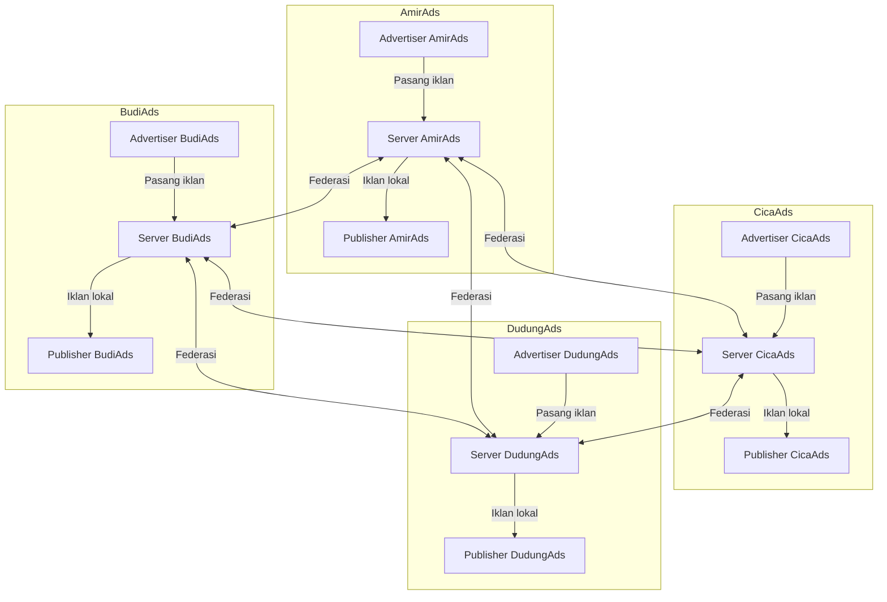
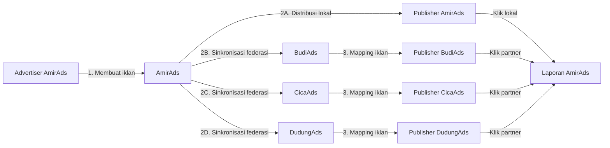
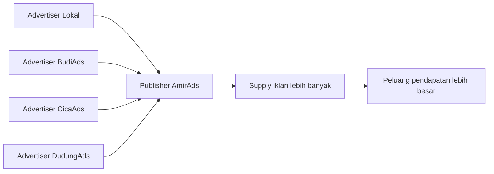
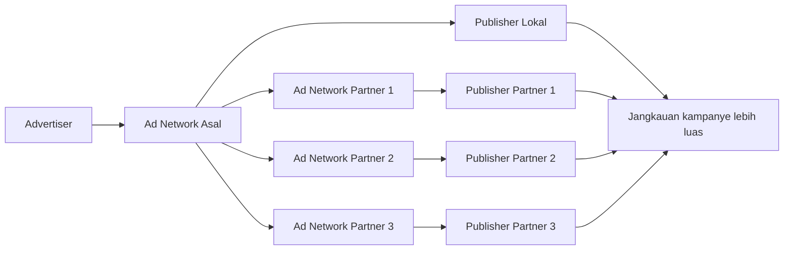
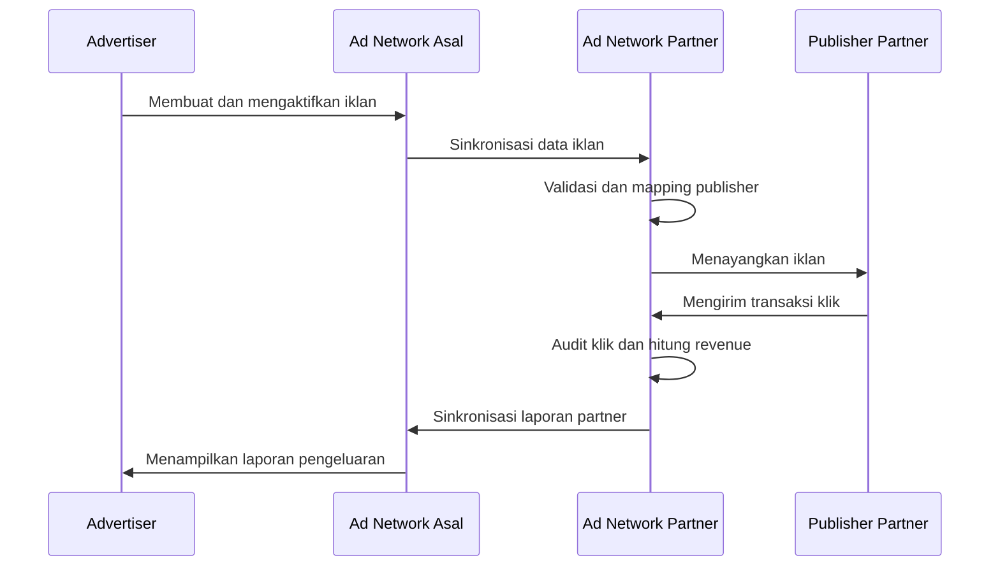
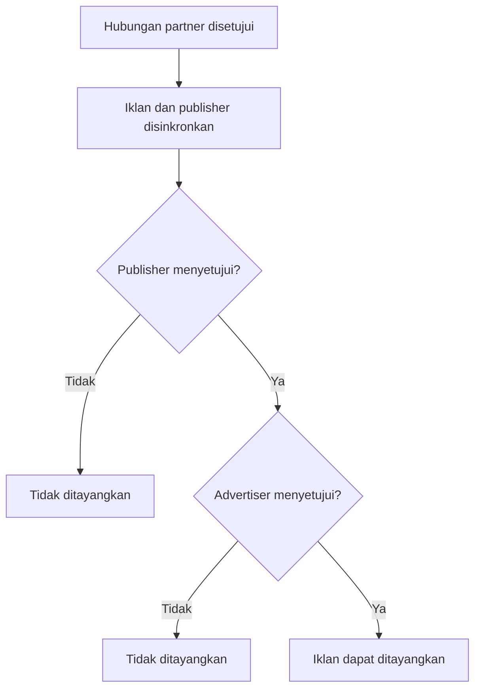
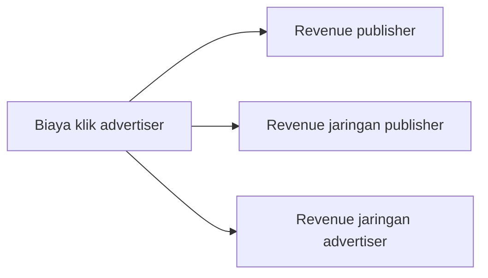

# Konsep Federasi Ad Network

## 1. Pengertian

Federasi Ad Network adalah mekanisme yang memungkinkan beberapa jaringan iklan independen saling terhubung dan berkolaborasi.

Setiap ad network tetap memiliki:

- advertiser sendiri;
- publisher sendiri;
- server dan database sendiri;
- kebijakan harga dan persetujuan sendiri;
- pencatatan klik dan pembayaran sendiri.

Setelah hubungan federasi disetujui, sebuah ad network dapat membagikan supply iklan kepada publisher di jaringan partner. Sebaliknya, publisher lokal dapat menerima iklan dari advertiser lokal maupun advertiser yang berasal dari jaringan partner.

Sebagai contoh, Amir mendirikan **AmirAds**, sedangkan Budi, Cica, dan Dudung menjalankan jaringan mereka masing-masing. Melalui federasi, advertiser AmirAds dapat menjangkau publisher BudiAds, CicaAds, dan DudungAds tanpa harus membuat akun secara terpisah pada setiap jaringan.

## 2. Struktur Dasar Federasi

Hubungan tersebut tidak berarti seluruh data antarjaringan digabungkan menjadi satu database. Setiap jaringan tetap berdiri sendiri. Federasi hanya mengizinkan pertukaran data yang diperlukan, seperti informasi iklan, mapping publisher, status persetujuan, dan laporan transaksi klik.

## 3. Advertiser Lokal dan Advertiser Partner

Advertiser membuat dan mengelola iklan melalui ad network tempat akunnya terdaftar. Ad network tersebut disebut **ad network asal**.

Iklan kemudian dapat didistribusikan melalui dua jalur:

1. **Distribusi lokal** — iklan ditampilkan kepada publisher yang terdaftar pada ad network asal.
2. **Distribusi partner** — data iklan disinkronkan kepada ad network partner dan ditampilkan kepada publisher partner yang memenuhi ketentuan.

Advertiser tidak perlu memasang iklan satu per satu di setiap jaringan. Advertiser tetap mengendalikan iklan dari jaringan asal, sedangkan sistem federasi menangani sinkronisasi dan distribusinya.

## 4. Supply Iklan untuk Publisher

Publisher yang terdaftar pada sebuah ad network dapat menerima dua sumber iklan:

- **iklan lokal**, yaitu iklan dari advertiser yang terdaftar di jaringan yang sama;
- **iklan partner**, yaitu iklan dari advertiser yang terdaftar pada jaringan federasi lain.

Ketika supply iklan lokal sedikit, ad network dapat menggunakan iklan partner yang sesuai. Publisher memperoleh lebih banyak peluang penayangan tanpa perlu mendaftarkan situsnya ke banyak jaringan secara manual.

## 5. Jangkauan Advertiser

Dari sisi advertiser, federasi memperluas jangkauan kampanye dari publisher lokal menuju publisher di berbagai jaringan partner.

Advertiser tetap melakukan pengaturan melalui ad network asal, termasuk:

- membuat materi iklan;
- menentukan landing page;
- menetapkan budget per klik;
- menentukan total alokasi budget;
- menghentikan atau melanjutkan iklan;
- melihat laporan klik dan pengeluaran.

Ad network partner bertugas mencocokkan iklan tersebut dengan publisher yang tersedia pada jaringannya.

## 6. Alur Data Federasi

Secara umum, alurnya adalah:

1. Advertiser membuat iklan pada ad network asal.
2. Ad network asal memvalidasi dan mengaktifkan iklan.
3. Iklan ditampilkan kepada publisher lokal.
4. Iklan yang memenuhi ketentuan disinkronkan kepada jaringan partner.
5. Jaringan partner mencocokkan iklan dengan publisher miliknya.
6. Publisher lokal atau partner menampilkan iklan.
7. Transaksi klik dicatat dan diaudit oleh jaringan tempat klik terjadi.
8. Data pengeluaran dan revenue partner dikirim kembali kepada jaringan asal.
9. Advertiser melihat laporan gabungan lokal dan partner.

## 7. Persetujuan dalam Federasi

Federasi dapat menerapkan beberapa lapisan persetujuan:

- **Persetujuan ad network** — menentukan apakah sebuah jaringan dapat menjadi partner.
- **Persetujuan publisher** — menentukan apakah publisher bersedia menampilkan suatu iklan.
- **Persetujuan advertiser** — menentukan apakah advertiser bersedia iklannya ditampilkan pada publisher tertentu.

Lapisan persetujuan membantu setiap pihak mempertahankan kendali meskipun distribusi berlangsung lintas jaringan.

## 8. Revenue dan Pembayaran

Klik yang terjadi pada publisher partner dapat menghasilkan pembagian revenue untuk beberapa pihak:

1. publisher yang menampilkan iklan;
2. ad network pemilik publisher;
3. ad network asal advertiser.

Nilai pembagian mengikuti kebijakan masing-masing implementasi. Transaksi lokal dan partner perlu dicatat secara terpisah agar audit dan rekonsiliasi pembayaran dapat dilakukan dengan jelas.

## 9. Keamanan Federasi

Karena federasi menghubungkan beberapa server independen, komunikasi antarsistem harus dilindungi.

Prinsip keamanan yang perlu diterapkan:

- setiap jaringan partner memiliki kredensial server-to-server;
- `public_key` dan `secret_key` tidak pernah ditampilkan kepada browser;
- request antarserver harus diautentikasi;
- data dari hidden input browser tidak boleh langsung dipercaya;
- kepemilikan advertiser, publisher, iklan, dan mapping harus diverifikasi di database;
- laporan klik hanya dapat dibaca oleh pemilik data;
- klik harus melalui proses audit sebelum dihitung sebagai revenue;
- kegagalan sinkronisasi dicatat tanpa membocorkan kredensial;
- hubungan partner dapat dicabut tanpa menghapus akun lokal.

## 10. Manfaat Federasi

### Untuk publisher

- Mendapatkan supply iklan dari lebih banyak advertiser.
- Mengurangi risiko slot iklan kosong.
- Memperbesar peluang klik dan pendapatan.
- Tidak perlu mendaftarkan situs ke banyak ad network.

### Untuk advertiser

- Menjangkau publisher di luar jaringan asal.
- Mengelola kampanye dari satu ad network.
- Memperoleh jangkauan audiens yang lebih luas.
- Mendapatkan laporan lokal dan partner dalam satu sistem.

### Untuk pemilik ad network

- Menambah inventory publisher dan supply iklan.
- Tetap mempertahankan identitas serta kendali jaringan.
- Mendapat peluang revenue dari transaksi lintas jaringan.
- Dapat membangun ekosistem bersama tanpa menggabungkan seluruh database.

## 11. Kesimpulan

Federasi membentuk ekosistem iklan yang lebih luas tanpa menghilangkan kemandirian setiap ad network. Advertiser tetap menjadi milik jaringan asal, publisher tetap dikelola oleh jaringan tempat mereka terdaftar, dan setiap server tetap memiliki data serta kebijakannya sendiri.

Kolaborasi terjadi melalui sinkronisasi terkontrol. Iklan dari satu jaringan dapat ditampilkan kepada publisher jaringan lain, sedangkan klik, revenue, persetujuan, dan pembayaran tetap dicatat agar dapat diaudit oleh pihak terkait.

Dengan model ini, publisher memperoleh supply iklan yang lebih banyak, advertiser mendapatkan jangkauan yang lebih luas, dan setiap ad network memperoleh peluang pertumbuhan melalui kerja sama lintas jaringan.
