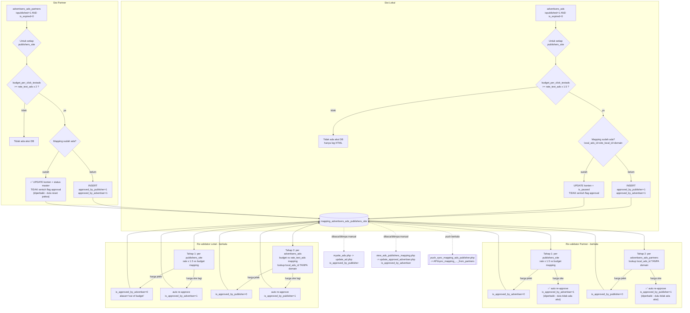

# Dokumentasi Detail — Mesin Mapping Iklan ↔ Situs Publisher

> Terkait: [CRONJOB_JOBS.md](./CRONJOB_JOBS.md) §2 Modul A & §4 (keempat file ini adalah bagian dari 23 skrip `public_html/cronjob/`, sudah diringkas di sana), [USER_DASHBOARD.md](./USER_DASHBOARD.md) Modul C & G (halaman dashboard yang membaca/menimpa hasil mapping ini secara manual: `mysite_ads.php`→`update_ad.php`, `view_ads_publishers_mapping.php`→`update_approval_advertiser.php`, dan pasangan `_partner`-nya), [DATABASE_ERD.md](./DATABASE_ERD.md) (skema penuh `mapping_advertisers_ads_publishers_site`).
>
> Dokumen ini adalah **pendalaman**, bukan pengganti, `CRONJOB_JOBS.md` — keempat file berikut dibaca ulang baris-demi-baris untuk menjelaskan algoritma persis, pembagian tanggung jawab antar-file, dan beberapa temuan perilaku yang belum tercatat sebelumnya (lihat §6).
>
> File yang dibahas: `public_html/cronjob/mapping_ads_publisher.php`, `mapping_ads_publisher_check_rate.php`, `mapping_ads_publisher_partner.php`, `mapping_ads_publisher_check_rate_partner.php`.

## 1. Apa yang Dilakukan Modul Ini

Modul ini adalah **mesin pencocokan otomatis** yang memasangkan setiap iklan aktif dengan setiap situs publisher, murni berdasarkan kecocokan harga — tanpa melibatkan kurasi konten manual di titik pencocokan itu sendiri. Hasilnya ditulis ke satu tabel bersama: `mapping_advertisers_ads_publishers_site`. Tabel yang sama ini juga dibaca-tulis oleh halaman dashboard (`mysite_ads.php`, `view_ads_publishers_mapping.php`, dst. — lihat [USER_DASHBOARD.md](./USER_DASHBOARD.md)) untuk approval manual, dan oleh `push_sync_mapping_ads_publisher.php` untuk disinkronkan ke jaringan partner.

Empat file dibagi menurut dua sumbu:

| | **Sumber Iklan: Lokal** (`advertisers_ads`, dibuat lewat `add_advertisement.php`) | **Sumber Iklan: Partner** (`advertisers_ads_partners`, cache hasil sinkron `API/sync_ads` dari jaringan mitra) |
|---|---|---|
| **Mesin pencocokan awal** (insert pasangan baru, sekali per kombinasi iklan×situs) | `mapping_ads_publisher.php` | `mapping_ads_publisher_partner.php` |
| **Re-validator berkala** (cek ulang rate/budget, approve/reject otomatis) | `mapping_ads_publisher_check_rate.php` | `mapping_ads_publisher_check_rate_partner.php` |

Keduanya berjalan sebagai skrip HTML-dump (bukan CLI murni — mencetak halaman Bootstrap/CSS lengkap untuk debugging manual di browser), dipanggil terjadwal lewat cron eksternal (tidak ada file crontab di repo — lihat catatan umum di `CRONJOB_JOBS.md` §1), dan **tidak ada locking** yang mencegah dua run tumpang tindih.

## 2. Tabel Data: `mapping_advertisers_ads_publishers_site`

Kolom-kolom kunci yang dipakai keempat file ini (skema penuh di `sql/kumpulbl_kbc_hanya_structure.sql:342-375`):

- **Kunci bisnis** (dipakai untuk cek "sudah ada/belum"): `local_ads_id` + `publishers_site_local_id` + `ads_providers_domain_url`. **Tidak ada UNIQUE KEY untuk kombinasi ini** di skema (`ALTER TABLE` hanya menambahkan `PRIMARY KEY (id)` dan beberapa `KEY` non-unique untuk `local_ads_id`/`publishers_site_local_id`/`ads_providers_domain_url`/`pubs_providers_domain_url` secara terpisah — lihat `sql/kumpulbl_kbc_hanya_structure.sql:1031-1036`). Keunikan murni ditegakkan di level aplikasi lewat pola *check-then-insert* — lihat risiko race condition di §6.
- `rate_text_ads` — **harga jual ke advertiser** (rate asli publisher × markup 1.5x/2x), **bukan** rate asli publisher. Nama kolom ini identik dengan `publishers_site.rate_text_ads` (rate asli, tanpa markup) — mudah tertukar kalau membaca dua tabel sekaligus.
- `budget_per_click_textads` — cache dari `advertisers_ads.budget_per_click_textads`/`advertisers_ads_partners.budget_per_click_textads` milik iklan tsb.
- `is_approved_by_publisher` / `is_approved_by_advertiser` — dua flag independen; kedua diskusi approval dashboard (`update_ad.php` untuk publisher, `update_approval_advertiser.php`/`_partner.php` untuk advertiser) hanya mengubah salah satu flag ini per submit.
- `is_published` / `is_paused` / `is_expired` (+ tanggalnya) — **cache** status dari iklan master (`advertisers_ads`/`advertisers_ads_partners`), bukan sumber kebenaran.
- `reasons_rejected_by_publisher` / `reasons_rejected_by_advertiser` — teks alasan, diisi otomatis `'out of budget'` oleh kedua file check-rate saat auto-reject harga; dikosongkan lagi (`''`) saat auto-approve ulang (hanya diimplementasikan di sisi lokal, lihat §6 #2).

## 3. Algoritma per File

### 3.1 `mapping_ads_publisher.php` — Mesin Pencocokan Awal (Lokal)

1. `SELECT * FROM advertisers_ads WHERE ispublished = 1 AND is_expired = 0` — ambil semua iklan lokal yang aktif (tidak difilter `is_paused`/`is_paid` di query ini, hanya ditampilkan sebagai badge status di HTML debug).
2. **Untuk setiap iklan**, loop **`SELECT * FROM publishers_site`** — **seluruh baris tanpa filter apa pun** (tidak ada filter status/kategori/kebijakan konten situs).
3. Hitung `rate_text_ads_with_markup = rate_text_ads (situs) × 1.5`.
4. **Gerbang tunggal**: kalau `budget_per_click_textads (iklan) >= rate_text_ads_with_markup` → lanjut ke langkah 5. Kalau tidak, **tidak ada aksi DB sama sekali** (baris log "Harga Tidak Cocok" saja) — mapping yang sudah ada sebelumnya (kalau ada) **tidak disentuh** di sini; penolakan sesungguhnya jadi tanggung jawab `mapping_ads_publisher_check_rate.php` (lihat §3.2).
5. Cek `mapping_advertisers_ads_publishers_site` by `(local_ads_id, publishers_site_local_id, ads_providers_domain_url)`:
   - **Sudah ada** → `UPDATE` kolom konten (`title_ads`, `description_ads`, `landingpage_ads`, `image_url`, `site_name`, `site_domain`, `site_desc`, `is_published`, `is_paused` — disalin dari status *master* `advertisers_ads` saat ini, `is_expired`, `expired_date`, `budget_per_click_textads`). **Tidak menyentuh** `rate_text_ads`, `is_approved_by_publisher`, `is_approved_by_advertiser`, atau kolom `reasons_rejected_*` — status approval yang sudah ada (baik hasil approval manual maupun auto-reject dari check-rate) tetap dipertahankan apa adanya.
   - **Belum ada** → `INSERT` baris baru dengan `is_approved_by_publisher = 1`, `is_approved_by_advertiser = 1` (keduanya **auto-approve** sejak lahir, tanpa tinjauan manusia), `approval_date_publisher`/`approval_date_advertiser = NOW()`.

### 3.2 `mapping_ads_publisher_check_rate.php` — Re-validator Berkala (Lokal)

Dua tahap independen, keduanya jalan penuh setiap kali dieksekusi (tidak ada filter "hanya yang berubah"):

**Tahap 1 — dari sisi situs publisher.** Untuk tiap `publishers_site`, hitung ulang `rate_with_margin = rate_text_ads × 1.5`, lalu ambil semua mapping-nya (`WHERE publishers_local_id = ? AND site_domain = ?` — cocok untuk kasus ini karena memang ingin mencakup **semua** iklan, lokal maupun partner, yang terpasang di situs tsb). Untuk tiap mapping:
- Kalau `rate_with_margin > budget_per_click_textads` (mapping) → `is_approved_by_advertiser = 0`, `reasons_rejected_by_advertiser = 'out of budget'`, refresh `rate_text_ads`.
- Kalau tidak → **auto-approve ulang**: `is_approved_by_advertiser = 1`, `reasons_rejected_by_advertiser = ''`, refresh `rate_text_ads` (dengan guard `WHERE ... AND (is_approved_by_advertiser != 1 OR rate_text_ads != ? OR reasons_rejected_by_advertiser != '')` supaya tidak menulis ulang kalau tidak ada perubahan).

Juga menampilkan peringatan visual (bukan aksi DB) kalau status mapping (`is_published`/`is_expired`/`is_paused`, cache) sedang tidak aktif.

**Tahap 2 — dari sisi iklan advertiser.** Untuk tiap `advertisers_ads`, ambil mapping-nya **`WHERE local_ads_id = ?`** (⚠️ tanpa filter `ads_providers_domain_url` — lihat §6 #3). Sebelum cek harga, kalau status master iklan tidak aktif (`is_paid=0` atau `ispublished=0` atau `is_expired=1` atau `is_paused=1`), **sinkronkan langsung** `is_published`/`is_expired`/`expired_date`/`is_paused`/`paused_date` di baris mapping mengikuti status master (supaya skrip ad-serving publik tidak menunggu `push_sync_ads_expired.php`). Baru kemudian cek harga:
- Kalau `budget_per_click_textads (iklan) < rate_text_ads (mapping, sudah termasuk markup)` → `is_approved_by_publisher = 0`, `reasons_rejected_by_publisher = 'out of budget'`.
- Kalau tidak → auto-approve ulang `is_approved_by_publisher = 1`, alasan dikosongkan (guard serupa Tahap 1).

### 3.3 `mapping_ads_publisher_partner.php` — Mesin Pencocokan Awal (Partner)

Struktur sama seperti §3.1, dengan tiga perbedaan penting:

1. Sumber iklan `advertisers_ads_partners` (bukan `advertisers_ads`), markup **2×** (bukan 1.5×).
2. Gerbang harga sama (`budget_per_click_textads >= rate_text_ads_with_markup`), tapi **tidak ada** badge status master ditampilkan/dicek sebelum loop (file ini tidak menarik kolom `ispublished`/`is_paused`/dst. dari `advertisers_ads_partners` sama sekali, hanya `ispublished=1 AND is_expired=0` di `WHERE` awal).
3. ✅ **Diperbaiki** — cabang UPDATE (mapping sudah ada) sebelumnya **memaksa ulang** `is_published = 1`, `is_paused = 0`, `is_expired = 0`, `is_approved_by_publisher = 1`, `is_approved_by_advertiser = 1`, dan mengosongkan **kedua** kolom `reasons_rejected_*` — **tanpa syarat**, setiap kali file ini berjalan dan gerbang harga di langkah 2 lolos, menimpa keputusan reject/pause manapun (manual lewat dashboard maupun auto-reject dari `mapping_ads_publisher_check_rate_partner.php`). Sekarang cabang UPDATE ini **tidak lagi menyentuh** `is_approved_by_publisher`/`is_approved_by_advertiser`/`approval_date_*`/`reasons_rejected_*` sama sekali (persis seperti versi lokal) — kolom itu murni tanggung jawab `mapping_ads_publisher_check_rate_partner.php`. `is_published`/`is_paused`/`is_expired`/`expired_date` tetap disegarkan, tapi sekarang dari nilai *master* `advertisers_ads_partners` yang sebenarnya (di-fetch ke `$ispublished`/`$is_paused`/`$is_expired`/`$expired_date`), bukan hardcode `1`/`0`/`0`. Detail lengkap di §6 #1.

### 3.4 `mapping_ads_publisher_check_rate_partner.php` — Re-validator Berkala (Partner)

Struktur sama seperti §3.2 (dua tahap, markup 1.5× untuk sisi publisher karena tahap ini membandingkan rate publisher lokal terhadap budget advertiser partner — bukan 2× seperti mesin pencocokan awalnya), tapi dengan satu perbedaan struktural penting:

- ✅ **Diperbaiki** — kedua tahap sebelumnya hanya punya cabang "tolak", tanpa cabang "auto-approve ulang": kalau harga cocok, kode hanya mencetak `"Oke: Harga Cocok"` tanpa `UPDATE` apa pun, sehingga `is_approved_by_advertiser`/`is_approved_by_publisher` tidak pernah kembali ke `1` secara otomatis setelah ditolak. Sekarang kedua tahap sudah punya cabang re-approve eksplisit (mengikuti pola guard yang sama seperti versi lokal §3.2: `UPDATE ... SET is_approved_by_* = 1, reasons_rejected_by_* = '', ... WHERE id = ? AND (is_approved_by_* != 1 OR ... OR reasons_rejected_by_* != '')`), jadi mapping partner yang sempat ditolak karena harga bisa pulih otomatis begitu harga membaik lagi, tanpa lagi bergantung pada reset paksa di §6 #1.
- Tahap 2 juga mengambil mapping lewat `WHERE local_ads_id = ?` tanpa filter domain — sama seperti versi lokal, lihat §6 #3.

## 4. Perbandingan Lokal vs Partner

| Aspek | Lokal (`mapping_ads_publisher.php` + `_check_rate.php`) | Partner (`mapping_ads_publisher_partner.php` + `_check_rate_partner.php`) |
|---|---|---|
| Sumber iklan | `advertisers_ads` | `advertisers_ads_partners` |
| Markup harga jual | 1.5× | 2× |
| Filter situs saat mencocokkan | Tidak ada (semua `publishers_site`) | Tidak ada (semua `publishers_site`) |
| Auto-approve saat INSERT pertama kali | Ya (`is_approved_by_*=1`) | Ya (`is_approved_by_*=1`) |
| UPDATE saat mapping sudah ada (mesin pencocokan) | Hanya kolom konten + `is_paused`/`is_expired`/`is_published` (disalin dari master) + `budget_per_click_textads`; **tidak** menyentuh `is_approved_by_*`/alasan reject | ✅ **Diperbaiki** — dulu reset paksa `is_approved_by_publisher=1`, `is_approved_by_advertiser=1`, `is_paused=0`, `is_expired=0`, alasan reject dikosongkan tanpa syarat; sekarang sama seperti versi lokal (hanya kolom konten + status master, tidak menyentuh flag approval) |
| Re-approve otomatis di file check-rate saat harga membaik kembali | Ya, eksplisit di kedua tahap | ✅ **Diperbaiki** — dulu tidak ada (hanya bisa auto-reject); sekarang eksplisit di kedua tahap, mengikuti pola guard yang sama seperti versi lokal |
| Lookup mapping by iklan di Tahap 2 check-rate | `WHERE local_ads_id = ?` (tanpa domain) | `WHERE local_ads_id = ?` (tanpa domain) — risiko sama |
| Riwayat keamanan query | Prepared statement sejak awal | Sempat raw-interpolated tanpa sanitasi kutip, **sudah diperbaiki** (lihat `CRONJOB_JOBS.md` §5 finding #5) |

## 5. Diagram Mermaid

### 5.1 Alur Keputusan Mesin (per run cron)



### 5.2 Siklus Hidup Satu Baris Mapping — Sekarang Simetris Lokal ↔ Partner

> ✅ Per perbaikan terbaru, sisi partner mengikuti pola yang sama persis dengan sisi lokal — diagram di bawah ini adalah perilaku **saat ini** (bukan lagi menggambarkan bug lama; lihat §6 #1 dan #2 untuk riwayat sebelum diperbaiki).

```mermaid
stateDiagram-v2
    [*] --> BelumAda: Iklan aktif + situs baru\nharga cocok (gerbang markup)

    BelumAda --> Approved: INSERT pertama kali\n(auto-approve dua arah, TANPA tinjauan manual)

    Approved --> RejectedHarga: check-rate mendeteksi\nharga sudah tidak cocok
    Approved --> RejectedManual: Publisher/Advertiser\nreject manual via dashboard

    state "Sisi LOKAL (mapping_ads_publisher.php + _check_rate.php)" as SL {
        RejectedHarga --> Approved: check-rate re-approve otomatis\nbegitu harga cocok lagi
        RejectedManual --> RejectedManual: mesin pencocokan awal\nTIDAK menyentuh flag approval\n(keputusan manual tetap sticky)
    }

    state "Sisi PARTNER (mapping_ads_publisher_partner.php + _check_rate_partner.php)" as SP {
        RejectedHarga --> Approved: ✅ check-rate_partner sekarang\nre-approve otomatis juga\n(diperbaiki - dulu one-way ratchet)
        RejectedManual --> RejectedManual: ✅ mesin pencocokan partner sekarang\nTIDAK lagi reset paksa\n(diperbaiki - dulu ikut approved lagi)
    }

    Approved --> [*]: Ditampilkan ke show_ads_native*.js.php\n(di luar cakupan dokumen ini)
```

## 6. Temuan Penting (Analisis Mendalam)

1. ✅ **Diperbaiki — reset paksa approval di `mapping_ads_publisher_partner.php` yang dulu menimpa keputusan reject/pause manual maupun otomatis.** Sebelumnya, selama gerbang harga (`budget_per_click_textads >= rate × 2`) masih lolos, **setiap kali** file ini berjalan (dijadwalkan berkala), cabang UPDATE-nya menulis ulang `is_approved_by_publisher=1`, `is_approved_by_advertiser=1`, `is_paused=0`, `is_expired=0`, dan mengosongkan kedua kolom alasan reject — **tanpa mengecek nilai sebelumnya sama sekali**. Efeknya: (a) kalau publisher sengaja menolak sebuah iklan partner lewat `mysite_ads.php`/`update_ad.php` karena alasan konten (bukan harga), penolakan itu **otomatis dibatalkan** pada run cron berikutnya selama harga masih cocok; (b) kalau `mapping_ads_publisher_check_rate_partner.php` sempat menolak mapping karena harga jelek, lalu harga membaik, mapping ikut kembali approved lewat file ini — yang secara kebetulan "benar" untuk kasus harga, tapi juga membatalkan reject berbasis konten yang tidak berkaitan dengan harga sama sekali. **Sudah diperbaiki**: cabang UPDATE sekarang hanya menyegarkan kolom konten (`title_ads`, `description_ads`, `landingpage_ads`, `image_url`, `site_name`, `site_domain`, `site_desc`, `budget_per_click_textads`, `revenue_publishers`) dan status master (`is_published`/`is_paused`/`is_expired`/`expired_date`, disalin dari `advertisers_ads_partners` yang sebenarnya) — **tidak lagi menyentuh** `is_approved_by_publisher`/`is_approved_by_advertiser`/`approval_date_*`/`reasons_rejected_*`, persis seperti pola yang sudah benar di versi lokal (`mapping_ads_publisher.php`). Cabang INSERT (pasangan baru) tidak diubah — auto-approve saat pertama kali dibuat tetap dipertahankan sebagai desain yang disengaja (lihat #6 di bawah), dan sekarang juga mewarisi `is_paused` dari status master alih-alih selalu hardcode `0`.
2. ✅ **Diperbaiki — `mapping_ads_publisher_check_rate_partner.php` dulu adalah "ratchet satu arah".** Kedua tahapnya sebelumnya hanya bisa mengubah status ke *rejected* (saat harga jelek), tidak pernah mengembalikan ke *approved* saat harga membaik lagi (tidak ada query UPDATE di cabang "harga cocok") — kontras dengan versi lokal yang eksplisit menulis ulang status approve di kedua tahap. Karena perbaikan #1 di atas menghapus reset paksa yang (secara tidak sengaja) berfungsi sebagai satu-satunya jalan pemulihan otomatis untuk kasus harga, kedua tahap file ini **sekarang juga punya cabang re-approve eksplisit** (pola guard sama seperti versi lokal: `UPDATE ... SET is_approved_by_* = 1, reasons_rejected_by_* = '', ... WHERE id = ? AND (is_approved_by_* != 1 OR ... OR reasons_rejected_by_* != '')`), sehingga mapping partner yang ditolak karena harga tetap bisa pulih otomatis begitu harga membaik — tanpa perlu menimpa reject berbasis konten.
3. ⚠️ **Potensi tabrakan ID lintas-jaringan di lookup Tahap 2 kedua file check-rate.** `mapping_ads_publisher_check_rate.php` (Tahap 2) dan `mapping_ads_publisher_check_rate_partner.php` (Tahap 2) sama-sama mengambil mapping lewat `WHERE local_ads_id = ?` **tanpa** menyertakan `ads_providers_domain_url` dalam filter — padahal `local_ads_id` hanyalah PK auto-increment di server asalnya masing-masing (`advertisers_ads.id`/`advertisers_ads_partners.local_ads_id` yang disalin dari `id` server partner, lihat `add_advertisement.php` dan skema `advertisers_ads_partners` — keduanya mulai dari 1 dan bertambah independen). Karena tabel mapping menyimpan baris untuk **kedua** sumber (lokal dan partner) sekaligus dan `local_ads_id` kecil sangat mungkin bertabrakan antar-jaringan, query di kedua file ini berisiko memproses baris mapping milik jaringan yang salah — mis. `mapping_ads_publisher_check_rate.php` (dimaksudkan untuk memvalidasi iklan **lokal**) bisa saja ikut menyetujui/menolak baris mapping yang sebenarnya milik iklan **partner** dengan `local_ads_id` yang sama.
4. ⚠️ **Tidak ada UNIQUE constraint di level database untuk kunci bisnis mapping** (`local_ads_id` + `publishers_site_local_id` + `ads_providers_domain_url`) — hanya index biasa (lihat §2). Pola *check-then-insert* di `mapping_ads_publisher.php`/`_partner.php` murni bergantung pada logika aplikasi untuk mencegah duplikat. Digabung dengan tidak adanya locking antar-run cron (dicatat juga secara umum di `CRONJOB_JOBS.md` §1), dua eksekusi yang tumpang tindih (mis. cron sebelumnya belum selesai saat yang berikutnya mulai) berisiko membuat baris mapping duplikat untuk kombinasi iklan×situs yang sama.
5. **Kebijakan konten publisher (`advertiser_allowed`/`advertiser_rejected` di `publishers_site`, diisi lewat `add_site.php`/`mysite.php`) sama sekali tidak dibaca oleh mesin pencocokan ini.** Dikonfirmasi lewat pencarian seluruh `public_html/`: kedua kolom ini hanya **ditulis** (`add_site.php`, `add_site_internal.php`, `mysite.php`) dan **ditampilkan sebagai teks referensi** (`mysite_ads.php`, `view_rate_publisher.php`/`_partner.php`, `admin/manage_publishers.php`) — tidak pernah dipakai sebagai kondisi `WHERE`/`if` di file manapun, termasuk keempat file mapping ini. Artinya: kebijakan "advertiser yang diizinkan/ditolak" yang diisi publisher murni informasi untuk dibaca manusia, **bukan filter otomatis** — sebuah iklan dari kategori yang secara eksplisit "ditolak" publisher tetap akan dipasangkan & auto-approved oleh mesin ini selama harga cocok, dan publisher harus proaktif menemukan lalu me-reject manual satu-per-satu lewat `mysite_ads.php` kalau tidak berkenan.
6. **Auto-approve tanpa tinjauan manusia adalah desain yang disengaja, bukan bug** — baik `mapping_ads_publisher.php` maupun `mapping_ads_publisher_partner.php` men-set `is_approved_by_publisher=1` DAN `is_approved_by_advertiser=1` sekaligus pada saat INSERT pertama kali, semata berdasarkan gerbang harga. Kombinasi dengan temuan #5 berarti gerbang satu-satunya sebelum sebuah iklan benar-benar tayang di situs publisher adalah **harga**, bukan kecocokan konten/kebijakan — kontrol konten sepenuhnya reaktif (publisher/advertiser harus login dan reject manual setelah pasangan terbentuk).
7. **Markup 1.5× (lokal) vs 2× (partner) konsisten dengan bagian lain sistem** — sudah didokumentasikan di `USER_DASHBOARD.md` (harga jual di `view_rate_publisher.php` vs `view_rate_publisher_partner.php` memakai markup yang sama) dan `CRONJOB_JOBS.md`, bukan temuan baru, dicantumkan di sini untuk kelengkapan tabel §4.
8. **Tidak ada penanganan error untuk `mysqli->query()`/`prepare()` yang gagal** di keempat file (pola umum yang sama seperti skrip cronjob lain) — kalau query utama gagal (mis. koneksi putus di tengah loop besar), `$result_ads->num_rows` pada objek `false` akan memicu fatal error dan skrip berhenti tanpa mekanisme retry/alert.

## 7. Ringkasan Keterkaitan Antar-Dokumen

- Hasil kerja modul ini (kolom `is_approved_by_*`, `is_published`, dst. di `mapping_advertisers_ads_publishers_site`) adalah **data yang ditampilkan dan bisa ditimpa manual** oleh 4 halaman dashboard: `mysite_ads.php`→`update_ad.php` (publisher), `view_ads_publishers_mapping.php`→`update_approval_advertiser.php` (advertiser, mapping lokal), `view_ads_publishers_partner_mapping.php`→`update_approval_advertiser_partner.php` (advertiser, mapping partner) — detail lengkap masing-masing endpoint ada di [USER_DASHBOARD.md](./USER_DASHBOARD.md) Modul C & G.
- Baris yang statusnya diperbarui modul ini (khususnya arah `pubs_providers_domain_url`/`ads_providers_domain_url` yang melibatkan partner) selanjutnya diambil `push_sync_mapping_ads_publisher.php` untuk dikirim ke jaringan mitra — lihat `CRONJOB_JOBS.md` §4 Modul E.
- `is_expired`/`is_paused` cache di tabel mapping ini juga disentuh terpisah oleh `push_sync_ads_expired.php` (tahap 2-5) untuk sinkronisasi dua-arah status — lihat `CRONJOB_JOBS.md` §4 Modul E, terutama catatan bahwa tanpa langkah itu status bisa "nyangkut" karena mesin di dokumen ini hanya me-refresh baris yang lolos gerbang harga.
