# Dokumentasi Dashboard User — `public_html/` (root) — Publisher (Blogger) & Advertiser

> Terkait: [ADMIN_PANEL.md](./ADMIN_PANEL.md) (panel admin terpisah, `public_html/admin/`), [API_ENDPOINTS.md](./API_ENDPOINTS.md) (endpoint federasi server-to-server yang dipanggil dari beberapa file di sini, mis. `update_approval_advertiser_partner.php`), [DATABASE_ERD.md](./DATABASE_ERD.md) (skema tabel `msusers`, `advertisers_ads*`, `publishers_site*`, `mapping_advertisers_ads_publishers_site*`, `articles`, `influencer_media`, dll.), [CRONJOB_JOBS.md](./CRONJOB_JOBS.md) (rekalkulasi terjadwal yang beririsan dengan beberapa halaman di sini).
>
> Ada dokumen alur bisnis level tinggi yang sudah ada lebih dulu di `../documentation/` (`02-aktor-dan-peran.md`, `03-alur-publisher.md`, `04-alur-advertiser.md`, `08-konten-artikel-dan-ai-tools.md`, `09-influencer-marketing.md`) — dokumen ini melengkapinya dengan **detail per-file** teknis, mengikuti format yang sama seperti [ADMIN_PANEL.md](./ADMIN_PANEL.md).

## 1. Ringkasan

`public_html/` (root, di luar `admin/`, `API/`, `cronjob/`, `blog/`, dll. yang sudah/akan didokumentasikan terpisah) berisi **106 file PHP**. Dokumen ini mencakup **78 di antaranya** — semua halaman yang benar-benar menjadi bagian dari *dashboard user setelah login* (memakai satu sesi `msusers` yang sama untuk peran Publisher/Blogger, Advertiser, dan Influencer/pemilik media). **28 file sisanya sengaja tidak dibahas** karena bukan bagian dashboard — lihat §6.

Karakteristik umum:

- **Satu akun, banyak peran.** Sesuai `documentation/02-aktor-dan-peran.md`: tidak ada pemilihan "jenis akun" saat registrasi (`reg.php`). Setelah login, `dashboard.php` menampilkan `main_menu.php` dengan tombol **Advertiser** dan **Publisher** yang sama-sama bisa diakses akun manapun. Peran ditentukan oleh tindakan: menambah situs (`add_site.php`) → jadi publisher; membuat iklan (`add_advertisement.php`) → jadi advertiser. Sub-fitur **Influencer Media** (`add_media_influencer.php` dkk.) adalah lapisan tambahan di atas peran publisher (pemilik media menjual slot, advertiser membelinya).
- **Guard sesi standar**: `session_start(); if (!isset($_SESSION['user_id'])) { header("Location: login.php"); exit(); }` di baris atas — dipakai di **sebagian besar** file; dua variabel session (`user_id`, `email`) yang di-set oleh `login.php` menjadi kontrak yang diandalkan seluruh dashboard. Beberapa endpoint AJAX berdampak rendah (`get_ideas.php`, `check_username.php`) masih memanggil `session_start()` tanpa memeriksa isinya.
- **Guard sesi ≠ guard kepemilikan.** Banyak halaman yang sudah benar mengecek login ternyata tidak selalu memverifikasi bahwa *baris data* yang diminta (`ad_id`, `pub_id`, dst.) benar-benar milik `$_SESSION['user_id']` yang sedang login — pola IDOR (Insecure Direct Object Reference) berulang di beberapa file, lihat §5.
- **Koneksi DB dibuka ulang di tiap file** (pola sama seperti `admin/`), umumnya lewat `include("db.php")` lalu `new mysqli(...)` manual — kecuali klaster artikel/AI yang memakai `class Database` dari `config.php`.
- **Dua sistem shared-library berdampingan**: mayoritas halaman meng-include `function.php` (yang berantai meng-include `function_provider.php`, `function_ads.php`, `function_publisher.php`), sementara klaster artikel/AI (23 file) memakai `config.php` (class `Database`, class `Logger`, helper provider-JSON versi sendiri). Keduanya punya implementasi independen untuk fungsi serupa (lihat temuan §5).
- **Beberapa klaster file yatim/duplikat** (backup lama yang lupa dihapus, atau draft yang tidak pernah ditautkan) — jumlahnya cukup signifikan, terutama di modul artikel. Lihat penanda "Status" di tabel §2 dan detail di §4/§5.

## 2. Tabel Ringkas & Pengelompokan

| Modul | Halaman | Fungsi singkat | Guard sesi |
|---|---|---|---|
| **A. Auth & Registrasi** | `reg.php` | Registrasi publik: reCAPTCHA v3 → email unik → password acak via email | — (pra-login) |
| | `login.php` | Login `msusers`, set `$_SESSION['user_id']`/`['email']` | — (ini halaman login) |
| | `logout.php` | `session_destroy()` + redirect login | — |
| | `forgot_password.php` | Form lupa password → email link reset | — (pra-login) |
| | `forgot_password_2.php` | ⚠️ Duplikat byte-identik, orphan | — |
| | `reset_password.php` | Set password baru dari link email | — (pra-login) |
| | `check_username.php` | AJAX cek ketersediaan username (`publisher_quota`) | session tanpa gate |
| **A. Layout Dashboard Bersama** | `dashboard.php` | Landing pasca-login, render `main_menu.php` | ✅ |
| | `main_menu.php` | Partial: sapaan, link Profil/Advertiser/Publisher/Settings/Logout | — (include) |
| | `publisher_menu.php` | Halaman antara → `include_publisher_menu.php` | ✅ |
| | `advertiser_menu.php` | Halaman antara → `include_advertiser_menu.php` | ✅ |
| | `include_publisher_menu.php` | Partial grid 7 tombol menu publisher | — (include) |
| | `include_advertiser_menu.php` | Partial grid 4 tombol menu advertiser | — (include) |
| | `profile.php` | Edit nama/rekening bank (`msusers`) | ✅ |
| | `settings.php` | Ganti password sendiri | ✅ |
| **A. Shared Library** | `config.php` | Config + class `Database`/`Logger` (khusus klaster artikel/AI) | — (library) |
| | `db.php` | Baca `.env`, isi variabel kredensial legacy | — (library) |
| | `function.php` | Entry point library utama (di-include 48+ halaman) | — (library) |
| | `function_ads.php` | Helper insert advertiser/iklan (jalur API federasi) | — (library) |
| | `function_provider.php` | Rekonsiliasi revenue provider/partner | — (library) |
| | `function_provider_request_join.php` | INSERT/UPDATE federasi join provider | — (library) |
| | `function_publisher.php` | Rekalkulasi revenue paid/unpaid publisher | — (library) |
| | `function_send_email.php` | `sendmail()` — kirim email transaksional | — (library) |
| | `logger.php` | ⚠️ Dead code — semua pemanggil di-comment | — (library) |
| **B. Publisher — Situs & Slot Iklan** | `add_site.php` | Tambah situs publisher eksternal | ✅ |
| | `add_site_internal.php` | Daftar blog internal + kuota artikel AI awal | ✅ |
| | `mysite.php` | Daftar situs milik user, edit, ambil script embed | ✅ |
| | `mysite_ads.php` | Detail 1 situs: iklan yang tayang di situs itu | ✅ |
| **C. Advertiser — Riset Publisher & Approval Mapping** | `view_ads_publishers_mapping.php` | Publisher lokal yang menayangkan 1 iklan + approve/reject | ✅ |
| | `view_ads_publishers_partner_mapping.php` | Sama, untuk mapping jaringan partner | ✅ |
| | `view_rate_publisher.php` | Directory rate situs publisher lokal | ✅ |
| | `view_rate_publisher_partner.php` | Directory rate situs publisher partner | ✅ |
| **D. Publisher — Directory Iklan Tersedia** | `view_advertiser_list.php` | Directory iklan lokal published | ✅ |
| | `view_advertiser_list_partner.php` | Directory iklan partner published | ✅ |
| | `view_ads_sort_by_highest_bid_per_click.php` | Leaderboard iklan by bid per klik | ✅ |
| **E. Laporan Klik** | `clicks_ads_local_detail.php` | Detail klik 1 iklan lokal (advertiser) | ✅ + kepemilikan |
| | `clicks_ads_partner_detail.php` | Detail klik partner dengan guard dan validasi pemilik iklan | ✅ + kepemilikan |
| | `clicks_publisher_ads_partner_detail.php` | Rekap klik semua situs milik user per provider | ✅ + kepemilikan |
| | `clicks_publisher_detail.php` | Detail klik 1 situs — ⚠️ tanpa cek kepemilikan `pub_id` | ✅ (IDOR) |
| | `process_clicks_report_csv.php` | Export CSV klik iklan lokal | ✅ + kepemilikan |
| | `process_clicks_report_csv_partner.php` | Export CSV klik iklan partner | ✅ + kepemilikan |
| **F. Publisher — Konten Artikel & AI Tools** | `add_article.php` | Generate artikel via AI (2 tahap) | ✅ |
| | `edit_article.php` | Edit artikel (editor Quill) | ✅ |
| | `edit_article2.php` | ⚠️ Duplikat `edit_article.php`, orphan | ✅ |
| | `edit_article_tm.php` | ⚠️ Varian TinyMCE+CSRF, orphan (lebih baik dari yang aktif) | ✅ |
| | `edit_article_backup.php` | ⚠️ Backup lama, orphan | ✅ |
| | `view_edit_articles.php` | Daftar artikel milik publisher | ✅ |
| | `view_edit_articles_backup.php` | ⚠️ Versi lama, orphan | ✅ |
| | `article_api.php` | API JSON: cek kuota, generate (riset web+OpenAI), ambil artikel | ✅ |
| | `article_api_backup.php` | ⚠️ Versi lama tanpa riset web, orphan | ✅ |
| | `upload_image_article.php` | Upload gambar inline editor Quill | ✅ |
| | `upload_image_article_tm.php` | ⚠️ Upload untuk TinyMCE, orphan tak-langsung | ✅ |
| | `generate_ai_images.php` | Generate gambar artikel (OpenAI Images / Replicate lama) | ✅ |
| | `view_ai_images_articles.php` | Daftar artikel + tombol generate/get AI image | ✅ |
| | `generate_audio_summary.php` | Ringkas + TTS artikel jadi MP3 | ✅ |
| | `view_summary_audio_articles.php` | Daftar artikel + tombol generate audio | ✅ |
| | `generate_quiz.php` | Generate Q&A ("Summary FAQ") dari artikel | ✅ |
| | `view_quiz_articles.php` | Daftar artikel + tombol generate FAQ | ✅ |
| | `get_ideas.php` | ⚠️ AJAX 500 ide artikel acak — tanpa cek session | session tanpa gate |
| **G. Advertiser — Manajemen Iklan** | `add_advertisement.php` | Form buat iklan baru + upload banner | ✅ |
| | `edit_ads.php` | Edit iklan (judul/desk/gambar/budget-per-click) | ✅ |
| | `update_ad.php` | ⚠️ *Nama menyesatkan* — sebenarnya approval publisher atas mapping | ✅ (tanpa cek kepemilikan mapping) |
| | `delete_ads.php` | Hapus iklan milik user | ✅ + kepemilikan |
| | `pause_resume_ads.php` | Toggle pause iklan milik user | ✅ + kepemilikan |
| | `view_ads.php` | List+filter iklan milik sendiri, modal aksi | ✅ |
| | `update_approval_advertiser.php` | Approval advertiser atas mapping lokal | ✅ |
| | `update_approval_advertiser_partner.php` | Approval mapping partner dan sinkronisasi aman server-to-server | ✅ + kepemilikan |
| **H. Influencer Media** | `add_media_influencer.php` | Daftarkan slot media (publisher/pemilik media) | ✅ |
| | `mymedia.php` | List media milik sendiri | ✅ |
| | `edit_media.php` | Edit media milik sendiri (kepemilikan tervalidasi) | ✅ |
| | `delete_media.php` | Hapus media milik sendiri (via GET, bukan POST) | ✅ |
| | `listmedia.php` | Katalog semua media (advertiser) + keranjang + checkout | ✅ |
| **I. Pembayaran & Invoice** | `mypayment.php` | Riwayat pembayaran yang sudah dicairkan admin | ✅ |
| | `myrevenue.php` | Akumulasi revenue per situs (include lintas-folder ke `admin/function_admin.php`) | ✅ |
| | `list_invoice_payment.php` | Daftar order pembelian influencer media | ✅ |
| | `delete_invoice.php` | Hapus order milik sendiri | ✅ |
| | `confirm_payment.php` | Catat notifikasi "sudah transfer" (bukan payment gateway) | ✅ |
| | `update_paid_desc.php` | Catat notifikasi bukti transfer budget iklan | ✅ |

## 3. Diagram Navigasi & Alur Data

```mermaid
flowchart TD
    LOGIN[login.php] -->|session user_id+email| DASH[dashboard.php]
    DASH --> MENU[main_menu.php]
    MENU --> PROF[profile.php]
    MENU --> SET[settings.php]
    MENU --> PM[publisher_menu.php]
    MENU --> AM[advertiser_menu.php]

    subgraph PUB[Publisher/Blogger]
        PM --> IPM[include_publisher_menu.php]
        IPM --> VAL[view_advertiser_list.php]
        IPM --> VALP[view_advertiser_list_partner.php]
        IPM --> VSORT[view_ads_sort_by_highest_bid_per_click.php]
        IPM --> ASITE[add_site.php]
        IPM --> MSITE[mysite.php]
        IPM --> MREV[myrevenue.php]
        IPM --> MPAY[mypayment.php]
        ASITE -->|redirect| MSITE
        MSITE --> MSADS[mysite_ads.php]
        MSITE -.script embed.-> JSPUB[["show_ads_native*.js.php (luar cakupan)"]]
        MSADS -->|approve mapping| UPDAD[update_ad.php]
        MSITE --> CPD[clicks_publisher_detail.php]
        MSITE --> CPAPD[clicks_publisher_ads_partner_detail.php]
    end

    subgraph ADV[Advertiser]
        AM --> IAM[include_advertiser_menu.php]
        IAM --> VADS[view_ads.php]
        IAM --> AADV[add_advertisement.php]
        IAM --> VRP[view_rate_publisher.php]
        IAM --> VRPP[view_rate_publisher_partner.php]
        AADV -->|redirect| VADS
        VADS --> EADS[edit_ads.php]
        VADS --> PRA[pause_resume_ads.php]
        VADS --> DADS[delete_ads.php]
        VADS --> UPD[update_paid_desc.php]
        VADS --> VAPM[view_ads_publishers_mapping.php]
        VADS --> VAPMP[view_ads_publishers_partner_mapping.php]
        VADS --> CAL[clicks_ads_local_detail.php]
        VADS --> CAP[clicks_ads_partner_detail.php]
        VAPM --> UAA[update_approval_advertiser.php]
        VAPMP --> UAAP[update_approval_advertiser_partner.php]
        UAAP -.POST public_key/secret_key.-> APIPART[["API/approval_advertiser_partner (luar cakupan)"]]
    end

    subgraph CONTENT[Publisher - Konten Artikel and AI]
        MSADS -.tautan dari add_site_internal.-> AART[add_article.php]
        AART -->|AJAX generate+publish| AAPI[article_api.php]
        AART -->|AJAX ide| GIDEAS[get_ideas.php]
        AART -.redirect setelah publish.-> BLOG[["blog/{username}/{pub_id}/{slug} (luar cakupan)"]]
        VEA[view_edit_articles.php] --> EART[edit_article.php]
        EART -->|AJAX upload gambar| UIA[upload_image_article.php]
        VAI[view_ai_images_articles.php] --> GAI[generate_ai_images.php]
        VSUM[view_summary_audio_articles.php] --> GAS[generate_audio_summary.php]
        VQZ[view_quiz_articles.php] --> GQ[generate_quiz.php]
    end

    subgraph MEDIA[Influencer Media]
        AMI[add_media_influencer.php] --> MYM[mymedia.php]
        MYM --> EM[edit_media.php]
        MYM --> DM[delete_media.php]
        LM[listmedia.php] -.session cart, checkout.-> HBI[(hasil_belanja_influencer)]
        HBI --> LIP[list_invoice_payment.php]
        LIP --> CP[confirm_payment.php]
        LIP --> DI[delete_invoice.php]
    end

    MPAY -.->|recalculate publisher revenue| MSU[(msusers)]
    MREV -.->|recalculate local and global revenue| MSU
```

## 4. Detail per Modul

### Modul A — Auth, Registrasi, Layout Dashboard & Shared Library

#### `reg.php`
Form registrasi publik. Verifikasi Google reCAPTCHA v3 (score ≥ 0.5), cek email unik (`SELECT COUNT(*) FROM msusers WHERE loginemail = ?`, prepared), generate password acak 10 karakter, `password_hash()`, INSERT ke `msusers` (`loginemail`, `passwords`, `whatsapp`, `forgot_password_key`, `regdate`) — **tidak ada pemilihan jenis akun**, sesuai `documentation/02-aktor-dan-peran.md`. Kirim email berisi password plaintext via `sendmail()`. Tombol "Lanjut ke login" mem-POST email+password ke `login.php` untuk prefill form.

#### `login.php`
Form login `msusers`. Mode `prefill` (dari tombol di `reg.php`) hanya mengisi ulang nilai form, tidak menyentuh DB. Login sungguhan: `SELECT ... WHERE loginemail = ?` (prepared) + `password_verify()`. Sukses → `session_regenerate_id(true)`, set `$_SESSION['user_id']` = `msusers.id` dan `$_SESSION['email']` = `msusers.loginemail` — **dua variabel session ini adalah kontrak yang dipakai seluruh halaman dashboard lain sebagai guard** — lalu UPDATE `last_login` + reset `number_last_login_attempt=0`. Gagal → increment `number_last_login_attempt`, tapi **nilai ini tidak pernah dibaca/ditegakkan** — tidak ada rate-limit/lockout riil untuk akun `msusers`, berbeda dari `admin/login.php` yang sudah punya lockout 15 menit setelah 5 kali gagal (lihat `docs/ADMIN_PANEL.md` §5 finding #8 — temuan itu masih akurat per kode saat ini).

#### `logout.php`
`session_start()` + `session_destroy()` + redirect `login.php`.

#### `forgot_password.php`
reCAPTCHA v3, cek email dengan **interpolasi string langsung** (`real_escape_string`, bukan prepared statement — beda gaya dari `reg.php`/`login.php`), generate `forgot_password_key` 50 karakter, kirim link `reset_password.php?key=...`.

#### `forgot_password_2.php`
**Duplikat byte-identik 100%** dari `forgot_password.php` (`diff` kosong). Tidak ditautkan dari mana pun — file mati, pola sama seperti `admin/approval_join_force2.php` (`docs/ADMIN_PANEL.md` §5 #4).

#### `reset_password.php`
Terima `?key=`, cocokkan ke `msusers.forgot_password_key` (interpolasi string langsung juga), set password baru + kosongkan key (cegah reuse). Tidak ada pengecekan kedaluwarsa waktu.

#### `check_username.php`
AJAX (`session_start()` tanpa gate — hanya dipanggil dari halaman yang sudah ter-gate). Cek `username` di **`publisher_quota`** (bukan `msusers`), dipakai `add_site_internal.php`.

#### `dashboard.php`
Landing pasca-login. Guard standar. Render `main_menu.php`.

#### `main_menu.php`
Partial (tanpa guard sendiri). Sapaan email, link Profil/Advertiser/Publisher/Pengaturan/Logout — hub navigasi yang mewujudkan model "satu akun, dua peran".

#### `publisher_menu.php` / `advertiser_menu.php`
Halaman antara identik strukturnya: guard sesi, include `main_menu.php`, lalu include partial menu perannya (`include_publisher_menu.php`/`include_advertiser_menu.php`).

#### `include_publisher_menu.php`
Partial, grid 7 tombol: Advertiser Lokal, Advertiser Partner, Iklan Berjalan, Tambah Site, Site Saya, Pendapatan, Pembayaran — peta navigasi resmi peran Publisher.

#### `include_advertiser_menu.php`
Partial, grid 4 tombol: Iklan Saya, Tambah Iklan, Rate Publisher Lokal, Rate Publisher Partner — peta navigasi resmi peran Advertiser.

#### `profile.php`
Edit `realname`/`bank`/`account_name`/`account_number` di `msusers` — data ini dipakai admin untuk pencairan dana publisher (`admin/fetch_bank_details.php`).

#### `settings.php`
Ganti password sendiri (verifikasi lama, validasi panjang ≥8, `password_hash()`).

#### `config.php`
Bukan halaman — dipakai khusus klaster artikel/AI (23 file: `add_article.php`, `edit_article*.php`, `article_api*.php`, `generate_*`, dll.). Berisi array `$config`, class `Database` (wrapper mysqli), class `Logger`, `get_providers_domain_url_json()`/`getProvidersNameById_JSON()` versi sendiri, `sanitize_input()`/`validate_input()`. Modul lain (Auth/Layout, Publisher situs, Advertiser iklan) tidak meng-include file ini — mereka pakai `function.php`.

#### `db.php`
Baca kredensial dari `.env` **di luar web root**, validasi semua key wajib, isi variabel legacy (`$servername_db` dkk.) untuk kompatibilitas. Setiap halaman tetap harus bikin koneksi `mysqli` sendiri setelahnya.

#### `function.php`
Entry point library yang di-include di **48 dari 78** halaman dashboard. Meng-include `function_provider.php`, `function_ads.php`, `function_publisher.php` — jadi satu `include` memuat seluruh rantai. Isi langsung: `CLICK_SKEY_SECRET`/`build_click_skey()` (HMAC tanda tangan klik, dipakai skrip ad-serving publik di luar cakupan), `is_probable_bot_user_agent()`/`count_recent_clicks()` (anti-fraud), `updateRevenueForUser()` (dipakai `mypayment.php`), berbagai `get_providers_*` (lookup tabel `providers`).

#### `function_ads.php`
`insertAdvertiser()`, `insertAdvertisersAds()`/`updateAdvertisersAds()` — dipakai jalur federasi `API/insert_advertiser`/`API/insert_ads`, bukan dipanggil langsung dari halaman dashboard.

#### `function_provider.php`
`updateProviderRevenue()`, `getProvidersNameById_JSON()` (lihat temuan duplikasi §5), `checkProviderCredentials()` — mekanisme federasi provider/partner, ikut ter-load tiap kali `function.php` di-include meski tidak relevan untuk halaman dashboard biasa.

#### `function_provider_request_join.php`
`insertProvidersRequest()`, `UpdateProviderPartner()` — mendukung alur `API/request_join`. Berisi banyak `echo` debug polos.

#### `function_publisher.php`
`updatePublisherRevenuePaid_unPaid()`, `updateRevenueTotal()` (dipanggil `pay_pubs_partner.php`/admin setelah pembayaran), `rekapTotalPublisherPartner()`, `calculateTotalRevenue()` — rekalkulasi revenue publisher.

#### `function_send_email.php`
`sendmail()` — POST ke API pihak ketiga `aplikasi.kirim.email`. Dipakai `reg.php`, `forgot_password.php`/`forgot_password_2.php`.

#### `logger.php`
Class `Logger` — **dead code**, semua referensi (`article_api.php`, `generate_*.php`, dll.) berbentuk `//require_once("logger.php")` yang di-comment. Fungsinya digantikan definisi ulang `class Logger` di `config.php`.

### Modul B — Publisher (Blogger): Kelola Situs & Slot Iklan

#### `add_site.php`
Form tambah situs publisher "eksternal" (situs sudah ada di luar platform). Validasi `rate_text_ads` 10–10.000, generate `public_key`/`secret_key`, INSERT `publishers_site` (`internal_blog` default, tidak diisi eksplisit — beda dari `add_site_internal.php`). Redirect ke `mysite.php`.

#### `add_site_internal.php`
Alur pendaftaran "blog internal" (`{provider_domain}/blog/{username}`, fitur di `public_html/blog/` — luar cakupan). Validasi username via AJAX ke `check_username.php`. Mendaftar sekaligus membuat baris `publishers_site` (`internal_blog=1`) **dan** baris `publisher_quota` (`daily_free_quota=1`) — jadi blog internal otomatis dapat kuota artikel AI gratis. Kalau sudah terdaftar, tampil link langsung ke `add_article.php?pub_id=...`.

#### `mysite.php`
"Site Publisher Saya" — kartu per situs dengan pagination. Tiga aksi POST ke dirinya sendiri: **Update** (ubah rate/deskripsi/kebijakan iklan, sinkron `rate_text_ads` baru ke `mapping_advertisers_ads_publishers_site`), **Delete** (diblokir manual jika situs masih dipakai mapping aktif — dan tombolnya di UI **sengaja dinonaktifkan/disembunyikan** untuk semua situs saat ini, jadi handler backend-nya praktis tak terpicu dari UI manapun), **Ambil Script** (modal kode embed `show_ads_native.js.php`/`show_ads_native_landscape.js.php` — endpoint publik, luar cakupan). Link ke `mysite_ads.php` (iklan per situs) dan `clicks_publisher_detail.php` (revenue).

#### `mysite_ads.php`
Detail satu situs: info rate, lalu iklan yang sudah dipetakan+published+belum-expired (`mapping_advertisers_ads_publishers_site`). Modal "Ubah" per iklan submit ke `update_ad.php` untuk approve/reject (`is_approved_by_publisher`).

### Modul C — Advertiser: Riset Publisher & Approval Mapping Iklan

> Catatan: `view_ads_publishers_mapping.php`/`_partner_mapping.php` dipicu dari alur advertiser (approval mapping iklan miliknya), sedangkan `view_rate_publisher*.php` adalah riset harga sebelum memasang iklan — keduanya termasuk aksi advertiser meski beberapa halaman "_partner"-nya justru meng-include `include_publisher_menu.php` (kemungkinan sisa penataan menu yang belum konsisten).

#### `view_ads_publishers_mapping.php`
Untuk satu iklan lokal (`local_ads_id`), tampilkan ringkasan budget/spending lalu daftar publisher lokal yang menayangkannya (`mapping_advertisers_ads_publishers_site`), sort by rate/budget per klik. Modal "Ubah Persetujuan" submit ke `update_approval_advertiser.php`. Link ke `clicks_ads_local_detail.php`/`clicks_ads_partner_detail.php`.

#### `view_ads_publishers_partner_mapping.php`
Versi lebih lama (layout polos) untuk `mapping_advertisers_ads_publishers_site_from_partners`. Form approve submit ke `update_approval_advertiser_partner.php`. **Bug navigasi**: form pencarian/sort/pagination mengarah ke `view_ads_publishers_mapping.php` (bukan dirinya sendiri) — sisa copy-paste. Juga ada link `{domain}/data/clicks_local_detail.php` yang tidak match nama file klik yang sebenarnya ada — kemungkinan tautan usang.

#### `view_rate_publisher.php`
Directory seluruh `publishers_site` (rate, harga jual ke advertiser lokal = rate × 1.5, kebijakan iklan), search + sort, tanpa filter kepemilikan (memang untuk dilihat siapa saja yang login, sebagai riset harga).

#### `view_rate_publisher_partner.php`
Sama, sumber `publishers_site_partners`, markup ×2 (margin partner lebih besar). **Bug navigasi sama**: search/sort/pagination mengarah ke `view_rate_publisher.php`, bukan dirinya sendiri.

### Modul D — Publisher: Directory Iklan yang Tersedia

#### `view_advertiser_list.php`
Directory iklan lokal `ispublished=1`, search+pagination, read-only (approval dilakukan lewat `mysite_ads.php`).

#### `view_advertiser_list_partner.php`
Sama, sumber `advertisers_ads_partners`. **Bug navigasi**: pagination mengarah ke `view_rate_publisher.php` — pola bug copy-paste yang sama berulang di file "_partner" lama.

#### `view_ads_sort_by_highest_bid_per_click.php`
Leaderboard gabungan (`UNION`) iklan lokal+partner `ispublished=1 AND is_paused=0`, urut `budget_per_click_textads` tertinggi, limit 100 — membantu publisher memilih iklan paling menguntungkan.

### Modul E — Laporan Klik

#### `clicks_ads_local_detail.php`
Detail klik tervalidasi (`isaudit=1 AND is_reject=0`) untuk satu iklan lokal. Kepemilikan **diverifikasi dengan benar** (`advertisers_id = $user_id`, 404 kalau tidak cocok).

#### `clicks_ads_partner_detail.php`
Kembaran laporan di atas untuk `ad_clicks_partner`. Guard login wajib dan iklan diverifikasi melalui `advertisers_ads.advertisers_id = $_SESSION['user_id']` sebelum detail klik dibaca. Filter domain diterapkan juga pada query jumlah baris pagination.

#### `clicks_publisher_ads_partner_detail.php`
Rekap klik semua situs milik user pada satu provider (toggle `?local=`). Kepemilikan **diverifikasi dengan benar** via `JOIN publishers_site ... JOIN msusers`.

#### `clicks_publisher_detail.php`
Detail klik satu situs (`pub_id`). Guard login ada, **tapi tidak ada verifikasi bahwa `pub_id` milik user yang login** — IDOR: user A bisa melihat data klik situs user B lain hanya dengan mengganti `pub_id` di URL.

#### `process_clicks_report_csv.php` / `process_clicks_report_csv_partner.php`
Export CSV klik tervalidasi (`ad_clicks`/`ad_clicks_partner`). Keduanya mewajibkan login, memvalidasi parameter, dan memastikan `local_ads_id`+domain berasal dari iklan milik user sebelum mengeluarkan data sensitif.

### Modul F — Publisher (Blogger): Manajemen Konten Artikel & AI Tools

Semua file di modul ini dilindungi guard sesi standar, kecuali `get_ideas.php`. Tabel utama: `articles`, `publisher_quota`, `llm_settings` (satu baris config aktif, lihat `docs/ADMIN_PANEL.md` Modul B), `idea_article`.

#### `add_article.php`
Halaman utama pembuatan artikel — form 2 tahap: tahap 1 kirim `fetch('article_api.php', {action:'generate_article'})`; hasil mengisi form tahap 2 (editor CKEditor untuk review). Tombol "View Article" langsung redirect ke `/blog/{username}/{pub_id}/{slug}` — **artikel sudah ter-INSERT saat generate** (oleh `article_api.php`), tombol publish di tahap 2 tidak mengirim apa pun ke server, hanya redirect. Tombol "Get an Idea" membuka modal berisi hasil `get_ideas.php`.

#### `edit_article.php`
Edit `articles` milik user (`WHERE id=? AND publishers_local_id=?`). Editor Quill, upload gambar via `upload_image_article.php`, video handler parsing URL YouTube/Instagram/TikTok. **Tidak ada token CSRF**.

#### `edit_article2.php`
⚠️ **Orphan.** Identik dengan `edit_article.php` (beda hanya atribut iframe YouTube). Tidak ada file lain yang link ke sini (`view_edit_articles.php` hanya link ke `edit_article.php`).

#### `edit_article_tm.php`
⚠️ **Orphan**, meski secara kualitas **lebih baik** dari `edit_article.php` yang aktif: pakai token CSRF, validasi kepemilikan terpisah sebelum UPDATE, editor TinyMCE, upload via `upload_image_article_tm.php`, validasi panjang field. "_tm" = TinyMCE. Tidak ditautkan dari halaman manapun.

#### `edit_article_backup.php`
⚠️ **Orphan/backup** — duplikat lama `edit_article.php`.

#### `view_edit_articles.php`
Daftar artikel publisher, pagination windowed, link Edit → `edit_article.php`, tombol "View Article" ke `blog/{username}`.

#### `view_edit_articles_backup.php`
⚠️ **Orphan/backup** — versi lama tanpa kolom tag, tanpa tombol View Article, ada artefak HTML rusak.

#### `article_api.php`
API JSON internal, tiga action: `check_quota`, `generate_article` (utama), `get_article`. `generate_article`: cegah double-submit (<60 detik), validasi field wajib, ambil config `llm_settings`, **riset web** via OpenAI Responses API (tool `web_search`, minta ≥2 sumber; kalau gagal tetap lanjut generate dengan pagar prompt anti-mengarang), panggil `callOpenAiApi()` (menangani `gpt-5*` dengan `max_completion_tokens`/`reasoning_effort` vs model lain dengan `max_tokens`/`temperature`) yang wajib mengembalikan `{title, html_content, tag}`. Sumber referensi dibangun server sendiri (bukan disalin mentah dari model) lalu ditambahkan ke `html_content`. Generate = langsung publish (`ispublished=1`), tidak ada draft terpisah.

#### `article_api_backup.php`
⚠️ **Orphan/backup** — versi lama tanpa riset web, tanpa proteksi double-submit, tanpa dukungan model `gpt-5`.

#### `upload_image_article.php`
Upload gambar untuk editor Quill, validasi hanya ekstensi file, simpan ke `uploads/`, balas `{url}`.

#### `upload_image_article_tm.php`
⚠️ **Orphan tak-langsung** (hanya dipakai `edit_article_tm.php` yang sendiri orphan). Lebih ketat: validasi MIME asli (`finfo`), limit 5MB, balas `{location}` (format TinyMCE).

#### `generate_ai_images.php`
Dua mode: `action=get` (ambil hasil prediksi Replicate lama, jalur kompatibilitas), atau default (generate prompt via OpenAI Chat lalu panggil OpenAI Images `gpt-image-2`, 1536×1024, gaya "3D cartoon editorial illustration"). UPDATE `articles.images`. Menolak generate ulang kalau sudah terisi.

#### `view_ai_images_articles.php`
Daftar artikel + tombol Generate/Get AI Image atau thumbnail.

#### `generate_audio_summary.php`
Ringkas artikel (OpenAI Chat, **hardcode `gpt-4.1-mini`** — sengaja, karena `llm_settings` sekarang berisi model reasoning `gpt-5` yang tidak kompatibel dengan pemanggilan sederhana di file ini), lalu TTS (`gpt-4o-mini-tts`) ke MP3, simpan `voice/{articleId}.mp3`.

#### `view_summary_audio_articles.php`
Daftar artikel + tombol Generate Audio Summary atau `<audio>` player.

#### `generate_quiz.php`
Generate Q&A esai dari artikel (OpenAI Chat, juga hardcode `gpt-4.1-mini` dengan alasan sama). Tandai `articles.json_quiz` dengan `{"status":"processing"}` sebelum panggil API (cegah generate ganda) — tanpa locking DB eksplisit, ada celah race condition kecil (dampak: double API call, bukan korupsi data).

#### `view_quiz_articles.php`
Daftar artikel + tombol "Generate Summary FAQ" (label UI berbeda dari nama backend `json_quiz`/"quiz" — kosmetik, tidak berdampak fungsional).

#### `get_ideas.php`
⚠️ AJAX ambil 500 ide acak dari `idea_article`. Memanggil `session_start()` tapi **tidak pernah memeriksa `$_SESSION['user_id']`** — bisa diakses tanpa login (dampak rendah, data generik).

### Modul G — Advertiser: Manajemen Iklan

#### `add_advertisement.php`
Form buat iklan baru. Rate limit 5 iklan/jam per `advertisers_id`. Validasi `budget_per_click_textads` (Rp 30–3.000) dan `budget_allocation` (Rp 5.000–60.000.000). Upload banner wajib ke `banner_mini/`. INSERT `advertisers_ads`, lalu UPDATE `local_ads_id = id` (identitas unik iklan lintas provider). Redirect ke `view_ads.php`.

#### `edit_ads.php`
Handler POST dari modal edit di `view_ads.php`. Update judul/deskripsi/landing/gambar/`budget_per_click_textads` — **`budget_allocation` sengaja tidak bisa diedit**. Dua UPDATE dalam satu transaksi: `advertisers_ads` dan `mapping_advertisers_ads_publishers_site` (menjaga data mapping tetap sinkron).

#### `update_ad.php`
⚠️ **Nama menyesatkan** — bukan "update iklan" secara umum, melainkan endpoint approval **publisher** (dipanggil dari `mysite_ads.php`): UPDATE `mapping_advertisers_ads_publishers_site.is_approved_by_publisher`. Guard sesi ada, tapi **tidak ada pengecekan bahwa `publishers_site_local_id` yang dikirim memang milik user login**.

#### `delete_ads.php`
Hapus permanen `advertisers_ads` by `id`, dibatasi dengan `advertisers_id = $_SESSION['user_id']`. Request terhadap iklan yang tidak dimiliki ditolak tanpa mengubah data.

#### `pause_resume_ads.php`
Toggle `is_paused`; query SELECT dan UPDATE sama-sama dibatasi ke `advertisers_id = $_SESSION['user_id']`.

#### `view_ads.php`
Halaman "Iklan Saya" — filter+pagination aman (prepared statement dinamis). Modal aksi: Konfirmasi Bayar (→ `update_paid_desc.php`), Pause/Resume, Edit, Hapus (dengan pengecekan UI-only sebelum submit). Link ke laporan klik dan mapping publisher. Murni SELECT, tidak ada side-effect recalculation saat render.

#### `update_approval_advertiser.php`
Approval advertiser untuk mapping **lokal**: UPDATE `is_approved_by_advertiser`+`approval_date_advertiser`. **Berbeda total** dari approval admin (`admin/update_publish_status.php`, mengubah `ispublished`/`is_paid`) — lihat penjelasan 3-lapis approval di §5. Berisi 5 baris `echo` debug sebelum redirect.

#### `update_approval_advertiser_partner.php`
Approval mapping **partner**, lalu meneruskan status ke server provider mitra via POST. Mapping dan iklan diverifikasi terhadap user login; domain provider diambil ulang dari database, bukan dipercaya dari hidden input. `public_key`/`secret_key` hanya dipakai pada header request server-to-server dan tidak dicetak ke respons.

### Modul H — Influencer Media

#### `add_media_influencer.php`
Publisher/pemilik media mendaftarkan slot media sosial/blog untuk dijual ke advertiser (lihat `documentation/09-influencer-marketing.md`). Markup dihitung sekali saat insert: `rate_markup_provider = rate_partner = rate_owner / 6` (dibulatkan kelipatan 50), disimpan sebagai kolom terpisah.

#### `mymedia.php`
List `influencer_media WHERE owner_id = user_id`. Hitung ulang `harga_jual_lokal`/`harga_jual_partner` saat render (read-only, tidak ditulis balik ke DB).

#### `edit_media.php`
Edit satu baris `influencer_media` — SELECT & UPDATE keduanya menyertakan `AND owner_id = ?`. Proteksi kepemilikan yang benar.

#### `delete_media.php`
Hapus `influencer_media WHERE id=? AND owner_id=?` — kepemilikan tervalidasi, tapi dipicu lewat **link GET** (bukan form POST), secara teknis rentan CSRF-via-link (dampak terbatas ke data milik sendiri).

#### `listmedia.php`
Halaman advertiser: katalog semua media lintas owner, harga jual dihitung ulang saat tampil. Keranjang di `$_SESSION['cart']`, aksi add/remove/clear/checkout lewat satu form POST. Checkout → INSERT tiap item ke `hasil_belanja_influencer`.

### Modul I — Pembayaran & Invoice

#### `mypayment.php`
Saldo dari `msusers` + riwayat pembayaran yang **sudah dicairkan admin** (`payment_local_pubs`/`payment_partner_pubs_sync`, diisi lewat `admin/pay_pubs_local.php`/`admin/pay_pubs_partner.php`). Memanggil `updateRevenueForUser()` (`function.php`) di awal — **side-effect tulis-ke-DB saat halaman dibuka**.

#### `myrevenue.php`
Include langsung `admin/function_admin.php` — **satu-satunya file di scope ini yang menembus batas folder `admin/`**, memakai `updateLocalRevenue()`/`updateGlobalRevenue()` yang sama dipakai `admin/manage_ads.php`. Menampilkan **akumulasi revenue** (termasuk yang belum cair) per situs, beda konsep dari `mypayment.php` yang fokus **riwayat pencairan**. Side-effect tulis-ke-DB saat dibuka, dengan fungsi recalc yang **berbeda dan independen** dari yang dipakai `mypayment.php` — potensi drift.

#### `list_invoice_payment.php`
Daftar order pembelian influencer media milik advertiser, grouped per `order_id`. Form "Confirm Payment" → `confirm_payment.php`, tombol "Delete Invoice" → `delete_invoice.php`.

#### `delete_invoice.php`
Hapus `hasil_belanja_influencer WHERE order_id=? AND advertiser_id=?` — kepemilikan tervalidasi, dipicu form POST.

#### `confirm_payment.php`
INSERT `log_payment_order_influencer` — murni **notifikasi manual** ("saya sudah transfer"), tidak ada kolom status yang ikut ter-update otomatis. Verifikasi sesungguhnya manual di luar aplikasi.

#### `update_paid_desc.php`
UPDATE `advertisers_ads.paid_desc` (dengan `AND advertisers_id=?`, kepemilikan tervalidasi). Bug kecil: `$stmt->execute()` dipanggil dua kali (idempotent, dampak minor). Sama seperti di atas, hanya deskripsi teks bebas — status `is_paid` sesungguhnya diubah admin lewat `admin/update_publish_status.php`.

## 5. Temuan & Catatan Kualitas Kode

1. ✅ **Akses laporan klik partner diperketat.** `clicks_ads_partner_detail.php` kini mewajibkan sesi aktif dan memverifikasi pemilik iklan sebelum membaca `ad_clicks_partner`.
2. ✅ **Ekspor CSV diperketat.** Endpoint lokal dan partner kini mewajibkan login serta ownership `local_ads_id`+domain sebelum mengirim data klik.
3. ✅ **Kredensial approval partner tidak lagi bocor.** Semua debug sensitif dihapus; mapping/domain diverifikasi dari database dan kredensial hanya dipakai server-to-server.
4. ✅ **Aksi hapus dan pause/resume kini terikat pemilik.** Query SELECT/DELETE/UPDATE menyertakan `advertisers_id = $_SESSION['user_id']`.
5. ⚠️ **IDOR pada beberapa halaman yang sudah gated tapi tidak cek kepemilikan objek**: `clicks_publisher_detail.php` (`pub_id` tidak divalidasi milik user login) dan `update_ad.php` (`publishers_site_local_id` tidak divalidasi). Kontras dengan file-file sejenis yang sudah benar (`clicks_ads_local_detail.php`, `clicks_publisher_ads_partner_detail.php`, `edit_media.php`, `delete_media.php`, `update_paid_desc.php`, `delete_invoice.php`).
6. ⚠️ **Beberapa endpoint AJAX memanggil `session_start()` tapi tidak pernah memeriksa isinya**: `get_ideas.php`, `check_username.php` — dampak rendah (data generik/publik) tapi pola berulang yang sama menjadi kritis di temuan #1/#2 di atas.
7. **Klaster file yatim/duplikat cukup besar**, terutama di modul artikel: `forgot_password_2.php` (duplikat byte-identik `forgot_password.php`), `logger.php` (dead code, digantikan `class Logger` di `config.php`), `edit_article2.php`, `edit_article_tm.php` (justru **lebih baik** — sudah CSRF — tapi tidak pernah ditautkan), `edit_article_backup.php`, `view_edit_articles_backup.php`, `article_api_backup.php`, dan `upload_image_article_tm.php` (orphan tak-langsung karena hanya dipakai `edit_article_tm.php`). Pola sama seperti `admin/approval_join_force2.php` yang sudah didokumentasikan sebelumnya — sisa iterasi development yang lupa dibersihkan.
8. **Tidak ada lockout percobaan login untuk akun `msusers`** (root `login.php`) — mengonfirmasi ulang temuan `docs/ADMIN_PANEL.md` §5 #8 yang menyebut ini masih berlaku hari ini: hitungan gagal dicatat tapi tidak pernah ditegakkan, berbeda dari `admin/login.php` yang sudah dilengkapi lockout 15 menit.
9. **Tiga lapis "approval" dengan penamaan mirip tapi tabel/kolom beda**: admin (`ispublished`/`is_paid` global di `advertisers_ads`, `admin/update_publish_status.php`), publisher per-mapping (`is_approved_by_publisher`, lewat file bernama `update_ad.php` — namanya menyesatkan), advertiser per-mapping (`is_approved_by_advertiser`, lewat `update_approval_advertiser.php`/`_partner.php`). Ketiganya independen, tidak tumpang tindih secara fungsi, tapi penamaan berpotensi membingungkan pengembang baru.
10. **Bug navigasi copy-paste berulang** di halaman "_partner"/versi lama: `view_ads_publishers_partner_mapping.php`, `view_rate_publisher_partner.php`, `view_advertiser_list_partner.php` — form pencarian/sort/link pagination-nya mengarah ke file saudara non-partner, bukan ke dirinya sendiri.
11. **Duplikasi logika rekalkulasi revenue**: `mypayment.php` (`function.php::updateRevenueForUser`) dan `myrevenue.php` (`admin/function_admin.php::updateLocalRevenue`/`updateGlobalRevenue`, di-include lintas-folder dari halaman publik ke `admin/`) sama-sama menyegarkan kolom revenue `msusers` dari sumber data yang sama, dengan implementasi terpisah — potensi drift kalau salah satu diubah tanpa yang lain. Ditambah tiga implementasi paralel independen untuk `get_providers_domain_url_json()`/`getProvidersNameById_JSON()` di `config.php`/`function.php`/`function_provider.php` (beda penanganan error: kembalikan string kosong vs `die()`).
12. **Tidak ada payment gateway nyata** — baik `confirm_payment.php` (pembelian influencer media) maupun `update_paid_desc.php` (budget iklan) hanya menyimpan teks notifikasi manual "sudah transfer"; status paid sesungguhnya diubah admin secara terpisah setelah verifikasi manual di luar sistem.
13. **Inkonsistensi prepared-statement** pada alur lupa/reset password: `forgot_password.php`/`forgot_password_2.php`/`reset_password.php` menyisipkan variabel langsung ke string SQL (dengan/tanpa `real_escape_string`), berbeda dari `reg.php`/`login.php` yang konsisten pakai bind parameter.
14. **`delete_media.php` memakai link GET untuk aksi destruktif** (hapus data) alih-alih form POST — secara teknis rentan CSRF-via-link, meski dampaknya terbatas ke data milik user itu sendiri.
15. **`generate_audio_summary.php`/`generate_quiz.php` sengaja hardcode `gpt-4.1-mini`** alih-alih memakai model dari `llm_settings` — bukan bug, tapi keputusan desain yang perlu diingat: kalau admin mengganti `llm_settings.llm_model` ke model reasoning lain lewat `admin/llm_settings.php`, dua fitur ini **tidak ikut berubah** karena model-nya di-hardcode terpisah.

## 6. Di Luar Cakupan Dokumen Ini

28 file PHP lain di `public_html/` root **bukan** bagian dashboard login (tidak memakai guard `$_SESSION['user_id']`, dan secara fungsi adalah endpoint publik/landing/tooling, bukan halaman yang dinavigasi user dari menu dashboard):

- **Landing & dokumen publik**: `index.php`, `index2.php` (halaman depan marketing), `doc.php` (halaman dokumen teknis terpisah), `test.php` (skrip uji coba mysqlnd, sisa development).
- **Ad-serving & tracking publik** (dipanggil dari situs milik publisher via `<script>` embed yang dihasilkan `mysite.php`/`add_site.php`, bukan dibuka user lewat dashboard): `sample.js.php`, `sample_landscape.js.php`, `show_ads_native.js.php`, `show_ads_native.js2.php`, `show_ads_native.js3.php`, `show_ads_native.js4.php`, `show_ads_native_landscape.js.php`, `show_ads_native_portrait.js.php`, `preview.php`, `preview.js.php`, `preview_vertical.js.php`, `videojs.php`, `track_click.php`, `verify_captcha.php` (captcha anti-bot sebelum `track_click.php`, sesi `captcha_result`-nya independen dari sesi dashboard), `dam.php`, `dambs.php`, `flbanner.php`, `sca.php`, `scahor.php` (lima file terakhir ini semuanya berisi skrip placeholder identik "This script has expired").
- **Analitik & feed publik**: `gtag.js.php` (snippet Google Analytics statis), `tiktok.php` (tracking endpoint TikTok pixel), `sitemap.php` (XML sitemap publik), `get_ads.php` (AJAX daftar iklan published untuk widget publik, tanpa guard sesi).
- **Helper murni**: `saatini.php` (potongan kode set timezone + format tanggal, di-include beberapa file di atas).

File-file ini bisa didokumentasikan terpisah (mis. sebagai "AD_SERVING.md") kalau dibutuhkan — di luar ruang lingkup dokumen dashboard user ini.
