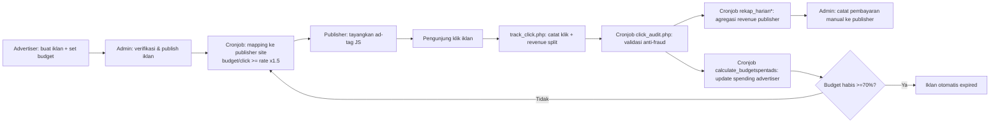

# Gambaran Umum Bisnis

> Navigasi: [Runbook operasional](../OPERATIONS_RUNBOOK.md) · [Indeks dokumentasi](../README.md) · Berikutnya: [Aktor dan peran](./02-aktor-dan-peran.md)

## Apa itu aplikasi ini

KumpulBlogger adalah **ad network native-ads** (menampilkan iklan berbentuk kartu berisi gambar, judul, dan deskripsi yang menyatu dengan konten situs, bukan banner tradisional) yang mempertemukan dua pihak:

- **Advertiser** — pihak yang ingin beriklan, membayar per klik yang diterima iklannya.
- **Publisher** — pemilik situs/blog yang menyediakan slot iklan di halamannya dan menerima bagi hasil (revenue share) setiap kali pengunjungnya mengklik iklan tersebut.

Di tengah kedua pihak ini, platform (disebut "provider" di skema DB, direpresentasikan oleh entri `id=1` di `public_html/providers_data.json` dan tabel `providers`) bertindak sebagai **network operator**: mencocokkan iklan ke situs yang cocok, mencatat & memvalidasi klik, menghitung revenue share, dan (secara manual oleh admin) mencairkan dana ke publisher.

Selain model iklan inti, platform ini memperluas monetisasi dengan:
- **Blog internal + AI content tools** — publisher yang tidak punya website sendiri bisa membuat "situs" berbentuk blog terhosting di platform (`add_site_internal.php`) dan mengisi kontennya memakai AI (generate artikel, gambar, kuis, ringkasan audio), sehingga tetap bisa menayangkan iklan tanpa modal teknis.
- **Influencer marketplace** — advertiser bisa membeli slot promosi di kanal media sosial influencer yang terdaftar (`influencer_media`), terpisah dari mekanisme klik iklan native.
- **Jaringan Provider/Partner (white-label syndication)** — instance KumpulBlogger lain (situs dengan kode sumber yang sama, di domain berbeda, dioperasikan pihak lain) bisa "join force" agar inventori iklan dan situs saling dipertukarkan lintas jaringan, memperluas jangkauan setiap pihak tanpa membangun demand/supply dari nol (`public_html/white_label/index.php:83-90`).

## Model bisnis inti (Publisher ↔ Advertiser)

1. Advertiser membuat iklan dan menentukan **budget per klik** (`budget_per_click_textads`, Rp 30–Rp 3.000, `public_html/add_advertisement.php:66-69`) dan **total budget alokasi** (`budget_allocation`, Rp 5.000–Rp 60.000.000, `public_html/add_advertisement.php:71-75`).
2. Publisher mendaftarkan situs dan menentukan **rate dasar per klik** yang mereka inginkan (`rate_text_ads`, Rp 10–Rp 10.000, `public_html/add_site.php:52-56`).
3. Sistem (cronjob) mencocokkan iklan ke situs **hanya jika** `budget_per_click_textads` advertiser ≥ `rate_text_ads` publisher **× 1.5** (markup 50% untuk pasar lokal) — lihat `public_html/cronjob/mapping_ads_publisher.php:108-115`. Untuk trafik dari jaringan partner, markup-nya 2× (lihat `public_html/mysite_ads.php:164-167` dan `05-provider-partner-network.md`).
4. Setiap klik valid membayarkan `rate_text_ads` (nilai `revenue_publishers`) ke publisher, dan platform mengambil selisih antara `budget_per_click_textads` advertiser dan `rate_text_ads` publisher sebagai marginnya sendiri (dibagi lagi dengan provider partner bila klik lintas jaringan) — lihat `06-ad-serving-dan-tracking-klik.md` dan `07-pembayaran-dan-revenue-share.md`.
5. Anggaran advertiser otomatis habis (iklan di-nonaktifkan/`is_expired`) ketika total spending mencapai ambang tertentu dari `budget_allocation` (cronjob `calculate_budgetspentads.php`, threshold 70%, `public_html/cronjob/calculate_budgetspentads.php:172`).
6. Karena tidak ada payment gateway otomatis, **pembayaran mengalir manual**: advertiser transfer bank lalu mengisi form konfirmasi; admin memverifikasi lalu meng-approve publikasi iklan dan (untuk publisher) mencatat pembayaran keluar setelah admin sendiri mentransfer dana revenue share.

## Value proposition per aktor

- **Publisher**: monetisasi trafik situs tanpa perlu berjualan iklan sendiri; bisa menerima iklan dari pasar lokal maupun dari seluruh jaringan partner (memperluas fill-rate iklan); bisa membuat "situs" berupa blog AI tanpa hosting sendiri.
- **Advertiser**: model bayar-per-klik dengan kontrol penuh atas bid dan budget; iklan bisa tayang tidak hanya di publisher lokal tapi juga di seluruh jaringan partner tanpa negosiasi manual per situs; transparansi data klik (IP, user agent, referrer, hash audit) diklaim tersedia untuk verifikasi independen (`public_html/white_label/index.php:111-154`).
- **Provider/Partner**: operator jaringan white-label lain bisa membangun bisnis ad-network sendiri memakai source code yang sama, lalu "join force" untuk saling meminjam supply (situs publisher) dan demand (iklan advertiser) tanpa berkompetisi head-to-head — model kolaborasi, bukan kompetisi (`public_html/white_label/index.php:87-90`).
- **Influencer**: mendapat kanal penjualan slot promosi kontennya ke advertiser platform tanpa perlu negosiasi langsung.
- **Admin**: mengelola kualitas jaringan (approve iklan/situs/partner), mencegah fraud, dan menjadi titik kendali keuangan (karena pembayaran manual).

## Ringkasan siklus revenue

