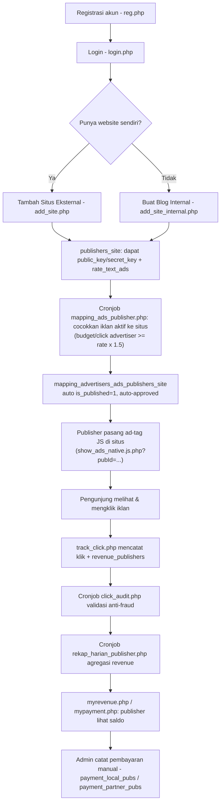

# Alur Publisher (End-to-End)

> Navigasi: [Runbook operasional](../OPERATIONS_RUNBOOK.md#9-uji-publisher-dan-penayangan) · [Advertiser](./04-alur-advertiser.md) · [Ad serving](./06-ad-serving-dan-tracking-klik.md) · [Dashboard user](../reference/USER_DASHBOARD.md)

## Ringkasan alur

## 1. Registrasi & login

- `public_html/reg.php:39-78` — form hanya email + WhatsApp, reCAPTCHA v3 wajib. Password digenerate otomatis dan dikirim via email (`function_send_email.php`). Tidak ada pemilihan "saya publisher/advertiser" — status ini emergent dari tindakan berikutnya.
- `public_html/login.php:31-71` — autentikasi `password_verify()` terhadap `msusers.passwords`; session `$_SESSION['user_id']`/`$_SESSION['email']` menjadi kunci semua halaman berikut.
- Lupa password: `forgot_password.php` → `forgot_password_2.php` → `reset_password.php` (alur reset berbasis token `forgot_password_key`).

## 2. Menambahkan situs

Ada dua jalur untuk menjadi publisher, keduanya menghasilkan baris di `publishers_site`:

### a) Situs eksternal (website sendiri)
`public_html/add_site.php:46-125` — publisher mengisi `site_name`, `site_domain`, `site_desc`, dan **rate per klik yang diminta** `rate_text_ads` (validasi 10–10.000, `add_site.php:52-56`). Sistem men-generate `public_key`/`secret_key` unik (`bin2hex(random_bytes(16))`, baris 42-43) untuk identifikasi ad-tag. Baris disimpan dengan `internal_blog=0` (default kolom).

### b) Blog internal (tanpa website sendiri)
`public_html/add_site_internal.php:44-90` — publisher memilih `username` (alfanumerik saja) yang menjadi bagian URL blog: `{domain-provider}/blog/{username}`. Rate klik default fix di **Rp 50** (`add_site_internal.php:82`, hardcoded, bukan input pengguna). Baris `publishers_site` disimpan dengan `internal_blog=1`. Kuota artikel publisher dikaitkan lewat tabel `publisher_quota` (lihat `08-konten-artikel-dan-ai-tools.md`).

Publisher bisa mendaftarkan banyak situs; satu akun = banyak baris `publishers_site`.

## 3. Pencocokan iklan ke situs (mapping otomatis)

Tidak ada langkah manual "publisher memilih iklan mana yang tayang". Proses **cronjob** (`public_html/cronjob/mapping_ads_publisher.php`) berjalan berkala, mengambil semua iklan aktif (`ispublished=1 AND is_expired=0`) dan mencocokkannya ke **semua** baris `publishers_site` di database:

- Syarat cocok: `budget_per_click_textads` (advertiser) ≥ `rate_text_ads` (publisher) × **1.5** (`cronjob/mapping_ads_publisher.php:108-115`).
- Jika cocok, baris baru/update dibuat di `mapping_advertisers_ads_publishers_site` dengan `revenue_publishers = rate_text_ads` (nilai asli publisher, tanpa markup) dan `budget_per_click_textads` (nilai bid asli advertiser) — markup 50% hanya dipakai sebagai syarat kelayakan, bukan disimpan sebagai harga transaksi.
- **Default auto-approve**: baris baru diberi `is_approved_by_publisher=1` dan `is_approved_by_advertiser=1` langsung oleh cronjob (`cronjob/mapping_ads_publisher.php:179-181`) — publisher/advertiser tidak wajib menyetujui manual sebelum iklan tayang, tapi keduanya **bisa mencabut persetujuan** setelahnya (lihat bawah).

Publisher dapat melihat & mengelola persetujuan tayang per iklan di situsnya lewat `public_html/mysite_ads.php` (menampilkan daftar iklan yang di-map ke situs tertentu beserta rate & status), dan mengubah `is_approved_by_publisher` lewat modal → `public_html/update_ad.php`.

## 4. Memasang ad-tag di situs

Publisher menempelkan tag JavaScript yang mengarah ke salah satu varian penyaji iklan (`show_ads_native.js.php`, `show_ads_native.js2.php`..`js4.php`, `show_ads_native_landscape.js.php`, `show_ads_native_portrait.js.php`, `sample.js.php`, `sample_landscape.js.php`) dengan parameter `pubId` = `publishers_site.id`. Detail penuh mekanisme rendering & keamanan klik ada di `06-ad-serving-dan-tracking-klik.md`.

Publisher juga dapat menetapkan `alternate_code` (HTML/JS fallback, mis. iklan dari jaringan lain) yang ditayangkan bila tidak ada iklan cocok (`publishers_site.alternate_code`, dipakai di `show_ads_native.js.php:70,112-118`).

## 5. Melihat performa & iklan yang tersedia

- `view_advertiser_list.php` / `view_advertiser_list_partner.php` — daftar advertiser lokal vs. dari jaringan partner.
- `view_ads_sort_by_highest_bid_per_click.php` — daftar iklan yang bisa/dapat ditayangkan, diurut dari bid tertinggi.
- `clicks_publisher_detail.php`, `clicks_publisher_ads_partner_detail.php` — rincian klik per situs.

## 6. Revenue & pembayaran

- `myrevenue.php:22-25` memanggil `updateLocalRevenue()`/`updateGlobalRevenue()` (`admin/function_admin.php:84-122`) untuk menyegarkan total revenue dari `publishers_site.current_site_revenue` sebelum ditampilkan; memecah revenue **lokal** vs **dari partner**, dan **sudah dibayar** vs **belum dibayar** (dihitung dari `payment_local_pubs` dan `payment_partner_pubs_sync`).
- `mypayment.php` menampilkan ringkasan yang sama plus 10 riwayat pembayaran terakhir dari kedua sumber.
- Pencairan dana **tidak otomatis** — lihat `07-pembayaran-dan-revenue-share.md` untuk alur penuh (admin mentransfer manual lalu mencatat via `admin/pay_pubs_local.php` / `admin/pay_pubs_partner.php`).

## 7. Rate publisher terlihat oleh advertiser

`view_rate_publisher.php` dan `view_rate_publisher_partner.php` (diakses dari menu advertiser) menampilkan daftar situs publisher beserta `rate_text_ads`-nya, agar advertiser bisa memperkirakan apakah bid mereka akan cukup untuk memenuhi syarat mapping di atas.

## Tabel database yang terlibat

`msusers`, `publishers_site`, `publishers_site_partners`, `mapping_advertisers_ads_publishers_site`, `mapping_advertisers_ads_publishers_site_from_partners`, `publisher_partner`, `publisher_quota`, `rekap_harian_publishers`, `rekap_pubs_revenue`, `rekap_publisher_revenue_harian_partner`, `rekap_total_publisher_partner`, `payment_local_pubs`, `payment_partner_pubs`, `payment_partner_pubs_sync`.
