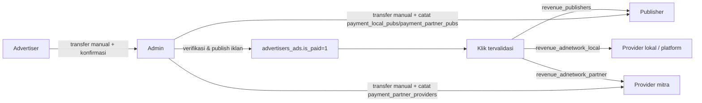

# Pembayaran dan Revenue Share

> Navigasi: [Runbook payout](../OPERATIONS_RUNBOOK.md#11-simulasikan-payout) · [Alur advertiser](./04-alur-advertiser.md) · [Panel admin](../reference/ADMIN_PANEL.md) · [ERD](../reference/DATABASE_ERD.md)

## Prinsip umum: tidak ada payment gateway otomatis

Di seluruh eksplorasi kode, **tidak ditemukan integrasi payment gateway** (Midtrans/Xendit/dsb.) maupun disbursement otomatis ke rekening bank. Baik pembayaran **masuk** dari advertiser maupun **keluar** ke publisher/provider dicatat **manual oleh admin** setelah verifikasi mutasi rekening bank di luar sistem. Info rekening tujuan pembayaran platform (untuk advertiser) hardcoded di `public_html/settings_all.php:11-23`.

## 1. Perhitungan revenue per klik (real-time, saat klik terjadi)

Di `public_html/track_click.php:104-110`, begitu sebuah klik masuk:

```php
if ($pubs_providers_domain_url == $ads_providers_domain_url) {
    // Iklan dan situs sama-sama milik jaringan lokal
    $revenue_adnetwork_local   = $revenue_publishers / 2;
    $revenue_adnetwork_partner = 0;
} else {
    // Iklan dari provider lain (partner) yang tayang di situs lokal, atau sebaliknya
    $revenue_adnetwork_local   = $revenue_publishers / 2;
    $revenue_adnetwork_partner = $revenue_publishers / 2;
}
```

di mana `$revenue_publishers` = `rate_text_ads` yang tersimpan di baris mapping (`mapping_advertisers_ads_publishers_site.rate_text_ads`, yaitu rate asli publisher, **bukan** harga bid advertiser). Jadi untuk setiap klik:

- **Publisher** menerima `revenue_publishers` penuh (= rate yang mereka tetapkan sendiri).
- **Provider lokal** (operator platform tempat publisher terdaftar) mengambil `revenue_publishers / 2` sebagai `revenue_adnetwork_local` — ini adalah bagian dari margin (selisih antara bid advertiser yang lebih tinggi dan rate publisher).
- Jika klik melibatkan jaringan partner (situs dan iklan dari provider berbeda), **provider mitra** juga mengambil `revenue_publishers / 2` sebagai `revenue_adnetwork_partner`.

Nilai-nilai ini disimpan langsung per baris di `ad_clicks`/`ad_clicks_partner`, dan diikat dengan checksum `hash_click` (MD5 dari kombinasi `hash_key` provider + seluruh data finansial klik, `track_click.php:125-137`) untuk mencegah manipulasi data setelah tersimpan.

> Catatan: perhitungan di atas dijalankan **sebelum** audit anti-fraud, sehingga klik yang nanti ditolak (`is_reject=1`) tetap punya nilai revenue tersimpan di baris tsb — namun nilai itu **tidak** dihitung ke `current_spending`/rekap resmi karena semua agregasi hilir (lihat di bawah) memfilter `isaudit=1 AND is_reject=0`.

## 2. Update spending advertiser & auto-expire

`cronjob/calculate_budgetspentads.php` (untuk klik lokal) dan `calculate_budgetspentads_partner.php` (untuk klik dari partner) menjumlahkan `revenue_publishers + revenue_adnetwork_local + revenue_adnetwork_partner` dari klik **valid** (`isaudit=1 AND is_reject=0`) per iklan, lalu:
- Update `advertisers_ads.current_spending` (atau `current_spending_from_partner`).
- Bila `current_spending + current_spending_from_partner ≥ 70% × budget_allocation` → iklan otomatis `is_expired=1` (`calculate_budgetspentads.php:172-204`).

## 3. Agregasi revenue publisher (rekap harian)

Beberapa cronjob rekap berjalan berjenjang untuk menyiapkan data yang ditampilkan di `myrevenue.php` dan panel admin:

- `cronjob/rekap_harian_local.php` & `rekap_harian_partner.php` — agregasi harian dari `ad_clicks`/`ad_clicks_partner` (klik valid saja) ke tabel `rekap_harian` per (`tanggal_klik`, `local_ads_id`, `ads_providers_domain_url`) — perspektif **advertiser** (total spending per iklan per hari).
- `cronjob/rekap_harian_publisher.php` dan `rekapPublisherRevenueHarianPartner.php` — agregasi ke `rekap_harian_publishers` / `rekap_publisher_revenue_harian_partner` — perspektif **publisher** (total revenue per situs per hari).
- `cronjob/rekap_total_publisher.php` (fungsi `rekapTotalPublisherPartner()` di `function_publisher.php:154-257`) — menjumlahkan seluruh rekap harian partner menjadi total kumulatif per publisher di `rekap_total_publisher_partner`.
- `cronjob/rekap_harian_provider_partner.php` — rekap di level provider (total klik & revenue per provider mitra) ke `rekap_harian_provider_partner`.
- `admin/function_admin.php:84-122` (`updateLocalRevenue()`, `updateGlobalRevenue()`, `updateTotalRevenue()`) menjumlahkan `publishers_site.current_site_revenue`/`current_site_revenue_from_partner` **milik seluruh situs** publisher tsb dan menyimpan totalnya ke `msusers.current_revenue`/`current_revenue_from_partner`/`total_current_revenue` — dipanggil setiap kali publisher membuka `myrevenue.php`/`mypayment.php` agar angka selalu segar.
- `publishers_site.current_site_revenue`/`current_site_revenue_from_partner` sendiri disegarkan oleh `calculateTotalRevenue()` (`function_publisher.php:329-360`), menjumlahkan `ad_clicks.revenue_publishers` per situs, dipisah berdasarkan apakah `ads_providers_domain_url` sama dengan domain situs (lokal) atau berbeda (dari partner).

## 4. Pembayaran ke publisher (payout) — manual oleh admin

Tidak ada tombol "tarik dana" di sisi publisher. Alurnya:
1. Publisher memantau saldo *unpaid* di `myrevenue.php`/`mypayment.php`.
2. Di luar sistem, admin melakukan transfer bank manual ke rekening publisher (`msusers.bank`/`account_number`/`account_name`).
3. Admin mencatat transaksi tsb ke sistem:
   - **Revenue lokal**: `admin/pay_pubs_local.php:25-46` → `INSERT INTO payment_local_pubs (email_pubs, nominal, payment_description, payment_date)`.
   - **Revenue dari partner**: `admin/pay_pubs_partner.php:31-57` → `INSERT INTO payment_partner_pubs (...)`, lalu memanggil `updateRevenueTotal()` dan `updatePublisherRevenuePaid_unPaid()` (`function_publisher.php:110-152, 46-106`) untuk menyegarkan status `revenue_paid`/`revenue_unpaid` di tabel `publisher_partner`.
4. `updateRevenueForUser()` (`function_publisher.php:272-322`, dipanggil dari `mypayment.php:27`) menjumlahkan seluruh `payment_local_pubs.nominal` milik email tsb menjadi `msusers.local_revenue_paid`, dan `local_revenue_unpaid = current_revenue - local_revenue_paid`.
5. Untuk publisher yang dibayar oleh **provider mitra** (bukan provider tempat dia mendaftar aslinya), catatan pembayaran direplikasi via `cronjob/push_payment_partner_pubs.php` → `API/getinfoPaymentPubsPartner` → tersimpan di `payment_partner_pubs_sync` sisi publisher terdaftar, supaya publisher tetap bisa melihat riwayat pembayarannya dari satu tempat (`mypayment.php:56-66`) walau uangnya ditransfer oleh operator jaringan lain.

## 5. Pembayaran advertiser (uang masuk) — manual & berbasis konfirmasi

Lihat detail di `04-alur-advertiser.md` bagian 2 — ringkas:
- Advertiser transfer manual → isi form "Laporan Konfirmasi Pembayaran" → `update_paid_desc.php` menyimpan `advertisers_ads.paid_desc`.
- Admin memverifikasi mutasi rekening secara manual, lalu `admin/update_publish_status.php` men-set `is_paid=1`, `ispublished=1`.
- Pola serupa (form konfirmasi manual) juga dipakai untuk checkout media influencer, lihat `09-influencer-marketing.md`.

## 6. Settlement antar-provider (B2B)

`admin/pay_provider_partner.php` mencatat pembayaran platform **ke provider mitra** (mis. saat klik advertiser lokal terjadi di situs milik jaringan mitra, provider lokal berutang `revenue_adnetwork_partner` ke mitra tsb) ke tabel `payment_partner_providers`, direplikasi via `cronjob/push_payment_partner_providers.php` → `API/getinfoPaymentProviderPartner` → `payment_partner_providers_sync` di sisi provider penerima.

`admin/list_payment_provider_partner.php`, `admin/list_payment_pubs_local.php`, `admin/list_payment_pubs_partner.php`, `admin/list_pubs_partner_revenue.php`, `admin/list_owner_pubs_partner_revenue.php` adalah halaman pelaporan/monitoring admin untuk seluruh alur di atas.

## Ringkasan alur dana



## Tabel database yang terlibat

`ad_clicks`, `ad_clicks_partner`, `advertisers_ads`, `publishers_site`, `msusers`, `publisher_partner`, `payment_local_pubs`, `payment_partner_pubs`, `payment_partner_pubs_sync`, `payment_partner_providers`, `payment_partner_providers_sync`, `rekap_harian`, `rekap_harian_publishers`, `rekap_harian_provider_partner`, `rekap_publisher_revenue_harian_partner`, `rekap_pubs_revenue`, `rekap_total_publisher_partner`.

## Perlu konfirmasi

- Ambang auto-expire iklan di 70% dari `budget_allocation` (bukan 100%) — apakah 30% sisanya sengaja disisakan sebagai buffer/margin admin, atau bug yang membuat advertiser tidak bisa membelanjakan seluruh budget-nya.
- Tidak ditemukan mekanisme otomatis yang mencegah pembayaran ganda (double payout) selain kalkulasi ulang total setiap kali — proses pencatatan pembayaran oleh admin tampak sepenuhnya manual tanpa rekonsiliasi otomatis terhadap saldo unpaid saat ini.
