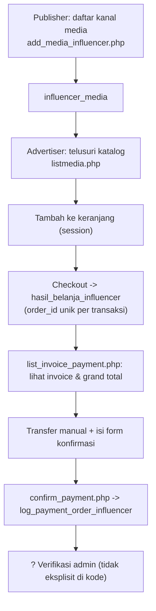

# Influencer Marketing

> Navigasi: [Runbook operasional](../OPERATIONS_RUNBOOK.md) · [Aktor](./02-aktor-dan-peran.md) · [Pembayaran](./07-pembayaran-dan-revenue-share.md) · [Dashboard user](../reference/USER_DASHBOARD.md)

## Konsep

Fitur terpisah dari mekanisme iklan native (klik iklan di situs). Di sini, **publisher yang sama** (akun `msusers`) bisa mendaftarkan kanal media sosial/media promosi miliknya sebagai "produk" yang bisa dibeli slot-nya oleh **advertiser**, mirip marketplace endorsement sederhana. Tidak ada mekanisme klik/tracking otomatis di sini — hanya katalog, keranjang belanja, dan pencatatan pemesanan.

## 1. Registrasi media oleh publisher/influencer

`public_html/add_media_influencer.php:29-77`:
- Publisher memilih **jenis media** dari tabel referensi `media` (`id`, `media`, `desc`, `icon` — mis. Instagram, TikTok, dsb.), mengisi `media_url` dan `owner_media_desc`, serta menentukan **harga dasar** `rate_owner`.
- Sistem otomatis menghitung markup:
  - `rate_markup_provider = rate_owner / 6` (dibulatkan ke kelipatan 50) — margin platform.
  - `rate_partner = rate_owner / 6` (dibulatkan ke kelipatan 50) — margin provider mitra (bila dijual lintas jaringan).
  - Harga jual ke advertiser lokal = `rate_owner + rate_markup_provider`; harga jual lintas-partner = `rate_owner + rate_markup_provider + rate_partner` (baris 51-56) — pola markup berjenjang yang sama semangatnya dengan markup rate iklan native (lokal vs. partner).
- Disimpan ke `influencer_media` (`sql/...:261-273`) dengan `owner_id` = `msusers.id` dan `owner_provider_domain_url` = identitas provider tempat dia terdaftar.
- Publisher mengelola daftar media miliknya di `mymedia.php` (baca `influencer_media` milik `owner_id` sendiri), mengedit via `edit_media.php`, menghapus via `delete_media.php`.

## 2. Penemuan & pembelian oleh advertiser

`public_html/listmedia.php`:
- Menampilkan katalog media (kemungkinan lintas seluruh publisher — query lengkap tidak dibaca detail, hanya bagian keranjang).
- **Keranjang belanja berbasis session PHP** (`$_SESSION['cart']`, baris 18-56): tambah item (`add_to_cart`), hapus item (`remove_from_cart`), kosongkan (`clear_cart`) — item disimpan sebagai array asosiatif (owner_id, media_id, nama, url, harga, quantity), bukan tabel database (keranjang hilang begitu sesi berakhir).
- **Checkout** (baris 74-100+): generate `order_id` unik format `YYYY_MM_DD_HH_MM_SS_{advertiser_user_id}` (baris 85-87), lalu setiap item keranjang di-`INSERT` sebagai baris terpisah ke `hasil_belanja_influencer` (`sql/...:229-241`: `order_id`, `advertiser_id`, `owner_id`, `media_id`, `media_name`, `media_url`, `harga`, `quantity`, `total_price`, `checkout_date`) — satu order bisa terdiri dari banyak baris (banyak media dalam satu invoice, dikelompokkan lewat `order_id` yang sama).

## 3. Konfirmasi pembayaran (pola sama seperti pembayaran iklan)

`public_html/list_invoice_payment.php:44-165`:
- Menampilkan daftar order milik advertiser (`GROUP BY order_id`, `SUM(total_price) AS grand_total`), lengkap rincian media per order.
- Menyediakan info rekening pembayaran (`$info_pembayaran`, sama seperti di `settings_all.php`, lihat `07-pembayaran-dan-revenue-share.md`).
- Form "Confirm Payment" mengirim ke `confirm_payment.php:26-59` yang **hanya mencatat pesan konfirmasi** (bank, tanggal, nama pengirim) ke tabel `log_payment_order_influencer` (`advertiser_id`, `order_id`, `payment_message`, `payment_date`) — **tidak** mengubah status order menjadi "paid" secara otomatis dan **tidak** ditemukan langkah admin eksplisit yang mem-verifikasi/menandai order influencer sebagai lunas dalam file-file yang dieksplorasi (**perlu konfirmasi** — kemungkinan diverifikasi manual oleh admin lewat komunikasi WhatsApp/luar sistem, mengikuti pola nomor rekening yang mengarahkan konfirmasi ke WhatsApp admin, `settings_all.php:20-21`).
- Advertiser bisa membatalkan pesanan yang belum diproses lewat `delete_invoice.php:30-32` (`DELETE FROM hasil_belanja_influencer WHERE order_id = ? AND advertiser_id = ?`).

## 4. Payout ke influencer (media owner)

Tidak ditemukan halaman/endpoint khusus yang secara eksplisit mencairkan dana `hasil_belanja_influencer` ke publisher pemilik media (`owner_id`). Kemungkinan payout influencer digabungkan ke alur pembayaran publisher umum (`payment_local_pubs`/`payment_partner_pubs`, lihat `07-pembayaran-dan-revenue-share.md`) karena `owner_id` juga merujuk ke `msusers.id` yang sama dengan akun publisher — **perlu konfirmasi**, karena tidak ada join eksplisit yang ditemukan antara `hasil_belanja_influencer`/`influencer_media` dengan tabel `payment_*`.

## Ringkasan alur

## Tabel database yang terlibat

`influencer_media`, `media`, `hasil_belanja_influencer`, `log_payment_order_influencer`, `msusers`.

## Perlu konfirmasi

- Tidak ditemukan langkah eksplisit yang menandai order influencer sebagai "lunas"/"diproses" setelah `confirm_payment.php` — perlu verifikasi ke tim produk apakah ini memang murni manual di luar sistem atau ada halaman admin yang tidak tercakup dalam daftar file yang dieksplorasi.
- Mekanisme payout dana `harga`/`total_price` dari `hasil_belanja_influencer` ke publisher pemilik media (`owner_id`) tidak ditemukan secara eksplisit terhubung ke tabel `payment_*`.
