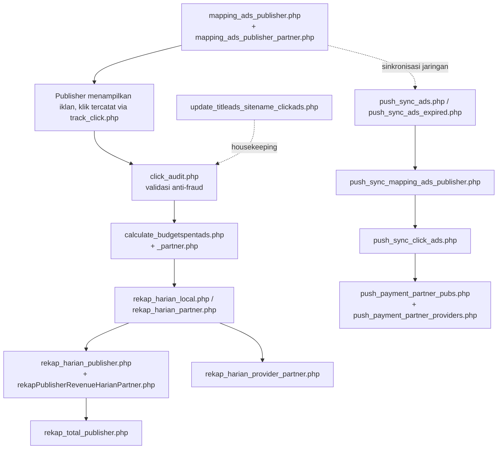

# Cronjob dan Otomatisasi

> Navigasi: [Runbook scheduler](../OPERATIONS_RUNBOOK.md#7-aktifkan-scheduler) · [Setup cron](../operations/CRON_SETUP.md) · [Referensi job](../operations/CRONJOB_JOBS.md)

Semua file di `public_html/cronjob/` adalah skrip PHP yang dirancang dipanggil **terjadwal** (cron OS/cPanel) — tidak ditemukan file konfigurasi cron (crontab, systemd timer, dsb.) di dalam repo ini, jadi jadwal eksekusi persisnya **perlu konfirmasi** ke tim operasional. Beberapa skrip menampilkan output HTML lengkap dengan styling (dirancang agar bisa dibuka manual di browser untuk debugging, bukan murni CLI).

## Urutan logis pipeline harian

## Daftar & fungsi tiap cronjob

| File | Fungsi bisnis |
|---|---|
| `mapping_ads_publisher.php` | **Mesin pencocokan utama**: mencocokkan iklan lokal aktif (`advertisers_ads`) ke seluruh `publishers_site`, syarat `budget_per_click_textads ≥ rate_text_ads × 1.5`, menulis/mengupdate `mapping_advertisers_ads_publishers_site` dengan auto-approve. Lihat `03-alur-publisher.md` §3. |
| `mapping_ads_publisher_check_rate.php` | Variasi/pengecekan ulang kecocokan rate untuk mapping lokal (kemungkinan re-validasi setelah rate/budget berubah) — **perlu konfirmasi** perbedaan detail dengan `mapping_ads_publisher.php`. |
| `mapping_ads_publisher_partner.php` | Versi lintas-jaringan: mencocokkan iklan (lokal atau dari `advertisers_ads_partners`) ke situs milik publisher di jaringan partner (`publishers_site_partners`), menulis ke `mapping_advertisers_ads_publishers_site_from_partners`. |
| `mapping_ads_publisher_check_rate_partner.php` | Re-validasi rate untuk mapping partner. |
| `click_audit.php` | **Audit anti-fraud asinkron** — memproses hingga 1000 klik `isaudit=0` per run, menjalankan `checkFraud()` (16 aturan velocity + IP/browser banned + proxy/VPN heuristik + validitas iklan), auto-ban IP pelanggar, mengisi `hash_audit`. Lihat `06-ad-serving-dan-tracking-klik.md` §4. |
| `calculate_budgetspentads.php` | Menjumlahkan revenue klik valid (lokal) per iklan ke `advertisers_ads.current_spending`; auto-expire iklan bila spending ≥ 70% `budget_allocation`. |
| `calculate_budgetspentads_partner.php` | Versi untuk klik yang terjadi di jaringan partner (iklan lokal diklik lewat situs partner) — menghasilkan kewajiban pembayaran provider lokal ke partner. |
| `rekap_harian_local.php` (nama file, docblock internal menyebut `rekap_harian.php`) | Agregasi harian klik valid dari `ad_clicks` ke tabel `rekap_harian`, perspektif per iklan/hari. |
| `rekap_harian_partner.php` | Sama seperti di atas tapi sumber datanya `ad_clicks_partner`. |
| `rekap_harian_publisher.php` | Agregasi harian revenue per situs publisher ke `rekap_harian_publishers`. |
| `rekapPublisherRevenueHarianPartner.php` | Agregasi harian revenue publisher dari trafik partner ke `rekap_publisher_revenue_harian_partner`. |
| `rekap_harian_provider_partner.php` | Agregasi harian total klik & revenue di level provider mitra ke `rekap_harian_provider_partner`. |
| `rekap_total_publisher.php` | Menjumlahkan seluruh rekap harian partner menjadi total kumulatif per publisher (`rekap_total_publisher_partner`), via fungsi `rekapTotalPublisherPartner()`. |
| `update_titleads_sitename_clickads.php` | Housekeeping: melengkapi kolom `title_ads`/`site_name`/`site_domain` yang kosong di baris `ad_clicks`/`ad_clicks_partner` lama (mirip logika yang juga ada di ekor `click_audit.php`). |
| `getinfoOwnerPublisherGlobal.php` | Mengambil info pemilik publisher lintas jaringan (mendukung `API/getOwnerPublisher`). |
| `check_partner_connection.php` | Cek konektivitas/kesehatan koneksi ke server provider mitra. |
| `push_sync_ads.php` | **Push** iklan aktif milik sendiri ke seluruh `providers_partners` (endpoint `API/sync_ads`), agar direplikasi jadi `advertisers_ads_partners` di sisi mitra. |
| `push_sync_ads_expired.php` | Push status expired/paused iklan yang sudah direplikasi agar sisi mitra ikut menonaktifkannya. |
| `push_sync_publishers.php` | Push data situs publisher milik sendiri ke mitra (endpoint `API/sync_publisher`). |
| `push_sync_mapping_ads_publisher.php` | Push baris mapping iklan↔situs lintas jaringan ke mitra (endpoint `API/sync_mapping_advertisers_ads_publishers_site_from_partners`). |
| `push_sync_click_ads.php` | Push klik yang sudah diaudit ke mitra (endpoint `API/sync_clicks`), menandai `is_sync`/`syncdate` di sisi pengirim. |
| `push_payment_partner_pubs.php` | Push riwayat pembayaran ke publisher (7 hari terakhir) ke mitra (endpoint `API/getinfoPaymentPubsPartner`) agar publisher lintas-jaringan tetap punya visibilitas status bayar. |
| `push_payment_partner_providers.php` | Push riwayat settlement pembayaran antar-provider (endpoint `API/getinfoPaymentProviderPartner`). |

Detail arah & payload sinkronisasi lintas-provider ada di `05-provider-partner-network.md`.

## Perlu konfirmasi

- Frekuensi/penjadwalan tiap cronjob (menit/jam/harian) tidak ada di repo — biasanya diatur di panel hosting (cPanel Cron Jobs) secara terpisah dari kode aplikasi.
- Urutan eksekusi yang benar antar cronjob (mis. apakah `calculate_budgetspentads.php` harus selalu berjalan setelah `click_audit.php` selesai) bergantung sepenuhnya pada jadwal cron eksternal — tidak ada orkestrasi/locking di level kode yang mencegah tumpang tindih run.
- Perbedaan detail antara `mapping_ads_publisher.php` dan `mapping_ads_publisher_check_rate.php` tidak dieksplorasi baris-per-baris.
