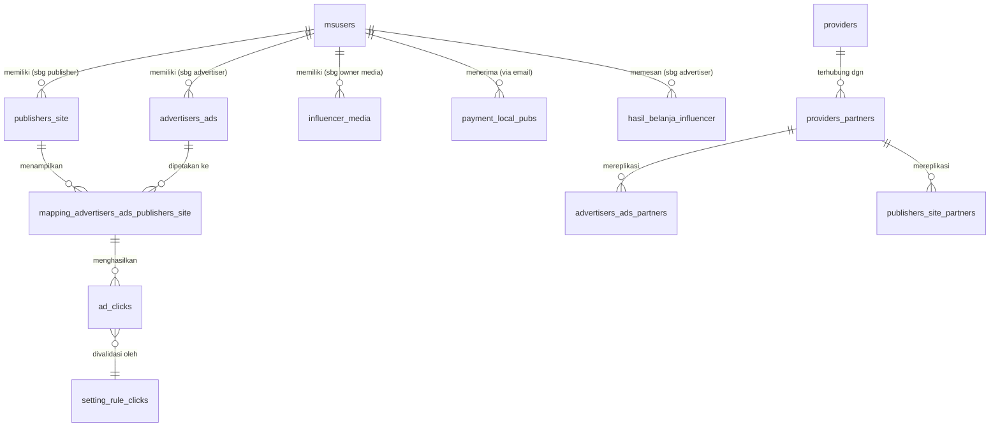

# Skema Database — Peran Bisnis Tiap Tabel

> Navigasi: [Runbook operasional](../OPERATIONS_RUNBOOK.md) · [ERD lengkap](../reference/DATABASE_ERD.md) · [API](../reference/API_ENDPOINTS.md) · [Cronjob](../operations/CRONJOB_JOBS.md)

Sumber: `sql/myadnetwork_db_hanya_structure.sql`. Dokumen ini menjelaskan **peran bisnis** tiap tabel (bukan dump kolom mentah), dikelompokkan per domain. Untuk struktur kolom lengkap, lihat file SQL langsung (nomor baris `CREATE TABLE` dicantumkan).

## 1. User & Autentikasi

| Tabel | Baris | Peran bisnis |
|---|---|---|
| `msusers` | 451 | Akun tunggal untuk **Publisher dan Advertiser** (peran ditentukan oleh tindakan, bukan field terpisah). Menyimpan kredensial login, info rekening bank untuk payout, dan akumulasi revenue/spending (lokal & partner) yang disegarkan berkala oleh cronjob/fungsi admin. |
| `msadmin` | 432 | Akun superuser platform, terpisah total dari `msusers`, mengelola approval & moderasi lewat panel `admin/`. |

## 2. Publisher

| Tabel | Baris | Peran bisnis |
|---|---|---|
| `publishers_site` | 676 | Situs/blog milik publisher (eksternal maupun blog internal, dibedakan `internal_blog`). Menyimpan `rate_text_ads` (harga per klik yang diminta publisher), `public_key`/`secret_key` (identitas ad-tag), akumulasi revenue per situs, dan status banned. |
| `publishers_site_partners` | 707 | Replika data `publishers_site` **milik publisher di jaringan provider mitra**, disinkronkan via `cronjob/push_sync_publishers.php` → `API/sync_publisher`, dipakai saat mencocokkan iklan lokal ke situs-situs di luar jaringan sendiri. |
| `publisher_partner` | 732 | Ringkasan akun publisher dari sudut pandang **provider mitra** — revenue total/paid/unpaid yang provider tsb berutang ke publisher yang aslinya terdaftar di jaringan lain. |
| `publisher_quota` | 754 | Kuota pembuatan artikel AI per publisher (kuota gratis harian, kuota gratis total, kuota berbayar, masa berlaku) — mengontrol fitur Blog Internal/AI. |

## 3. Advertiser & Iklan

| Tabel | Baris | Peran bisnis |
|---|---|---|
| `advertisers_ads` | 30 | Iklan native milik advertiser lokal: judul, deskripsi, gambar, landing page, bid per klik, total alokasi budget, status publish/paid/paused/expired, dan akumulasi spending (lokal & dari partner). |
| `advertisers_ads_partners` | 67 | Replika iklan **milik advertiser di jaringan provider mitra**, disinkronkan via `cronjob/push_sync_ads.php` → `API/sync_ads`, dipakai untuk ditayangkan di situs publisher lokal. |

## 4. Mapping Iklan ↔ Situs (jantung ad-serving)

| Tabel | Baris | Peran bisnis |
|---|---|---|
| `mapping_advertisers_ads_publishers_site` | 337 | Baris pencocokan iklan lokal ↔ situs publisher lokal (dibuat otomatis oleh `cronjob/mapping_ads_publisher.php`). Menyimpan status publish/pause/expire, persetujuan kedua pihak (`is_approved_by_publisher`, `is_approved_by_advertiser`), dan `revenue_publishers` (harga transaksi per klik yang berlaku). **Ini adalah sumber query utama `show_ads_native.js.php`.** |
| `mapping_advertisers_ads_publishers_site_from_partners` | 378 | Versi lintas-jaringan (iklan/situs dari provider mitra), direplikasi via `API/sync_mapping_advertisers_ads_publishers_site_from_partners`. |

## 5. Tracking Klik

| Tabel | Baris | Peran bisnis |
|---|---|---|
| `ad_clicks` | 98 | Log setiap klik yang tercatat lewat `track_click.php`: identitas iklan/situs, IP/cookie/user-agent/referrer, hasil audit anti-fraud (`isaudit`, `is_reject`, `reason_rejection`), pembagian revenue (`revenue_publishers`, `revenue_adnetwork_local`, `revenue_adnetwork_partner`), dan checksum integritas (`hash_click`, `hash_audit`). Data mentah untuk semua rekap finansial. |
| `ad_clicks_partner` | 139 | Klik yang direplikasi dari/ke jaringan provider mitra (tabel di-partition per tahun `click_time` untuk performa). |

## 6. Provider / Partner Network (B2B Syndication)

| Tabel | Baris | Peran bisnis |
|---|---|---|
| `providers` | 568 | Identitas jaringan **milik sendiri** (baris `id=1`); menyimpan `hash_key`/`secret_key` untuk tanda tangan hash klik/audit dan akumulasi `my_revenue` (pendapatan platform sebagai operator). |
| `providers_partners` | 622 | Daftar jaringan mitra yang sudah/berencana terhubung (`isapproved`, `is_hold` untuk kill-switch sementara), kredensial API (`public_key`/`secret_key`), dan akumulasi `partner_revenue`. |
| `providers_request` | 655 | Log permintaan "join force" yang masuk dari provider lain, menunggu approval admin. |
| `providers_contact_person` / `providers_contact_person_sync` | 588 / 605 | Kontak & rekening bank penanggung jawab tiap provider mitra, untuk keperluan settlement B2B; `_sync` adalah salinan hasil sinkronisasi dari sisi mitra. |

## 7. Pembayaran & Revenue

| Tabel | Baris | Peran bisnis |
|---|---|---|
| `payment_local_pubs` | 486 | Catatan manual pembayaran **admin → publisher** untuk revenue lokal. |
| `payment_partner_pubs` | 533 | Catatan manual pembayaran **admin → publisher** untuk revenue dari trafik jaringan partner. |
| `payment_partner_pubs_sync` | 550 | Salinan `payment_partner_pubs` yang diterima dari provider lain (lewat `API/getinfoPaymentPubsPartner`) — memberi publisher visibilitas pembayaran meski dibayar oleh operator jaringan lain. |
| `payment_partner_providers` | 500 | Settlement pembayaran **provider lokal → provider mitra** (B2B). |
| `payment_partner_providers_sync` | 516 | Salinan hasil sinkronisasi settlement dari sisi mitra. |

## 8. Reporting / Rekap Agregat

| Tabel | Baris | Peran bisnis |
|---|---|---|
| `rekap_harian` | 773 | Rekap harian spending per iklan (perspektif advertiser), sumber `ad_clicks`/`ad_clicks_partner` yang sudah valid. |
| `rekap_harian_publishers` | 813 | Rekap harian revenue per situs publisher. |
| `rekap_publisher_revenue_harian_partner` | 828 | Rekap harian revenue publisher khusus dari trafik jaringan partner. |
| `rekap_total_publisher_partner` | 861 | Akumulasi total (bukan harian) revenue & klik publisher dari trafik partner — hasil agregasi berjenjang dari tabel harian di atas. |
| `rekap_harian_provider_partner` | 798 | Rekap harian di level provider mitra (total klik & revenue partner). |
| `rekap_pubs_revenue` | 845 | Snapshot revenue publisher (lokal + partner + total) pada satu titik waktu kalkulasi (`calculation_date`). |
| `document_technical` | 215 | Tabel dokumentasi teknis internal (nama fungsi & deskripsi per file) — kemungkinan alat bantu dokumentasi/katalog kode itu sendiri, bukan bagian dari alur bisnis produk. |

## 9. Konten Artikel & AI

| Tabel | Baris | Peran bisnis |
|---|---|---|
| `articles` | 187 | Artikel blog internal publisher: konten HTML, metadata AI (bahasa, nada, topik, token usage), serta hasil tools turunan (`json_quiz`, `wav` untuk audio). |
| `idea_article` | 249 | Bank ide topik artikel (topik + deskripsi) sebagai starter inspirasi saat membuat artikel baru. |
| `llm_settings` | 307 | Konfigurasi model AI aktif (nama model, API key OpenAI/Replicate, max token, temperature) — dipakai semua endpoint generate-*. |
| `video_watch_logs` | 892 | Log aktivitas menonton video per publisher/pengunjung (durasi, IP, referrer) — terkait fitur video (belum tercakup penuh dalam eksplorasi). |

## 10. Influencer Marketing

| Tabel | Baris | Peran bisnis |
|---|---|---|
| `media` | 419 | Tabel referensi jenis kanal media sosial/promosi (nama, deskripsi, ikon). |
| `influencer_media` | 261 | Katalog slot promosi yang didaftarkan publisher/influencer, lengkap rate dasar dan markup berjenjang (provider, partner). |
| `hasil_belanja_influencer` | 229 | Baris item pesanan advertiser terhadap slot media influencer (dikelompokkan per `order_id`). |
| `log_payment_order_influencer` | 323 | Log pesan konfirmasi pembayaran manual advertiser untuk order influencer. |

## 11. Fraud Prevention

| Tabel | Baris | Peran bisnis |
|---|---|---|
| `setting_rule_clicks` | 879 | Konfigurasi ambang batas (`threshold`) 16 aturan deteksi klik-velocity (kode `aa`–`ap`), dikelola admin. |
| `list_ip_banned` | 294 | Daftar IP yang diblokir — baik manual oleh admin maupun auto-ban dari cronjob `click_audit.php` saat melanggar threshold velocity. |
| `list_browser_banned` | 281 | Daftar user-agent yang diblokir manual oleh admin. |

## Diagram relasi inti (disederhanakan)

