# Dokumentasi ERD Database — `myadnetwork_db`

> Navigasi: [Runbook operasional](../OPERATIONS_RUNBOOK.md) · [Peran bisnis tabel](../guides/12-skema-database.md) · [API](./API_ENDPOINTS.md) · [Cronjob](../operations/CRONJOB_JOBS.md)

> Sumber kebenaran struktur: `sql/myadnetwork_db_hanya_structure.sql` (dump phpMyAdmin, 30 tabel).
> Diagram di bawah menggunakan sintaks **Mermaid** — akan tampil sebagai gambar otomatis di GitHub, VS Code (dengan preview Markdown), dan Claude Artifact.

## 1. Ringkasan Sistem

Kumpulblogger.com adalah platform **ad-network + publishing** yang beroperasi dalam mode **federasi multi-provider**: instance ini bisa saling bertukar iklan/publisher/klik dengan instance/provider lain (partner) melalui API. Selain itu ada dua modul tambahan:

- **Modul konten AI** — generator artikel blog berbasis LLM (`articles`, `idea_article`, `llm_settings`).
- **Modul marketplace influencer** — jual-beli slot media influencer (`influencer_media`, `hasil_belanja_influencer`).

## 2. Karakteristik Desain Penting

1. **Tidak ada `FOREIGN KEY` di level database.** Semua `ALTER TABLE` di dump SQL hanya berisi `PRIMARY KEY`/`UNIQUE`/index biasa — tidak ada `ADD CONSTRAINT ... FOREIGN KEY`. Relasi antar tabel murni konvensi penamaan kolom (`xxx_id`, `xxx_local_id`, `xxx_providers_domain_url`) yang di-join manual di kode PHP (lihat `cronjob/click_audit.php`, `cronjob/update_titleads_sitename_clickads.php`). Diagram di bawah menandai relasi ini sebagai **relasi logis**, bukan constraint DB.

2. **Pola "Local vs Partner" (mirroring).** Untuk hampir setiap entitas inti ada dua tabel: satu untuk data milik provider ini sendiri, satu lagi mirror/cache dari partner:

   | Data lokal | Versi partner |
   |---|---|
   | `advertisers_ads` | `advertisers_ads_partners` |
   | `publishers_site` | `publishers_site_partners` |
   | `mapping_advertisers_ads_publishers_site` | `mapping_advertisers_ads_publishers_site_from_partners` |
   | `ad_clicks` | `ad_clicks_partner` |
   | `payment_partner_providers` | `payment_partner_providers_sync` |
   | `payment_partner_pubs` | `payment_partner_pubs_sync` |

3. **Identitas provider via domain URL.** Tabel `providers` (id=1 = domain milik sendiri, `Kumpulblogger.com`) adalah sumber identitas jaringan. Setiap baris iklan/situs/klik membawa kolom `*_providers_domain_url`. Kode aplikasi membandingkan domain ini dengan domain "diri sendiri" (`get_providers_domain_url_json()`) untuk memutuskan harus query ke tabel lokal atau tabel `_partners`. Ini pola kunci yang menjelaskan kenapa `ad_clicks` punya **dua** kolom domain (`ads_providers_domain_url` dan `pubs_providers_domain_url`) — iklan dan situs pada satu baris klik bisa berasal dari jaringan yang berbeda.

4. **Partisi tabel.** `ad_clicks_partner` di-`PARTITION BY RANGE (YEAR(click_time))` (before-2020, 2020, 2021, 2022, future) — tabel klik federasi diperkirakan bervolume besar.

5. **Tabel rekap/rollup** (`rekap_*`) adalah hasil agregasi harian (kemungkinan diisi cron job terpisah, di luar dua file yang baru diperbaiki) untuk mempercepat dashboard revenue tanpa scan tabel `ad_clicks`/`ad_clicks_partner` yang besar.

## 3. Pengelompokan Modul

| # | Modul | Tabel |
|---|---|---|
| A | Federasi Provider | `providers`, `providers_partners`, `providers_request`, `providers_contact_person`, `providers_contact_person_sync` |
| B | Advertiser & Iklan | `advertisers_ads`, `advertisers_ads_partners` |
| C | Publisher & Situs | `publishers_site`, `publishers_site_partners`, `publisher_partner`, `publisher_quota` |
| D | Mapping / Approval Penayangan | `mapping_advertisers_ads_publishers_site`, `mapping_advertisers_ads_publishers_site_from_partners` |
| E | Klik & Fraud Detection | `ad_clicks`, `ad_clicks_partner`, `list_ip_banned`, `list_browser_banned`, `setting_rule_clicks` |
| F | Akun Pengguna | `msusers`, `msadmin` |
| G | Pembayaran & Rekonsiliasi Revenue | `payment_local_pubs`, `payment_partner_providers(_sync)`, `payment_partner_pubs(_sync)`, `rekap_harian`, `rekap_harian_provider_partner`, `rekap_harian_publishers`, `rekap_publisher_revenue_harian_partner`, `rekap_pubs_revenue`, `rekap_total_publisher_partner` |
| H | Konten AI / Artikel | `articles`, `idea_article`, `document_technical`, `llm_settings` |
| I | Marketplace Influencer | `influencer_media`, `hasil_belanja_influencer`, `log_payment_order_influencer`, `media` |
| J | Lain-lain | `video_watch_logs` |

## 4. Diagram ERD per Modul

### 4.1 Federasi Provider

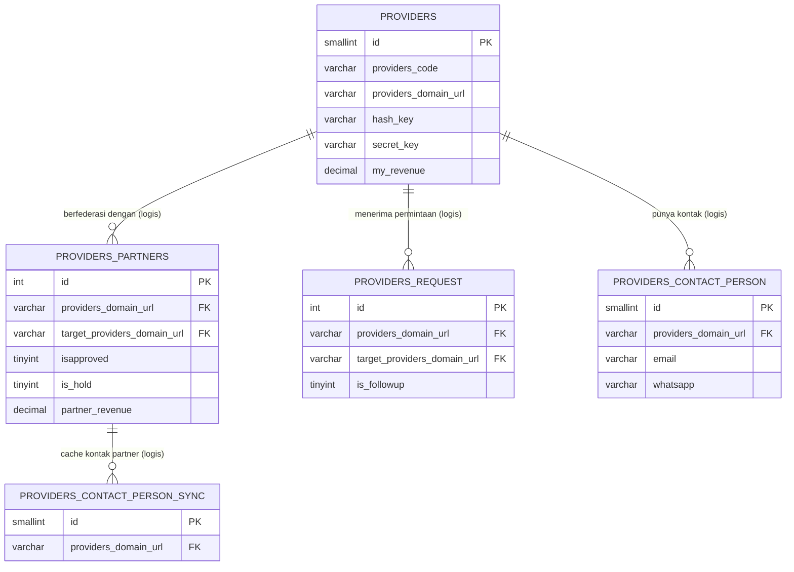

### 4.2 Advertiser & Iklan

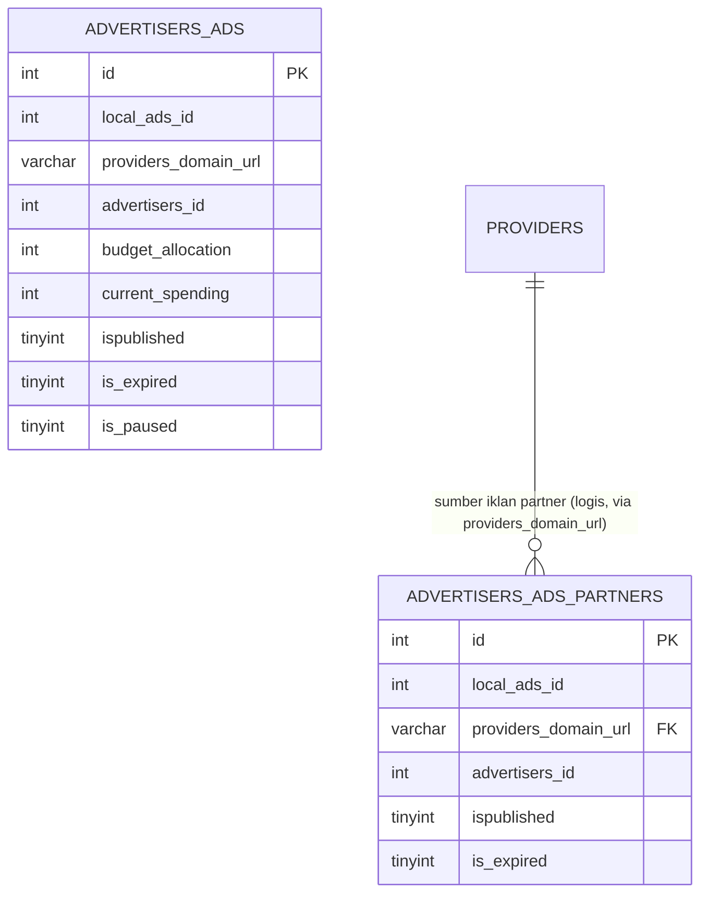

### 4.3 Publisher & Situs

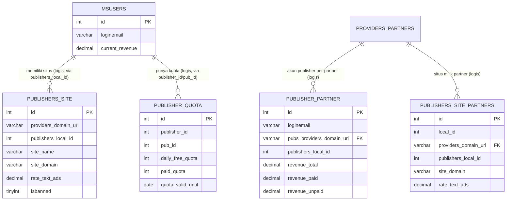

### 4.4 Mapping / Approval Penayangan Iklan

Tabel ini menjawab pertanyaan "iklan mana boleh tayang di situs mana, dengan rate berapa" — hasil approval dua arah (advertiser & publisher).

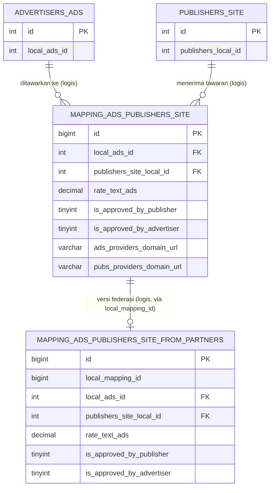

### 4.5 Klik & Fraud Detection

Ini modul inti bisnis (tempat bug yang baru diperbaiki berada). `ad_clicks` menyimpan **dua** identitas domain karena iklan & situs pada satu klik bisa berasal dari jaringan berbeda.

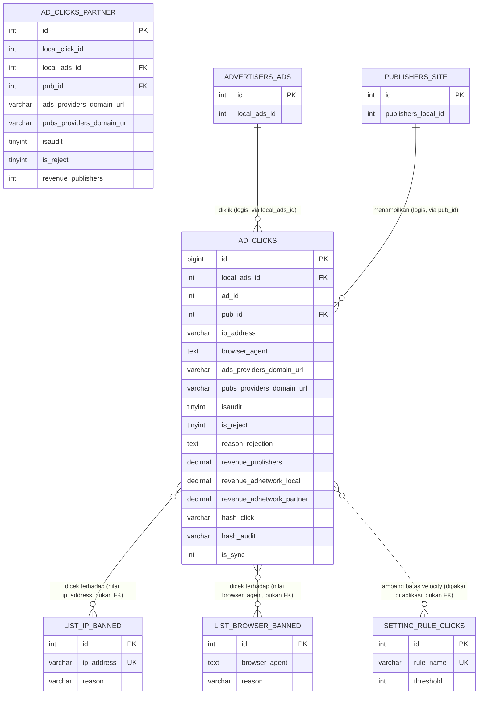

> Catatan bug yang baru diperbaiki: kolom `site_name`/`site_domain` di `ad_clicks`/`ad_clicks_partner` diisi belakangan oleh cronjob (`update_titleads_sitename_clickads.php`, `click_audit.php`) lewat lookup ke `publishers_site`/`publishers_site_partners` berdasarkan `pub_id`. Kalau `pub_id` tidak ketemu, `PDOStatement::fetch()` mengembalikan `false` — makanya perlu guard `is_array()` sebelum akses `['site_name']`/`['site_domain']`.

### 4.6 Akun Pengguna

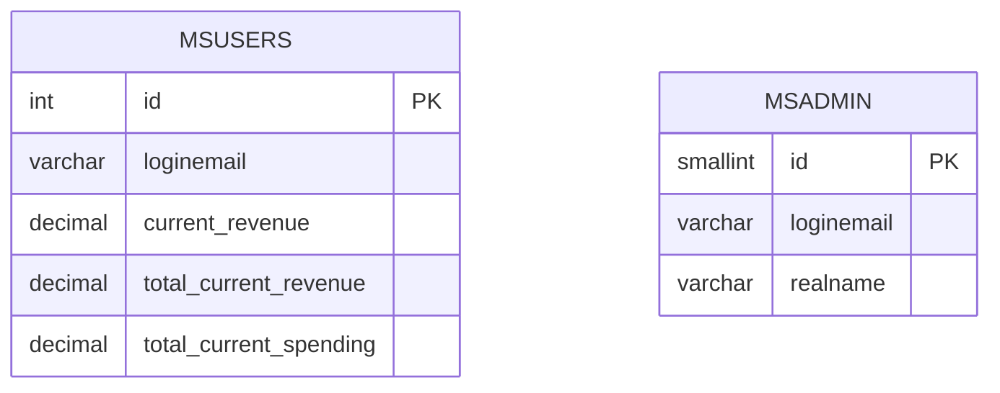
`msusers` dan `msadmin` berdiri sendiri (tidak ada tabel lain yang mereferensikannya lewat FK eksplisit); relasi ke `publishers_site`, `advertisers_ads`, `articles`, dll. dilakukan lewat pencocokan `publishers_local_id` / `advertisers_id` secara logis di kode aplikasi.

### 4.7 Pembayaran & Rekonsiliasi Revenue

```mermaid
erDiagram
    PAYMENT_LOCAL_PUBS {
        int id PK
        varchar email_pubs
        decimal nominal
        timestamp payment_date
    }
    PAYMENT_PARTNER_PROVIDERS {
        int id PK
        varchar partner_providers_domain_url FK
        varchar email_provider
        decimal nominal
    }
    PAYMENT_PARTNER_PROVIDERS_SYNC {
        int id PK
        int local_id
        varchar partner_providers_domain_url FK
    }
    PAYMENT_PARTNER_PUBS {
        int id PK
        int publisher_local_id FK
        varchar pubs_providers_domain_url FK
        decimal nominal
    }
    PAYMENT_PARTNER_PUBS_SYNC {
        int id PK
        int local_id
        int publisher_local_id FK
        varchar pubs_providers_domain_url FK
    }
    REKAP_HARIAN {
        bigint id PK
        date tanggal_klik
        int local_ads_id FK
        varchar ads_providers_domain_url
        int jumlah_klik
        int revenue_publishers
    }
    REKAP_HARIAN_PROVIDER_PARTNER {
        bigint id PK
        date rekap_date
        varchar ads_providers_domain_url UK
        int total_clicks
        decimal total_revenue_partner
    }
    REKAP_HARIAN_PUBLISHERS {
        bigint rekap_id PK
        date rekap_date
        int pub_id FK
        varchar pubs_providers_domain_url
        int total_revenue_publishers
    }
    REKAP_PUBS_REVENUE {
        int pub_id PK
        varchar pubs_providers_domain_url PK
        int total_revenue
        int total_click
    }
    REKAP_TOTAL_PUBLISHER_PARTNER {
        int id PK
        int pub_id UK
        varchar pubs_providers_domain_url UK
        int total_revenue_publishers
    }

    AD_CLICKS ||--o{ REKAP_HARIAN : "diagregasi jadi (logis, batch harian)"
    MSUSERS ||--o{ PAYMENT_LOCAL_PUBS : "dibayar (logis, via email_pubs)"
    PROVIDERS_PARTNERS ||--o{ PAYMENT_PARTNER_PROVIDERS : "pembayaran ke partner (logis)"
    PUBLISHER_PARTNER ||--o{ PAYMENT_PARTNER_PUBS : "pembayaran ke publisher partner (logis)"
```

### 4.8 Konten AI / Artikel

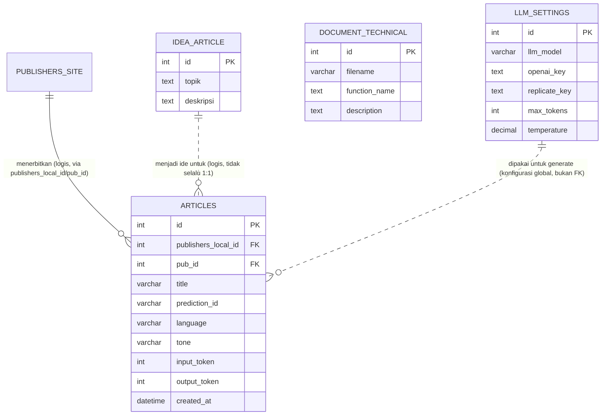
`document_technical` berdiri sendiri — tampaknya katalog dokumentasi teknis internal (nama file + fungsi + deskripsi), bukan bagian dari alur konten artikel.

### 4.9 Marketplace Influencer

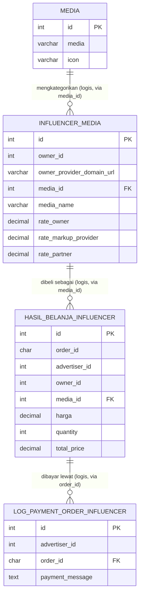

### 4.10 Lain-lain

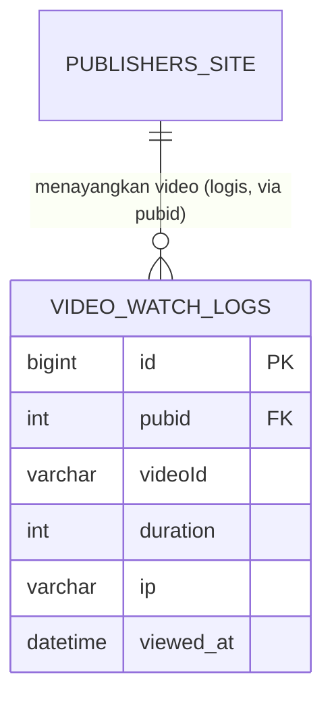

## 5. Kamus Data Ringkas

| Tabel | Fungsi | Kolom kunci |
|---|---|---|
| `providers` | Registry semua provider/jaringan yang dikenal (row id=1 = diri sendiri) | `id` PK, `providers_domain_url` |
| `providers_partners` | Relasi federasi (siapa jadi partner siapa) + status approval/hold | `providers_domain_url`, `target_providers_domain_url` |
| `providers_request` | Log permintaan federasi masuk (signature, IP, UA) | `providers_domain_url`, `target_providers_domain_url` |
| `providers_contact_person(_sync)` | Kontak PIC per provider (asli / cache dari partner) | `providers_domain_url` |
| `advertisers_ads` | Iklan milik advertiser lokal | `id`, `local_ads_id`, `advertisers_id` |
| `advertisers_ads_partners` | Cache iklan dari advertiser di jaringan partner | `local_ads_id`, `providers_domain_url` |
| `publishers_site` | Situs publisher lokal | `id`, `publishers_local_id` |
| `publishers_site_partners` | Cache situs publisher milik partner | `local_id`, `providers_domain_url` |
| `publisher_partner` | Akun publisher per hubungan partner (saldo revenue terpisah) | `publishers_local_id`, `pubs_providers_domain_url` |
| `publisher_quota` | Kuota harian/berbayar pembuatan artikel per publisher | `publisher_id`, `pub_id` |
| `mapping_advertisers_ads_publishers_site` | Approval iklan↔situs + rate CPC final | `local_ads_id`, `publishers_site_local_id` |
| `mapping_advertisers_ads_publishers_site_from_partners` | Versi federasi dari mapping di atas | `local_mapping_id` |
| `ad_clicks` | Fact table klik iklan (traffic lokal) | `id`, `local_ads_id`, `pub_id`, `hash_click` |
| `ad_clicks_partner` | Fact table klik dari/ke jaringan partner (partitioned by year) | `id`, `local_click_id`, `local_ads_id`, `pub_id` |
| `list_ip_banned` / `list_browser_banned` | Blacklist fraud (dicocokkan by value, bukan FK) | `ip_address` UK / `browser_agent` |
| `setting_rule_clicks` | Ambang batas velocity-click (aturan `aa`..`ap`) dipakai `click_audit.php` | `rule_name` UK |
| `msusers` / `msadmin` | Akun user platform (publisher/advertiser) / admin | `id`, `loginemail` |
| `payment_local_pubs` | Payout ke publisher lokal | `email_pubs`, `payment_date` |
| `payment_partner_providers(_sync)` | Pembayaran ke/dari provider partner (asli/cache) | `partner_providers_domain_url` |
| `payment_partner_pubs(_sync)` | Pembayaran ke publisher milik partner (asli/cache) | `publisher_local_id`, `pubs_providers_domain_url` |
| `rekap_harian` | Rollup harian klik+revenue per iklan | `tanggal_klik`, `local_ads_id` |
| `rekap_harian_provider_partner` | Rollup harian revenue per provider partner | `rekap_date`, `ads_providers_domain_url` UK |
| `rekap_harian_publishers` | Rollup harian revenue per publisher | `pub_id`, `rekap_date` |
| `rekap_publisher_revenue_harian_partner` | Rollup harian revenue publisher dari sisi partner | `pub_id`, `pubs_providers_domain_url`, `date_click` UK |
| `rekap_pubs_revenue` | Saldo revenue publisher (lokal+partner) terkini | `pub_id`, `pubs_providers_domain_url` PK gabungan |
| `rekap_total_publisher_partner` | Total revenue publisher per partner (snapshot) | `pub_id`, `pubs_providers_domain_url` UK |
| `articles` | Artikel blog hasil generate AI | `id`, `publishers_local_id`, `pub_id`, `prediction_id` |
| `idea_article` | Bank ide/topik untuk digenerate jadi artikel | `id` |
| `document_technical` | Katalog dokumentasi teknis internal (file & fungsi) | `id`, `filename` |
| `llm_settings` | Konfigurasi model & API key LLM untuk generate artikel | `id`, `llm_model` |
| `media` | Katalog jenis media/platform influencer (dengan icon) | `id`, `media` |
| `influencer_media` | Slot media milik seorang owner/influencer + tarif | `id`, `owner_id`, `media_id` |
| `hasil_belanja_influencer` | Order pembelian slot media influencer oleh advertiser | `order_id`, `advertiser_id`, `media_id` |
| `log_payment_order_influencer` | Log pembayaran atas order di atas | `order_id`, `advertiser_id` |
| `video_watch_logs` | Log tonton video ads per publisher | `id`, `pubid`, `videoId` |

## 6. Alur Data Kunci: Dari Klik sampai Payout

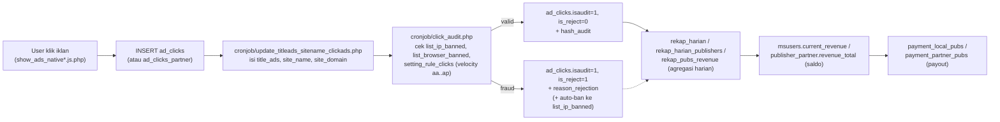

## 7. Batasan Dokumentasi Ini

- Tidak ada `FOREIGN KEY` di database, sehingga semua panah relasi di atas adalah **hasil pembacaan kode aplikasi** (terutama `public_html/cronjob/*.php` dan `public_html/function.php`), bukan hasil introspeksi constraint DB. Jika ada perubahan skema di masa depan, dokumen ini perlu disinkronkan manual dengan `sql/myadnetwork_db_hanya_structure.sql`.
- Tabel `rekap_*` diasumsikan diisi oleh cron job agregasi harian yang belum ditelusuri isinya secara detail dalam sesi ini — nama kolom sudah cukup jelas menunjukkan sumber & tujuan agregasi.
- Kolom lengkap tiap tabel (constraint `NOT NULL`, default value, tipe presisi) ada di `sql/myadnetwork_db_hanya_structure.sql` — dokumen ini hanya menampilkan kolom yang relevan untuk memahami relasi.
