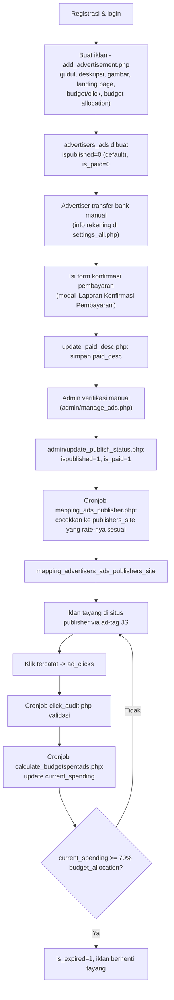

# Alur Advertiser (End-to-End)

## Ringkasan alur

## 1. Membuat iklan

`public_html/add_advertisement.php:48-144`:
- Rate limit: maksimal **5 iklan per jam** per akun (`check_submission_limit()`, baris 38-46, 52-55).
- Field wajib: `title_ads`, `description_ads`, `landingpage_ads`, `image_url` (upload JPG/PNG maks 5MB ke `banner_mini/`), `budget_per_click_textads` (**Rp 30–Rp 3.000**), `budget_allocation` (**Rp 5.000–Rp 60.000.000**).
- Setelah disimpan (baris `advertisers_ads` baru), sistem meng-update `local_ads_id` = `id` auto-increment-nya sendiri (baris 129-131) — pola self-referencing ID yang dipakai di banyak tabel lain untuk memudahkan sinkronisasi lintas-provider (`local_ads_id` tetap = ID asli di server pemilik, meski direplikasi ke server partner dengan `id` berbeda).
- Iklan baru **tidak langsung tayang**: default `ispublished=0` (skema `advertisers_ads`, `sql/...:46`), belum ada di `published_date` sampai admin memverifikasi pembayaran.
- Menurut UI (`add_advertisement.php:207-208`), semua field bisa diedit setelah disimpan **kecuali** `budget_allocation`.

## 2. Konfirmasi pembayaran

Tidak ada payment gateway. Alur manual:
1. Advertiser melihat info rekening bank platform di `myrevenue.php`/modal pembayaran (`settings_all.php:11-23`, variabel `$info_pembayaran` — berisi no. rekening BCA/Mandiri/BNI/GoPay/OVO/Dana).
2. Advertiser transfer manual di luar sistem.
3. Di `view_ads.php`, tombol **"Laporan Konfirmasi Pembayaran"** (hanya muncul bila `is_paid=0`, `view_ads.php:371-376`) membuka modal yang mengirim deskripsi konfirmasi (nominal, bank, tanggal) ke `update_paid_desc.php:34-36`, menyimpan ke kolom `advertisers_ads.paid_desc`.
4. Admin memverifikasi mutasi rekeningnya secara manual, lalu melalui `admin/manage_ads.php` menjalankan `admin/update_publish_status.php:41-43` untuk set `ispublished`, `published_date`, `is_paid`, `paid_date`.

> Catatan: ada endpoint terpisah `list_invoice_payment.php` + `confirm_payment.php` + `log_payment_order_influencer` yang polanya identik tapi khusus untuk **checkout media influencer** (`hasil_belanja_influencer`), bukan untuk iklan native — lihat `09-influencer-marketing.md`. Ini pola konfirmasi-pembayaran-manual yang sama dipakai berulang di beberapa fitur.

## 3. Mapping ke publisher & approval

Setelah `ispublished=1`, cronjob `mapping_ads_publisher.php` otomatis mencocokkan iklan ke semua `publishers_site` yang rate-nya memenuhi syarat (lihat `03-alur-publisher.md` bagian 3). Advertiser dapat melihat & mengubah persetujuan tayang per mapping:
- `view_ads_publishers_mapping.php` — daftar publisher lokal yang menayangkan iklan tsb, dengan filter/sort dan tombol **"Ubah Persetujuan"** → `update_approval_advertiser.php:19-44` (set `is_approved_by_advertiser`).
- `view_ads_publishers_partner_mapping.php` — versi untuk publisher dari jaringan partner, disetujui lewat `update_approval_advertiser_partner.php`.

Jika advertiser menolak (`is_approved_by_advertiser=0`) mapping tertentu, iklan tidak akan disertakan oleh query penyaji iklan (`show_ads_native.js.php:93`, syarat `m.is_approved_by_advertiser = 1`).

## 4. Mengelola iklan berjalan

Semua dilakukan dari `view_ads.php` (daftar iklan milik advertiser, dengan filter status & pencarian):
- **Pause/Resume**: `pause_resume_ads.php:47-56` — toggle `is_paused`.
- **Edit** (judul, deskripsi, landing page, gambar, budget per klik — **bukan** `budget_allocation`): `edit_ads.php` / `update_ad.php`.
- **Hapus**: `delete_ads.php:26-35` — **hanya bisa dihapus jika belum ada mapping** ke publisher manapun (dicek di `view_ads.php:432-445` sebelum tombol hapus ditampilkan).
- Advertiser bisa melihat estimasi harga di sisi publisher lewat `rate_text_ads_with_markup_local`/`_partner` di `mysite_ads.php:164-167` (markup 1.5× lokal, 2× partner) untuk memahami mengapa iklannya cocok/tidak cocok dengan situs tertentu.

## 5. Anggaran & auto-expire

`cronjob/calculate_budgetspentads.php` (untuk klik lokal) dan `calculate_budgetspentads_partner.php` (untuk klik dari jaringan partner) menjumlahkan `revenue_publishers + revenue_adnetwork_local + revenue_adnetwork_partner` dari klik yang **sudah teraudit dan tidak ditolak** (`isaudit=1 AND is_reject=0`, `cronjob/calculate_budgetspentads.php:87-95`) ke `advertisers_ads.current_spending`. Ketika `current_spending + current_spending_from_partner ≥ 70% × budget_allocation`, iklan otomatis di-set `is_expired=1` (`cronjob/calculate_budgetspentads.php:172-204`) — **bukan 100%**, ada buffer 30% yang perlu dikonfirmasi apakah disengaja sebagai margin aman atau sisa anggaran yang hangus.

## 6. Laporan performa

- `clicks_ads_local_detail.php` / `clicks_ads_partner_detail.php` — rincian klik per iklan, dipecah lokal vs. partner (tautan dari `view_ads.php`/`view_ads_publishers_mapping.php`).
- `preview.php` / `preview.js.php` / `preview_vertical.js.php` — pratinjau tampilan iklan tanpa harus live di situs publisher (tautan "Preview Iklan" di `view_ads.php:275`).

## Tabel database yang terlibat

`msusers`, `advertisers_ads`, `advertisers_ads_partners`, `mapping_advertisers_ads_publishers_site`, `mapping_advertisers_ads_publishers_site_from_partners`, `ad_clicks`, `ad_clicks_partner`, `rekap_harian`, `rekap_harian_provider_partner`.
