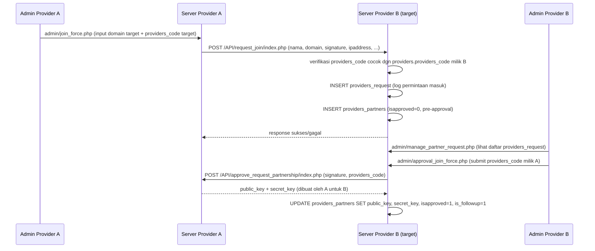

# Provider / Partner Network (B2B Syndication / White Label)

## Konsep

Karena source code platform ini bersifat **open source / white-label** (`public_html/white_label/index.php:83-92` secara eksplisit mengarahkan ke repo GitHub-nya), siapapun bisa menjalankan instance KumpulBlogger sendiri di domain berbeda. Setiap instance disebut satu **"provider"**. Dua atau lebih provider bisa **"join force"** (istilah yang dipakai konsisten di kode: `admin/join_force.php`, `admin/manage_partner_request.php`) agar:

- Iklan dari provider A bisa ikut ditayangkan di situs-situs milik publisher provider B (memperluas *fill-rate* & jangkauan advertiser A), dan sebaliknya.
- Klik yang terjadi lintas jaringan tetap dicatat dan revenue-nya dibagi tiga arah: publisher, provider pemilik situs, dan provider pemilik iklan (lihat `07-pembayaran-dan-revenue-share.md`).
- Filosofi bisnisnya secara eksplisit "kolaborasi bukan kompetisi" (`white_label/index.php:87`), karena provider tetap punya publisher/advertiser sendiri, hanya *supply* dan *demand* yang saling dipertukarkan.

## Identitas provider

- `public_html/providers_data.json` — file konfigurasi statis berisi identitas provider lokal (dibaca terus-menerus via `get_providers_domain_url_json()` / `getProvidersNameById_JSON()`, `public_html/function.php:280-307`, dipakai di hampir semua halaman untuk tahu "siapa saya").
- Tabel `providers` (`sql/...:568-580`, id=1 = diri sendiri) menyimpan `hash_key`/`secret_key` yang dipakai untuk menandatangani `hash_click`/`hash_audit` (lihat `06-ad-serving-dan-tracking-klik.md`).

## Alur "Join Force" (permintaan kemitraan)

Detail teknis:
- Permintaan awal: `public_html/admin/join_force.php:75-127` mengirim POST ke `{target_domain}/API/request_join/index.php` dengan header `Client-ID`/`Pass-Key` dan payload berisi `providers_code` (kode rahasia yang harus sudah diketahui operator A — dipertukarkan di luar sistem, misalnya lewat komunikasi manual/WhatsApp).
- Penerima memvalidasi `providers_code` terhadap `providers.providers_code` miliknya sendiri (`public_html/API/request_join/index.php:56-68`, fungsi `getProvidersCodeById()` di `function.php:340-364`).
- Jika valid: dicatat di `providers_request` (log permintaan, `function_provider_request_join.php:6-87`) **dan** langsung dibuat baris pre-approval di `providers_partners` dengan `isapproved=0` (`function_provider_request_join.php:125-202`).
- Admin penerima meninjau daftar permintaan di `admin/manage_partner_request.php:143-190` (tabel `providers_request`), lalu melakukan approval lewat `admin/approval_join_force.php:64-138` yang memanggil endpoint `API/approve_request_partnership/index.php` di server pemohon, dan menerima `public_key`/`secret_key` yang lalu disimpan sebagai kredensial API resmi ke `providers_partners`.
- Ada juga `admin/approval_join_force2.php` dan `admin/change_code_provider.php` untuk varian/perbaikan alur ini — **perlu konfirmasi** apa perbedaan persis `approval_join_force.php` vs `approval_join_force2.php` (kemungkinan versi lama vs baru dari alur yang sama; tidak dibaca detail dalam eksplorasi ini).

## Kredensial & keamanan API antar-provider

Setiap request API antar-server menyertakan header `public_key` / `secret_key` (dari `providers_partners`), diverifikasi oleh fungsi `checkProviderCredentials()` (dipanggil di `API/sync_ads/index.php:56` dkk. — implementasi fungsi ini ada di salah satu file `function_provider*.php`, dipakai luas di seluruh folder `API/`).

`providers_partners.is_hold` memungkinkan admin **menahan sementara** (bukan memutus) tayangan iklan dari provider tertentu tanpa menghapus kemitraan — dipakai langsung sebagai filter di query penyaji iklan (`show_ads_native.js.php:49-59`, iklan dari provider yang `is_hold=1` dikecualikan).

## Sinkronisasi data (push-based, dipicu cronjob)

Karena setiap provider punya database sendiri-sendiri, data harus direplikasi manual lewat HTTP API. Arahnya **push**: provider pemilik data mengirim ke provider mitra secara berkala via cronjob:

| Cronjob (pengirim) | Endpoint API (penerima) | Data yang dikirim |
|---|---|---|
| `cronjob/push_sync_ads.php` | `API/sync_ads/index.php` | Iklan aktif (`advertisers_ads` yang `ispublished=1, is_expired=0`) → disimpan di `advertisers_ads_partners` sisi penerima |
| `cronjob/push_sync_ads_expired.php` | (varian sync_ads) | Update status expired/paused iklan yang sudah direplikasi |
| `cronjob/push_sync_publishers.php` | `API/sync_publisher/index.php` | Data situs publisher (`publishers_site`) → `publishers_site_partners` sisi penerima |
| `cronjob/push_sync_mapping_ads_publisher.php` | `API/sync_mapping_advertisers_ads_publishers_site_from_partners/index.php` | Baris mapping iklan↔situs lintas jaringan → `mapping_advertisers_ads_publishers_site_from_partners` |
| `cronjob/push_sync_click_ads.php` | `API/sync_clicks/index.php` | Klik yang sudah diaudit (`ad_clicks`) → `ad_clicks_partner` sisi penerima, ditandai `is_sync`/`syncdate` di pengirim |
| `cronjob/push_payment_partner_pubs.php` | `API/getinfoPaymentPubsPartner/index.php` | Riwayat pembayaran ke publisher (7 hari terakhir) dari `payment_partner_pubs` → `payment_partner_pubs_sync` sisi penerima, agar publisher bisa melihat status "sudah dibayar" meski dibayar oleh provider lain |
| `cronjob/push_payment_partner_providers.php` | `API/getinfoPaymentProviderPartner/index.php` | Riwayat pembayaran **antar provider** (settlement B2B) |
| `admin/sync_databank.php` | `API/pushInfoAccountBankProvider/index.php` | Info rekening bank kontak provider (`providers_contact_person` ↔ `..._sync`) |
| `API/insert_pubs`, `API/insert_advertiser`, `API/insert_ads` | — | Endpoint untuk mendaftarkan entitas dari sisi provider mitra (arah masuk) |
| `API/getOwnerPublisher`, `cronjob/getinfoOwnerPublisherGlobal.php` | — | Lookup pemilik publisher lintas jaringan (mis. untuk keperluan payout/verifikasi) |
| `API/update_key` | — | Rotasi `public_key`/`secret_key` kemitraan |
| `admin/entry_bank_account.php`, `admin/fetch_bank_details.php` | — | Input/lihat data rekening bank pihak provider di sisi lokal |

Pola tabel **`*_partners`** (data ganda milik pihak lain, direplikasi) vs **`*_sync`** (log hasil sinkronisasi, biasanya untuk data pembayaran) konsisten dipakai di seluruh skema — lihat `12-skema-database.md`.

## Advertiser ↔ Publisher lintas jaringan dari sisi UI

- Publisher melihat advertiser dari jaringan partner di `view_advertiser_list_partner.php` dan rate-nya di `view_rate_publisher_partner.php`.
- Advertiser melihat & meng-approve mapping iklannya ke situs publisher partner di `view_ads_publishers_partner_mapping.php` → `update_approval_advertiser_partner.php`.
- Markup harga untuk trafik partner **2×** rate publisher (dibanding 1.5× untuk trafik lokal) — `mysite_ads.php:164-167` — mencerminkan biaya tambahan koordinasi lintas-jaringan yang harus dibagi ke provider mitra saat settlement.

## Tabel database yang terlibat

`providers`, `providers_partners`, `providers_request`, `providers_contact_person`, `providers_contact_person_sync`, `publishers_site_partners`, `advertisers_ads_partners`, `mapping_advertisers_ads_publishers_site_from_partners`, `ad_clicks_partner`, `payment_partner_pubs`, `payment_partner_pubs_sync`, `payment_partner_providers`, `payment_partner_providers_sync`, `publisher_partner`, `rekap_harian_provider_partner`, `rekap_publisher_revenue_harian_partner`, `rekap_total_publisher_partner`.

## Perlu konfirmasi

- Perbedaan fungsional pasti antara `admin/approval_join_force.php` dan `admin/approval_join_force2.php` — tidak dieksplorasi secara mendalam; kemungkinan salah satu adalah revisi/duplikat dari yang lain.
- Bagaimana `providers_code` awal dipertukarkan antar-operator sebelum proses `join_force` dimulai (tampaknya di luar sistem/manual).
