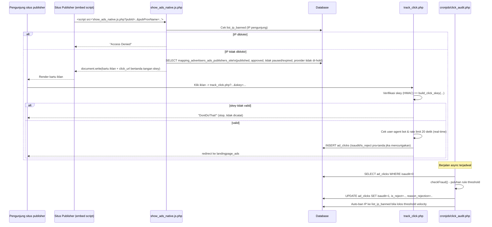

# Ad Serving dan Tracking Klik

## Ringkasan alur



## 1. Penyajian iklan (ad-tag JavaScript)

File utama: `public_html/show_ads_native.js.php` (dan varian `show_ads_native.js2/3/4.php`, `_landscape`, `_portrait`, `sample.js.php`, `sample_landscape.js.php`, `preview.js.php`, `preview_vertical.js.php` — kemungkinan besar varian tampilan/layout dari mekanisme yang sama; hanya `show_ads_native.js.php` yang dibaca detail dalam eksplorasi ini).

Publisher menyematkan `<script src="{domain}/show_ads_native.js.php?pubId={site_id}&pubProvName=...&maxads=...&column=...">` di halamannya. Alur di server:

1. **Header no-cache** (`show_ads_native.js.php:6-13`) agar setiap load mendapat `$carousel_id` unik (mencegah tabrakan DOM id kalau tag dipasang dua kali di satu halaman).
2. **Cek IP banned**: query `list_ip_banned` (baris 34-46) — jika IP pengunjung ada di daftar, skrip hanya menulis pesan "Access Denied" dan berhenti; iklan sama sekali tidak dikirim ke browser tersebut.
3. **Filter provider yang di-hold**: iterasi `providers_partners` yang `is_hold=1`, dikecualikan dari query iklan (baris 48-59) — mekanisme kill-switch admin untuk menahan sementara satu jaringan mitra tanpa memutus kemitraan.
4. **Query iklan yang eligible** (baris 77-97): dari `mapping_advertisers_ads_publishers_site` (join ke `advertisers_ads`/`advertisers_ads_partners` untuk validasi status terkini), dengan syarat: `is_published=1`, `is_expired=0`, `is_paused=0`, iklan sumbernya juga tidak expired/paused, **dan** `is_approved_by_publisher=1 AND is_approved_by_advertiser=1`.
5. **Randomisasi vs. bid tertinggi**: 55% peluang urutan acak (`RAND()`), 45% peluang urut berdasarkan `budget_per_click_textads DESC` (baris 73-96) — mekanisme agar iklan bid rendah tetap punya kesempatan tayang, bukan murni "yang bayar paling banyak selalu di atas".
6. **Fallback**: jika tidak ada iklan yang cocok, tampilkan `alternate_code` milik situs (jika diisi publisher) atau pesan default (baris 112-118).
7. **Render**: HTML kartu iklan (gambar, judul, deskripsi dipotong 250 karakter) ditulis via `document.write` dengan seluruh nilai dinamis di-escape lewat `ad_js_escape()` (`function.php:30-40`) untuk mencegah XSS/JS-injection dari data iklan yang berasal dari advertiser (title/description/domain bisa dikontrol pihak ketiga).
8. **Carousel**: jika iklan > 1, ditambahkan tombol prev/next dan auto-rotate tiap 7 detik (baris 281-309).
9. Setiap kartu memuat link **"Powered by KumpulBlogger.com"** (baris 279) — atribusi brand wajib pada tag iklan (relevan untuk model white-label, walau domain penayang berbeda-beda).

## 2. Pembuatan URL klik yang ditandatangani (anti-forge)

Setiap link iklan mengandung parameter `skey` hasil `build_click_skey()` (`function.php:21-24`):

```
skey = HMAC-SHA256( ip|adId|pubId|localAdsId|urlencode(referrer), CLICK_SKEY_SECRET )
```

`CLICK_SKEY_SECRET` adalah konstanta rahasia sisi server (`function.php:14-16`) yang **tidak pernah dikirim ke klien** — tujuannya memastikan `track_click.php` hanya memproses klik yang benar-benar berasal dari iklan yang di-render server ini, bukan URL klik yang direplay/dipalsukan dengan mengubah parameter (mis. mengganti `pubId` untuk mencuri atribusi klik ke situs lain). Verifikasi memakai `hash_equals()` (`track_click.php:41-46`) untuk mencegah timing attack.

## 3. Pencatatan klik (`track_click.php`)

1. Set/baca cookie `user_cookie` 7 hari (baris 18-24) — dipakai sebagai identitas anonim pengunjung lintas sesi untuk deteksi klik berulang.
2. **Verifikasi `skey`** — jika tidak cocok, keluar tanpa mencatat apapun (baris 43-46).
3. **Real-time abuse guard** (baris 48-69), dijalankan *sebelum* insert, terpisah dari audit asinkron:
   - `is_probable_bot_user_agent()` (`function.php:74-100`) — mendeteksi UA kosong, tidak mengandung `Mozilla`, atau mengandung kata kunci bot/tool (`bot`, `crawler`, `curl`, `python-requests`, `headless`, `selenium`, `puppeteer`, dll).
   - Rate-limit 20 detik: `count_recent_clicks()` (`function.php:59-67`) dibandingkan terhadap threshold rule `aj` dari `setting_rule_clicks`.
   - Jika salah satu terpicu, klik tetap **disimpan** (untuk jejak audit) tapi langsung ditandai `isaudit=1, is_reject=1` — pengunjung tetap diarahkan normal ke landing page (agar mekanisme deteksi tidak terlihat/diketahui pelaku).
4. **Hitung revenue split** (baris 104-110) — lihat detail di `07-pembayaran-dan-revenue-share.md`.
5. **`hash_click`** — checksum MD5 dari kombinasi `hash_key` provider + data klik (baris 125-137), disimpan untuk memverifikasi integritas data klik nantinya (dipublikasikan di endpoint transparansi, lihat contoh JSON di `white_label/index.php:117-148`).
6. `INSERT INTO ad_clicks` lalu **redirect** ke `landingpage_ads` iklan (baris 158).

## 4. Audit klik asinkron (anti-fraud lanjutan)

`public_html/cronjob/click_audit.php` — dijalankan berkala, memproses batch hingga 1000 klik `WHERE isaudit=0` (baris 106). Untuk tiap klik, `checkFraud()` (baris 261-469) mengevaluasi berurutan (berhenti di pelanggaran pertama):

1. **Status iklan** — ditolak jika iklan sumber sudah expired/paused saat ini (`isAdActive()`).
2. **Header proxy/VPN** — ditolak jika request mengandung `X-Forwarded-For`, `Via`, atau `Forwarded` (`isUsingProxyOrVpnHeaders()`, baris 249-257) — heuristik sederhana, berpotensi false-positive untuk pengguna di belakang reverse proxy/CDN legit (**perlu konfirmasi** apakah ini disengaja ketat).
3. **IP lokal/private** — IP di rentang `192.168.0.0/16`, `10.0.0.0/8`, `172.16.0.0/12`, `127.0.0.0/8` otomatis ditolak (`isLocalIpRange()`).
4. **IP/browser banned** — cek `list_ip_banned` dan `list_browser_banned`, plus deteksi bot UA yang sama dengan real-time guard.
5. **16 aturan velocity berjenjang** (`setting_rule_clicks`, kode `aa`–`ap`) — menghitung jumlah klik dari kombinasi IP+cookie+browser yang sama dalam jendela waktu 20 detik s.d. 24 jam (`countClicks()`); melebihi threshold → klik ditolak **dan** IP tersebut **otomatis di-ban** (`banIpForVelocity()`, baris 598-618) sehingga klik berikutnya dari IP itu langsung ditolak sejak awal (baik di gerbang real-time `track_click.php` maupun di `show_ads_native.js.php` yang mengecek `list_ip_banned` sebelum menampilkan iklan sama sekali).
6. Jika lolos semua pemeriksaan → `isaudit=1, is_reject=0`, dan dibuatkan `hash_audit` (`createHashAudit()`) sebagai bukti klik telah divalidasi.

Bagian akhir file yang sama juga mengisi kolom `title_ads`/`site_name`/`site_domain` yang kosong di `ad_clicks`/`ad_clicks_partner` dengan look-up ke tabel master terkait (baris 143-231) — housekeeping data, bukan logika fraud.

## 5. Konfigurasi anti-fraud oleh admin

- `admin/list_setting_rule_clicks.php` + `admin/update_threshold.php` — CRUD nilai threshold di `setting_rule_clicks`.
- `admin/list_setting_list_ip_banned.php` — kelola daftar IP yang diblokir manual (selain yang di-auto-ban sistem).
- `admin/list_setting_list_browser_banned.php` — kelola daftar user-agent yang diblokir manual.
- `admin/publisher_click_forensics.php`, `admin/latest_recognized_clicks.php`, `admin/rekap_user_local_click.php` — alat investigasi klik untuk admin.

## Tabel database yang terlibat

`ad_clicks`, `ad_clicks_partner`, `mapping_advertisers_ads_publishers_site`, `mapping_advertisers_ads_publishers_site_from_partners`, `setting_rule_clicks`, `list_ip_banned`, `list_browser_banned`, `providers`, `providers_partners`.

## Perlu konfirmasi

- Threshold "rentang waktu" pada rule `aa`–`ap` di `checkFraud()` sebagian memakai variabel yang tampak salah copy-paste (mis. baris `Threshold AK exceeded` menampilkan `$ai` alih-alih `$ak` di pesan — `cronjob/click_audit.php:412`); ini hanya memengaruhi teks log, bukan logika penolakan itu sendiri, tapi tetap tercatat sebagai temuan.
- Apakah pemblokiran otomatis berbasis header proxy/VPN (`isUsingProxyOrVpnHeaders()`) sengaja dibuat sangat ketat (memblokir semua trafik lewat CDN/reverse-proxy) atau merupakan simplifikasi yang belum disempurnakan.
